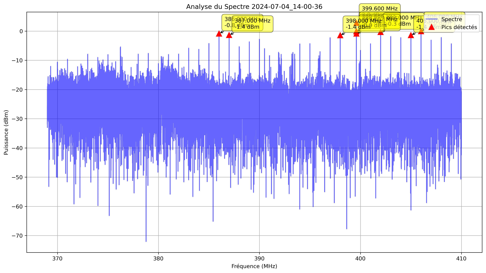
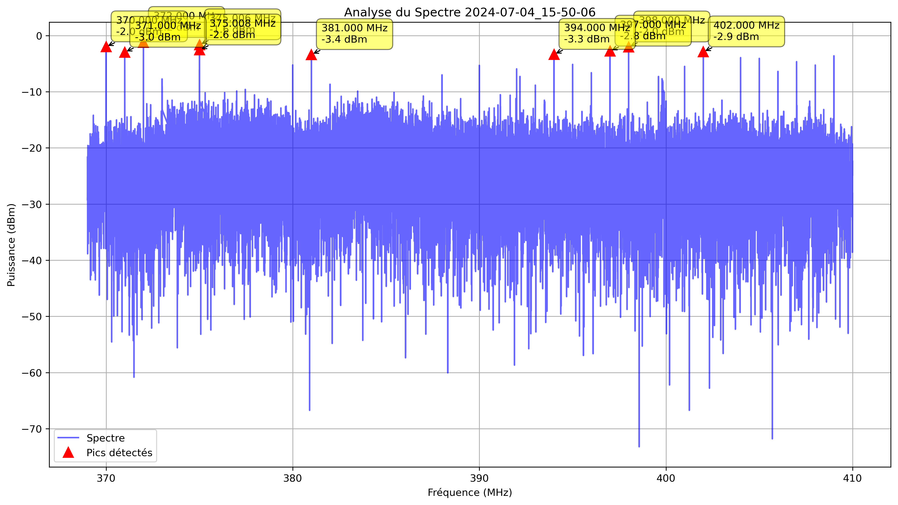

## Analyse du Spectre - 2024-07-04_10-25-34

| Fréquence (MHz) | Puissance (dBm) |
|-----------------|----------------|
| 405.000 | -2.10 |
| 402.000 | -2.20 |
| 409.000 | -2.80 |
| 397.000 | -2.86 |
| 403.000 | -3.45 |
| 406.000 | -3.93 |
| 399.812 | -4.00 |
| 398.000 | -4.42 |
| 407.586 | -4.65 |
| 388.000 | -4.70 |
| 399.811 | -5.01 |
| 399.600 | -5.04 |
| 405.002 | -5.06 |
| 407.588 | -5.15 |
| 402.002 | -5.15 |
| 394.000 | -5.24 |
| 375.000 | -5.44 |
| 395.000 | -5.54 |
| 404.998 | -5.55 |
| 397.002 | -5.57 |

---

## Analyse du Spectre - 2024-07-04_10-26-24

| Fréquence (MHz) | Puissance (dBm) |
|-----------------|----------------|
| 393.000 | -1.75 |
| 405.000 | -1.80 |
| 397.000 | -1.98 |
| 402.000 | -2.21 |
| 390.000 | -2.65 |
| 389.000 | -2.73 |
| 409.000 | -3.29 |
| 388.000 | -3.43 |
| 399.832 | -3.65 |
| 403.000 | -3.84 |
| 395.000 | -3.88 |
| 399.709 | -3.96 |
| 391.000 | -4.07 |
| 406.000 | -4.24 |
| 384.010 | -4.24 |
| 398.000 | -4.34 |
| 384.012 | -4.42 |
| 392.998 | -4.46 |
| 404.998 | -4.60 |
| 375.002 | -4.64 |

---

## Analyse du Spectre - 2024-07-04_10-27-13

| Fréquence (MHz) | Puissance (dBm) |
|-----------------|----------------|
| 399.600 | -2.18 |
| 399.598 | -3.37 |
| 390.000 | -3.54 |
| 397.000 | -4.06 |
| 398.000 | -4.47 |
| 409.000 | -4.72 |
| 375.000 | -4.79 |
| 403.000 | -4.89 |
| 404.000 | -4.91 |
| 384.232 | -5.47 |
| 406.000 | -5.57 |
| 388.000 | -5.69 |
| 384.266 | -5.79 |
| 393.000 | -5.81 |
| 375.002 | -5.93 |
| 397.002 | -6.17 |
| 390.002 | -6.35 |
| 398.002 | -6.61 |
| 403.002 | -6.88 |
| 395.000 | -6.89 |

---

## Analyse du Spectre - 2024-07-04_10-28-03

| Fréquence (MHz) | Puissance (dBm) |
|-----------------|----------------|
| 399.779 | -1.34 |
| 398.000 | -2.61 |
| 403.000 | -2.65 |
| 375.006 | -2.75 |
| 409.000 | -2.80 |
| 399.777 | -2.98 |
| 405.000 | -3.26 |
| 390.000 | -3.29 |
| 399.816 | -3.40 |
| 402.000 | -3.42 |
| 384.133 | -3.45 |
| 375.002 | -3.78 |
| 375.004 | -4.05 |
| 404.000 | -4.09 |
| 399.834 | -4.21 |
| 391.000 | -4.26 |
| 399.781 | -4.30 |
| 391.934 | -4.38 |
| 375.008 | -4.39 |
| 398.002 | -4.60 |

---

## Analyse du Spectre - 2024-07-04_10-28-53

| Fréquence (MHz) | Puissance (dBm) |
|-----------------|----------------|
| 402.000 | -2.20 |
| 409.000 | -3.57 |
| 402.002 | -3.71 |
| 403.000 | -3.85 |
| 399.865 | -3.86 |
| 399.867 | -3.87 |
| 397.000 | -3.88 |
| 398.000 | -3.97 |
| 399.863 | -4.17 |
| 384.123 | -4.36 |
| 401.000 | -4.37 |
| 384.111 | -4.59 |
| 375.002 | -4.77 |
| 407.654 | -4.78 |
| 389.000 | -4.89 |
| 384.121 | -4.99 |
| 384.129 | -5.09 |
| 404.000 | -5.12 |
| 394.000 | -5.38 |
| 399.762 | -5.44 |

---

## Analyse du Spectre - 2024-07-04_10-29-42

| Fréquence (MHz) | Puissance (dBm) |
|-----------------|----------------|
| 409.000 | 3.49 |
| 408.998 | 0.34 |
| 409.002 | 0.17 |
| 405.000 | -2.85 |
| 399.734 | -3.41 |
| 403.000 | -3.49 |
| 399.736 | -3.66 |
| 402.000 | -3.80 |
| 404.000 | -3.85 |
| 394.000 | -3.87 |
| 375.000 | -4.07 |
| 384.162 | -4.11 |
| 397.000 | -4.12 |
| 401.000 | -4.13 |
| 375.006 | -4.19 |
| 399.893 | -4.22 |
| 391.000 | -4.41 |
| 399.723 | -4.46 |
| 399.730 | -4.54 |
| 389.000 | -4.61 |

---

## Analyse du Spectre - 2024-07-04_10-30-32

| Fréquence (MHz) | Puissance (dBm) |
|-----------------|----------------|
| 405.000 | 3.16 |
| 402.000 | 2.66 |
| 409.000 | 2.40 |
| 401.000 | 1.83 |
| 405.002 | 0.05 |
| 399.781 | 0.05 |
| 384.092 | -0.02 |
| 399.783 | -0.27 |
| 404.998 | -0.43 |
| 401.998 | -0.45 |
| 409.002 | -0.77 |
| 402.002 | -0.81 |
| 384.090 | -1.14 |
| 408.998 | -1.33 |
| 400.998 | -1.50 |
| 399.779 | -1.62 |
| 401.002 | -1.62 |
| 384.094 | -1.64 |
| 406.000 | -2.17 |
| 397.000 | -2.19 |

---

## Analyse du Spectre - 2024-07-04_10-31-21

| Fréquence (MHz) | Puissance (dBm) |
|-----------------|----------------|
| 397.000 | -1.74 |
| 402.000 | -1.82 |
| 375.006 | -2.23 |
| 398.000 | -2.49 |
| 399.809 | -2.77 |
| 394.000 | -2.92 |
| 399.811 | -3.00 |
| 406.000 | -3.35 |
| 409.000 | -3.37 |
| 389.000 | -3.62 |
| 375.004 | -3.71 |
| 404.000 | -3.86 |
| 388.000 | -3.94 |
| 375.000 | -4.14 |
| 395.000 | -4.45 |
| 405.000 | -4.48 |
| 399.771 | -4.53 |
| 375.002 | -4.60 |
| 399.770 | -4.92 |
| 402.002 | -4.93 |

---

## Analyse du Spectre - 2024-07-04_10-32-11

| Fréquence (MHz) | Puissance (dBm) |
|-----------------|----------------|
| 403.000 | 1.75 |
| 404.000 | 1.53 |
| 404.002 | -1.28 |
| 403.002 | -1.47 |
| 403.998 | -1.61 |
| 402.998 | -1.64 |
| 386.000 | -1.73 |
| 384.000 | -2.04 |
| 399.600 | -2.77 |
| 399.852 | -2.96 |
| 385.000 | -3.48 |
| 399.693 | -3.49 |
| 399.732 | -3.56 |
| 399.730 | -3.59 |
| 399.600 | -4.11 |
| 399.691 | -4.44 |
| 406.000 | -4.49 |
| 399.729 | -4.56 |
| 386.002 | -4.64 |
| 383.000 | -4.76 |

---

## Analyse du Spectre - 2024-07-04_10-33-00

| Fréquence (MHz) | Puissance (dBm) |
|-----------------|----------------|
| 376.000 | 3.26 |
| 379.000 | 2.94 |
| 377.000 | 2.61 |
| 378.000 | 2.44 |
| 375.006 | 0.80 |
| 376.002 | 0.21 |
| 375.998 | -0.04 |
| 378.998 | -0.41 |
| 379.002 | -0.52 |
| 377.002 | -0.69 |
| 376.998 | -0.83 |
| 375.008 | -0.87 |
| 377.998 | -1.00 |
| 378.002 | -1.25 |
| 395.826 | -3.08 |
| 395.824 | -3.93 |
| 395.838 | -4.23 |
| 375.004 | -4.54 |
| 408.002 | -4.77 |
| 399.715 | -4.79 |

---

## Analyse du Spectre - 2024-07-04_10-33-50

| Fréquence (MHz) | Puissance (dBm) |
|-----------------|----------------|
| 382.000 | -1.94 |
| 375.006 | -2.05 |
| 405.000 | -2.66 |
| 399.814 | -3.83 |
| 399.779 | -3.84 |
| 399.812 | -3.87 |
| 399.781 | -3.90 |
| 399.781 | -4.33 |
| 381.998 | -4.55 |
| 384.061 | -4.55 |
| 378.000 | -4.59 |
| 406.000 | -4.64 |
| 399.818 | -4.76 |
| 375.004 | -4.77 |
| 399.820 | -4.77 |
| 399.793 | -4.83 |
| 395.939 | -4.94 |
| 399.779 | -5.00 |
| 399.600 | -5.04 |
| 404.998 | -5.11 |

---

## Analyse du Spectre - 2024-07-04_10-34-39

| Fréquence (MHz) | Puissance (dBm) |
|-----------------|----------------|
| 399.779 | -1.09 |
| 399.705 | -1.31 |
| 399.721 | -1.45 |
| 399.777 | -1.61 |
| 375.006 | -1.94 |
| 399.695 | -2.11 |
| 399.703 | -2.14 |
| 399.719 | -2.70 |
| 399.746 | -2.97 |
| 399.744 | -3.37 |
| 408.000 | -3.56 |
| 399.672 | -3.67 |
| 399.707 | -3.77 |
| 391.000 | -3.83 |
| 399.664 | -3.98 |
| 375.008 | -4.33 |
| 399.723 | -4.44 |
| 406.000 | -4.55 |
| 399.674 | -4.58 |
| 399.789 | -4.69 |

---

## Analyse du Spectre - 2024-07-04_10-35-29

| Fréquence (MHz) | Puissance (dBm) |
|-----------------|----------------|
| 399.783 | -0.49 |
| 399.834 | -0.70 |
| 399.836 | -0.87 |
| 399.854 | -1.27 |
| 399.852 | -1.45 |
| 399.785 | -2.24 |
| 399.781 | -2.63 |
| 399.725 | -2.66 |
| 375.006 | -2.75 |
| 375.004 | -2.87 |
| 399.742 | -3.30 |
| 399.744 | -3.32 |
| 399.811 | -3.43 |
| 399.812 | -3.74 |
| 399.727 | -3.84 |
| 399.791 | -4.01 |
| 375.002 | -4.30 |
| 399.838 | -4.58 |
| 399.855 | -4.64 |
| 399.861 | -4.75 |

---

## Analyse du Spectre - 2024-07-04_10-36-18

| Fréquence (MHz) | Puissance (dBm) |
|-----------------|----------------|
| 399.803 | -0.14 |
| 384.064 | -0.65 |
| 384.062 | -0.92 |
| 399.801 | -2.02 |
| 409.000 | -2.73 |
| 399.898 | -2.85 |
| 399.826 | -2.91 |
| 399.812 | -3.28 |
| 399.805 | -3.47 |
| 406.000 | -3.74 |
| 399.736 | -3.75 |
| 399.900 | -4.22 |
| 375.006 | -4.40 |
| 399.783 | -4.51 |
| 375.004 | -4.55 |
| 399.824 | -4.58 |
| 399.814 | -4.63 |
| 399.754 | -4.64 |
| 399.811 | -4.68 |
| 402.000 | -4.83 |

---

## Analyse du Spectre - 2024-07-04_10-37-08

| Fréquence (MHz) | Puissance (dBm) |
|-----------------|----------------|
| 399.885 | -0.93 |
| 393.000 | -0.94 |
| 399.920 | -1.72 |
| 399.887 | -2.02 |
| 399.918 | -2.03 |
| 399.902 | -2.06 |
| 399.877 | -2.15 |
| 399.932 | -2.25 |
| 375.006 | -2.54 |
| 399.750 | -2.93 |
| 399.861 | -3.01 |
| 399.752 | -3.14 |
| 399.916 | -3.22 |
| 399.934 | -3.48 |
| 399.783 | -3.54 |
| 399.922 | -3.68 |
| 399.781 | -3.71 |
| 399.855 | -3.81 |
| 399.787 | -3.91 |
| 399.799 | -3.96 |

---

## Analyse du Spectre - 2024-07-04_10-37-57

| Fréquence (MHz) | Puissance (dBm) |
|-----------------|----------------|
| 372.000 | 2.46 |
| 373.000 | 0.32 |
| 375.000 | 0.22 |
| 371.998 | -0.77 |
| 372.002 | -0.86 |
| 399.648 | -1.55 |
| 399.699 | -2.31 |
| 375.002 | -2.37 |
| 399.650 | -2.45 |
| 372.998 | -2.61 |
| 399.844 | -2.61 |
| 399.666 | -2.67 |
| 399.846 | -2.71 |
| 374.998 | -2.79 |
| 399.816 | -3.01 |
| 399.664 | -3.15 |
| 407.000 | -3.34 |
| 373.002 | -3.42 |
| 399.646 | -3.92 |
| 399.668 | -3.96 |

---

## Analyse du Spectre - 2024-07-04_10-38-47

| Fréquence (MHz) | Puissance (dBm) |
|-----------------|----------------|
| 375.006 | -0.79 |
| 375.004 | -3.22 |
| 375.008 | -3.53 |
| 405.000 | -3.85 |
| 409.000 | -4.18 |
| 407.000 | -4.56 |
| 406.000 | -4.58 |
| 384.127 | -4.90 |
| 372.398 | -4.95 |
| 399.775 | -5.58 |
| 399.799 | -5.66 |
| 408.000 | -5.69 |
| 374.982 | -5.72 |
| 401.000 | -5.72 |
| 393.000 | -5.81 |
| 405.002 | -5.94 |
| 384.125 | -5.97 |
| 380.193 | -6.04 |
| 384.129 | -6.11 |
| 380.195 | -6.16 |

---

## Analyse du Spectre - 2024-07-04_10-39-36

| Fréquence (MHz) | Puissance (dBm) |
|-----------------|----------------|
| 399.764 | 2.23 |
| 399.762 | 1.28 |
| 399.766 | 0.83 |
| 399.818 | -1.96 |
| 399.748 | -2.75 |
| 399.768 | -2.91 |
| 399.756 | -3.12 |
| 399.816 | -3.15 |
| 376.260 | -3.39 |
| 376.258 | -3.94 |
| 399.750 | -3.98 |
| 399.746 | -4.09 |
| 399.738 | -4.18 |
| 399.736 | -4.31 |
| 372.391 | -4.48 |
| 399.600 | -4.56 |
| 399.760 | -4.57 |
| 399.807 | -4.58 |
| 399.754 | -4.60 |
| 399.721 | -4.81 |

---

## Analyse du Spectre - 2024-07-04_10-40-26

| Fréquence (MHz) | Puissance (dBm) |
|-----------------|----------------|
| 399.717 | -0.60 |
| 399.715 | -0.91 |
| 399.689 | -1.09 |
| 399.729 | -1.48 |
| 399.691 | -1.53 |
| 399.748 | -1.78 |
| 399.713 | -1.83 |
| 399.732 | -2.07 |
| 399.730 | -2.09 |
| 399.730 | -2.41 |
| 399.746 | -2.71 |
| 399.688 | -2.76 |
| 399.707 | -2.77 |
| 399.727 | -2.80 |
| 399.699 | -3.17 |
| 399.734 | -3.41 |
| 399.715 | -3.50 |
| 405.000 | -3.53 |
| 399.705 | -3.71 |
| 399.729 | -3.73 |

---

## Analyse du Spectre - 2024-07-04_10-41-15

| Fréquence (MHz) | Puissance (dBm) |
|-----------------|----------------|
| 375.006 | -3.15 |
| 409.000 | -3.53 |
| 401.000 | -4.05 |
| 395.916 | -4.99 |
| 395.914 | -5.21 |
| 375.008 | -5.27 |
| 394.000 | -5.46 |
| 408.000 | -5.55 |
| 399.805 | -5.75 |
| 375.000 | -5.76 |
| 399.814 | -5.78 |
| 395.932 | -5.97 |
| 374.980 | -6.01 |
| 376.402 | -6.03 |
| 395.918 | -6.03 |
| 401.002 | -6.15 |
| 374.982 | -6.19 |
| 395.934 | -6.21 |
| 399.803 | -6.23 |
| 384.150 | -6.24 |

---

## Analyse du Spectre - 2024-07-04_10-42-05

| Fréquence (MHz) | Puissance (dBm) |
|-----------------|----------------|
| 399.791 | -2.11 |
| 399.789 | -2.29 |
| 395.857 | -4.41 |
| 380.176 | -4.46 |
| 384.084 | -4.75 |
| 380.174 | -4.89 |
| 409.000 | -4.92 |
| 384.086 | -5.34 |
| 376.291 | -5.96 |
| 372.311 | -5.97 |
| 390.000 | -6.05 |
| 408.000 | -6.09 |
| 384.088 | -6.13 |
| 399.787 | -6.13 |
| 402.000 | -6.24 |
| 399.793 | -6.42 |
| 399.871 | -6.43 |
| 380.178 | -6.51 |
| 399.801 | -6.61 |
| 384.049 | -6.68 |

---

## Analyse du Spectre - 2024-07-04_10-42-55

| Fréquence (MHz) | Puissance (dBm) |
|-----------------|----------------|
| 376.221 | -2.83 |
| 399.791 | -2.95 |
| 376.219 | -3.66 |
| 395.840 | -3.97 |
| 398.000 | -4.52 |
| 393.000 | -4.80 |
| 405.000 | -4.86 |
| 374.982 | -4.91 |
| 399.793 | -5.23 |
| 374.980 | -5.25 |
| 376.223 | -5.46 |
| 399.752 | -5.54 |
| 395.842 | -5.66 |
| 384.135 | -5.68 |
| 374.992 | -5.77 |
| 399.750 | -5.84 |
| 372.377 | -5.89 |
| 375.002 | -5.90 |
| 380.145 | -5.92 |
| 384.137 | -5.92 |

---

## Analyse du Spectre - 2024-07-04_10-43-44

| Fréquence (MHz) | Puissance (dBm) |
|-----------------|----------------|
| 375.006 | -2.98 |
| 399.859 | -3.67 |
| 406.000 | -3.95 |
| 395.895 | -3.99 |
| 375.004 | -4.61 |
| 399.857 | -4.66 |
| 408.000 | -4.85 |
| 374.980 | -4.86 |
| 374.982 | -4.88 |
| 375.008 | -5.12 |
| 395.885 | -5.39 |
| 384.166 | -5.55 |
| 374.992 | -5.58 |
| 399.926 | -5.92 |
| 409.000 | -6.05 |
| 384.168 | -6.12 |
| 384.164 | -6.17 |
| 405.998 | -6.26 |
| 399.896 | -6.28 |
| 399.865 | -6.28 |

---

## Analyse du Spectre - 2024-07-04_10-44-34

| Fréquence (MHz) | Puissance (dBm) |
|-----------------|----------------|
| 381.000 | 1.34 |
| 399.822 | -0.16 |
| 399.820 | -0.62 |
| 379.000 | -0.70 |
| 375.006 | -0.98 |
| 399.768 | -1.12 |
| 380.998 | -1.53 |
| 375.004 | -1.59 |
| 399.770 | -1.62 |
| 375.002 | -2.10 |
| 399.816 | -2.19 |
| 381.002 | -2.20 |
| 376.188 | -2.33 |
| 376.186 | -2.48 |
| 399.818 | -2.58 |
| 399.814 | -2.81 |
| 399.744 | -2.83 |
| 399.736 | -3.07 |
| 399.734 | -3.07 |
| 399.721 | -3.09 |

---

## Analyse du Spectre - 2024-07-04_10-45-23

| Fréquence (MHz) | Puissance (dBm) |
|-----------------|----------------|
| 399.807 | 0.74 |
| 399.809 | 0.24 |
| 399.832 | -0.28 |
| 375.006 | -0.87 |
| 399.811 | -1.58 |
| 399.805 | -1.94 |
| 375.008 | -2.20 |
| 399.861 | -2.72 |
| 399.822 | -2.77 |
| 399.830 | -3.08 |
| 399.812 | -3.15 |
| 399.820 | -3.53 |
| 399.859 | -3.74 |
| 399.824 | -3.76 |
| 399.783 | -3.91 |
| 399.781 | -3.92 |
| 399.834 | -3.98 |
| 399.752 | -4.45 |
| 399.809 | -4.72 |
| 399.766 | -4.73 |

---

## Analyse du Spectre - 2024-07-04 13:59:42

| Fréquence (MHz) | Puissance (dBm) |
|-----------------|----------------|
| 399.600 | 2.43 |
| 399.600 | 2.19 |
| 399.598 | 0.18 |
| 402.000 | 0.01 |
| 405.000 | -0.05 |
| 406.000 | -0.60 |
| 399.602 | -0.91 |
| 399.598 | -1.17 |
| 397.000 | -1.36 |
| 387.000 | -1.38 |
| 409.000 | -1.50 |
| 386.000 | -1.85 |
| 398.000 | -1.92 |
| 375.008 | -2.02 |
| 399.602 | -2.17 |
| 403.000 | -2.34 |
| 395.000 | -2.48 |
| 390.508 | -2.83 |
| 375.006 | -2.84 |
| 408.006 | -2.93 |

---

## Analyse du Spectre - 2024-07-04_14-00-36

| Fréquence (MHz) | Puissance (dBm) |
|-----------------|----------------|
| 399.600 | 2.79 |
| 406.000 | -0.04 |
| 399.598 | -0.06 |
| 399.600 | -0.09 |
| 402.000 | -0.33 |
| 386.000 | -0.84 |
| 399.602 | -0.87 |
| 387.000 | -1.37 |
| 405.000 | -1.41 |
| 398.000 | -1.43 |
| 403.000 | -1.87 |
| 408.006 | -2.21 |
| 404.000 | -2.26 |
| 397.000 | -2.28 |
| 390.000 | -2.81 |
| 407.000 | -3.10 |
| 405.998 | -3.15 |
| 399.598 | -3.28 |
| 402.002 | -3.37 |
| 406.002 | -3.47 |

---

## Analyse du Spectre - 2024-07-04_15-50-06

| Fréquence (MHz) | Puissance (dBm) |
|-----------------|----------------|
| 372.000 | -1.22 |
| 375.006 | -1.63 |
| 370.000 | -2.00 |
| 398.000 | -2.02 |
| 375.008 | -2.56 |
| 397.000 | -2.77 |
| 402.000 | -2.90 |
| 371.000 | -2.97 |
| 394.000 | -3.35 |
| 381.000 | -3.38 |
| 409.000 | -3.61 |
| 404.000 | -3.93 |
| 405.000 | -4.07 |
| 372.002 | -4.27 |
| 371.998 | -4.30 |
| 397.998 | -4.61 |
| 407.000 | -4.65 |
| 395.000 | -5.13 |
| 380.000 | -5.23 |
| 408.000 | -5.25 |

---
