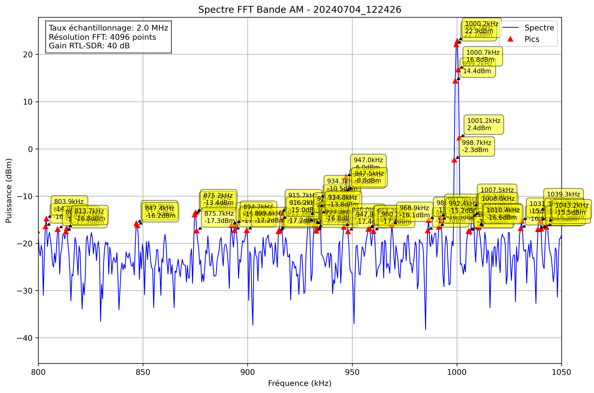

# Analyse Spectrale - 20240704_122426

## Paramètres

- Fréquence début: 800.0 kHz
- Fréquence fin: 1050.0 kHz
- Taux d'échantillonnage: 2.0 MHz
- Taille FFT: 4096 points
- Gain RTL-SDR: 40 dB

## Pics Détectés

| Fréquence (kHz) | Puissance (dBm) |
|-----------------|----------------|
| -75.0 | 0.5 |
| -74.5 | -2.7 |
| -74.0 | -12.7 |
| -57.4 | -15.2 |
| -56.9 | -14.9 |
| -56.4 | -16.3 |
| -55.0 | -17.4 |
| -38.9 | -16.4 |
| -38.4 | -16.2 |
| -37.9 | -15.7 |
| -37.4 | -16.0 |
| -27.1 | -17.4 |
| -13.0 | -17.4 |
| -9.1 | -17.3 |
| -8.6 | -14.8 |
| -8.1 | -15.8 |
| 21.7 | -16.8 |
| 22.2 | -16.9 |
| 38.8 | -16.9 |
| 42.7 | -17.5 |
| 58.8 | -17.3 |
| 74.4 | -15.1 |
| 74.9 | -9.6 |
| 75.4 | -11.5 |
| 77.8 | -17.5 |
| 92.5 | -16.7 |
| 97.9 | -16.1 |
| 98.3 | -16.8 |
| 99.8 | -17.3 |
| 114.9 | -17.2 |
| 115.4 | -16.8 |
| 120.3 | -17.4 |
| 127.6 | -16.0 |
| 128.1 | -15.2 |
| 138.9 | -13.7 |
| 139.4 | -8.1 |
| 139.8 | -8.2 |
| 140.3 | -3.0 |
| 140.8 | 1.0 |
| 141.3 | -2.6 |
| 141.8 | -6.2 |
| 142.3 | -10.5 |
| 142.8 | -12.6 |
| 143.3 | -14.4 |
| 143.8 | -15.9 |
| 155.0 | -16.6 |
| 157.9 | -15.4 |
| 158.4 | -13.3 |
| 158.9 | -11.9 |
| 159.4 | -10.8 |
| 161.3 | -15.1 |
| 171.6 | -14.7 |
| 172.1 | -13.5 |
| 183.3 | -13.5 |
| 183.8 | -13.9 |
| 184.3 | -11.4 |
| 185.3 | -16.6 |
| 188.2 | -16.2 |
| 189.6 | -17.3 |
| 205.8 | -16.6 |
| 206.2 | -17.0 |
| 217.0 | -16.3 |
| 217.5 | -15.9 |
| 224.8 | -15.2 |
| 225.3 | -14.8 |
| 232.6 | -17.4 |
| 237.5 | -17.0 |
| 242.9 | -17.4 |
| 243.4 | -16.7 |
| 249.7 | -17.2 |
| 261.4 | -17.4 |
| 261.9 | -16.3 |
| 266.3 | -17.2 |
| 266.8 | -16.1 |
| 276.1 | -17.0 |
| 276.6 | -15.7 |
| 277.1 | -16.4 |
| 277.5 | -16.9 |
| 278.0 | -13.3 |
| 278.5 | -15.9 |
| 293.7 | -14.3 |
| 294.1 | -15.6 |
| 295.6 | -17.1 |
| 296.1 | -16.1 |
| 296.6 | -17.3 |
| 298.5 | -17.5 |
| 299.0 | -17.2 |
| 334.2 | -15.0 |
| 374.2 | -9.5 |
| 374.7 | -1.6 |
| 375.2 | -0.5 |
| 375.7 | -6.7 |
| 384.5 | -16.6 |
| 385.0 | -16.7 |
| 386.9 | -16.6 |
| 387.4 | -15.8 |
| 387.9 | -15.9 |
| 399.1 | -9.2 |
| 399.6 | -1.6 |
| 400.1 | -0.3 |
| 400.6 | -5.3 |
| 401.1 | -15.7 |
| 412.8 | -17.0 |
| 436.2 | -16.8 |
| 436.7 | -16.6 |
| 482.6 | -16.8 |
| 483.1 | -13.1 |
| 483.6 | -11.4 |
| 484.1 | -12.6 |
| 484.6 | -16.8 |
| 524.1 | -15.9 |
| 524.6 | -7.2 |
| 525.1 | -5.0 |
| 525.6 | -9.5 |
| 542.7 | -15.9 |
| 543.2 | -16.6 |
| 543.7 | -16.9 |
| 544.1 | -17.3 |
| 545.1 | -17.4 |
| 545.6 | -16.7 |
| 546.1 | -17.5 |
| 563.2 | -17.1 |
| 594.4 | -17.4 |
| 602.2 | -17.1 |
| 602.7 | -15.6 |
| 603.2 | -17.0 |
| 615.4 | -14.2 |
| 615.9 | -11.4 |
| 616.4 | -13.6 |
| 634.0 | -17.5 |
| 647.2 | -17.1 |
| 647.7 | -17.2 |
| 682.3 | -16.3 |
| 698.9 | -16.4 |
| 699.4 | -4.8 |
| 699.9 | -1.0 |
| 700.4 | -3.9 |
| 700.9 | -14.1 |
| 735.5 | -16.7 |
| 739.5 | -17.4 |
| 739.9 | -14.9 |
| 740.4 | -12.9 |
| 740.9 | -13.0 |
| 741.4 | -15.9 |
| 765.3 | -15.1 |
| 765.8 | -12.3 |
| 766.3 | -14.0 |
| 766.8 | -16.8 |
| 783.9 | -16.2 |
| 784.4 | -15.3 |
| 799.5 | -17.3 |
| 803.4 | -16.4 |
| 803.9 | -14.8 |
| 809.3 | -17.0 |
| 813.2 | -17.5 |
| 813.7 | -16.8 |
| 846.9 | -15.8 |
| 847.4 | -16.2 |
| 874.7 | -13.9 |
| 875.2 | -13.4 |
| 875.7 | -17.3 |
| 892.3 | -16.2 |
| 893.8 | -17.2 |
| 894.2 | -15.9 |
| 899.6 | -17.2 |
| 914.7 | -17.5 |
| 915.2 | -17.2 |
| 915.7 | -13.4 |
| 916.2 | -15.0 |
| 928.9 | -15.5 |
| 929.4 | -14.1 |
| 931.8 | -16.0 |
| 932.3 | -16.1 |
| 932.8 | -17.3 |
| 933.3 | -16.8 |
| 933.8 | -12.5 |
| 934.3 | -10.5 |
| 934.8 | -13.8 |
| 946.0 | -16.5 |
| 946.5 | -9.1 |
| 947.0 | -6.0 |
| 947.5 | -8.8 |
| 947.9 | -17.4 |
| 957.7 | -16.9 |
| 958.2 | -16.8 |
| 960.2 | -17.4 |
| 968.9 | -16.1 |
| 986.0 | -17.3 |
| 986.5 | -15.0 |
| 991.4 | -16.5 |
| 991.9 | -14.4 |
| 992.4 | -15.2 |
| 998.7 | -2.3 |
| 999.2 | 14.4 |
| 999.7 | 22.1 |
| 1000.2 | 22.9 |
| 1000.7 | 16.8 |
| 1001.2 | 2.4 |
| 1005.6 | -17.4 |
| 1006.1 | -17.5 |
| 1007.0 | -14.5 |
| 1007.5 | -12.3 |
| 1008.0 | -14.1 |
| 1010.0 | -16.4 |
| 1010.4 | -16.6 |
| 1030.5 | -16.8 |
| 1031.0 | -15.2 |
| 1038.8 | -17.0 |
| 1039.3 | -13.2 |
| 1039.7 | -15.3 |
| 1040.2 | -16.9 |
| 1042.7 | -16.5 |
| 1043.2 | -15.5 |
| 1051.0 | -16.7 |
| 1051.5 | -16.9 |
| 1052.0 | -13.9 |
| 1052.4 | -6.7 |
| 1052.9 | -3.5 |
| 1053.4 | -6.1 |
| 1053.9 | -14.3 |
| 1057.3 | -16.4 |
| 1057.8 | -15.6 |
| 1062.2 | -17.3 |
| 1065.6 | -15.2 |
| 1066.1 | -16.7 |
| 1083.7 | -16.9 |
| 1084.2 | -17.0 |
| 1104.7 | -17.1 |
| 1105.7 | -11.5 |
| 1106.2 | -11.3 |
| 1106.6 | -15.3 |
| 1107.6 | -17.3 |
| 1108.1 | -16.4 |
| 1110.1 | -17.1 |
| 1110.5 | -17.0 |
| 1123.2 | -17.2 |
| 1123.7 | -15.4 |
| 1124.2 | -15.1 |
| 1124.7 | -14.6 |
| 1125.2 | -16.2 |
| 1156.9 | -16.4 |
| 1158.9 | -17.1 |
| 1211.6 | -15.0 |
| 1212.1 | -13.4 |
| 1215.5 | -15.9 |
| 1216.0 | -13.6 |
| 1216.5 | -15.3 |
| 1218.0 | -17.3 |
| 1232.1 | -16.5 |
| 1233.1 | -16.0 |
| 1233.6 | -12.7 |
| 1234.1 | -15.2 |
| 1234.6 | -12.2 |
| 1235.1 | -17.5 |
| 1235.5 | -16.1 |
| 1237.5 | -14.3 |
| 1238.0 | -12.9 |
| 1238.5 | -14.7 |
| 1239.0 | -16.4 |
| 1240.9 | -16.2 |
| 1241.4 | -16.0 |
| 1246.3 | -16.1 |
| 1246.8 | -12.3 |
| 1247.3 | -12.6 |
| 1247.8 | -14.0 |
| 1248.2 | -12.3 |
| 1248.7 | -14.6 |
| 1251.2 | -16.9 |
| 1258.5 | -12.5 |
| 1259.0 | -12.2 |
| 1259.5 | -12.2 |
| 1260.0 | -16.5 |
| 1260.4 | -14.0 |
| 1260.9 | -17.0 |
| 1264.4 | -13.2 |
| 1264.8 | -11.3 |
| 1265.3 | -16.4 |
| 1299.5 | -5.5 |
| 1300.0 | -1.6 |
| 1300.5 | -4.7 |
| 1301.0 | -15.7 |
| 1308.3 | -17.4 |
| 1308.8 | -15.2 |
| 1309.3 | -14.6 |
| 1310.3 | -17.2 |
| 1311.7 | -16.7 |
| 1312.2 | -14.5 |
| 1312.7 | -14.9 |
| 1317.1 | -17.5 |
| 1317.6 | -9.3 |
| 1318.1 | -9.0 |
| 1318.6 | -17.0 |
| 1323.9 | -14.0 |
| 1324.4 | -9.3 |
| 1324.9 | -6.1 |
| 1325.4 | -8.1 |
| 1325.9 | -16.0 |
| 1354.2 | -16.5 |
| 1354.7 | -17.4 |
| 1364.5 | -16.3 |
| 1365.4 | -15.7 |
| 1365.9 | -13.7 |
| 1370.3 | -11.3 |
| 1370.8 | -6.7 |
| 1371.3 | -9.1 |
| 1376.2 | -15.0 |
| 1376.7 | -13.6 |
| 1377.6 | -15.8 |
| 1378.1 | -13.8 |
| 1389.8 | -17.5 |
| 1405.5 | -16.5 |
| 1406.0 | -15.5 |
| 1406.4 | -15.1 |
| 1406.9 | -15.5 |
| 1415.7 | -16.1 |
| 1418.2 | -16.7 |
| 1421.1 | -16.3 |
| 1421.6 | -17.3 |
| 1423.0 | -14.3 |
| 1423.5 | -8.0 |
| 1424.0 | -8.4 |
| 1433.8 | -17.3 |
| 1448.9 | -16.8 |
| 1449.4 | -17.4 |
| 1468.9 | -17.0 |
| 1469.4 | -16.4 |
| 1473.8 | -13.7 |
| 1474.3 | -4.5 |
| 1474.8 | 0.3 |
| 1475.3 | -1.1 |
| 1475.8 | -9.0 |
| 1476.3 | -16.9 |
| 1476.8 | -9.8 |
| 1477.2 | -10.5 |
| 1477.7 | -16.2 |
| 1480.2 | -16.7 |
| 1483.1 | -16.2 |
| 1483.6 | -16.7 |
| 1486.0 | -17.4 |
| 1492.9 | -17.5 |
| 1493.4 | -16.8 |
| 1493.8 | -16.3 |
| 1494.3 | -17.4 |
| 1495.8 | -17.0 |
| 1496.3 | -15.3 |
| 1502.1 | -17.4 |
| 1513.4 | -17.0 |
| 1514.8 | -16.7 |
| 1515.3 | -15.7 |
| 1515.8 | -16.0 |
| 1516.3 | -17.3 |
| 1516.8 | -16.6 |
| 1519.7 | -17.0 |
| 1520.2 | -15.8 |
| 1529.0 | -16.5 |
| 1529.5 | -13.2 |
| 1530.0 | -14.1 |
| 1540.2 | -14.9 |
| 1540.7 | -11.5 |
| 1541.2 | -14.9 |
| 1557.8 | -16.9 |
| 1558.3 | -14.7 |
| 1558.8 | -14.7 |
| 1572.0 | -14.9 |
| 1577.8 | -17.3 |
| 1578.3 | -16.6 |
| 1582.7 | -14.4 |
| 1583.7 | -16.9 |
| 1584.2 | -14.6 |
| 1584.7 | -15.0 |
| 1585.2 | -16.6 |
| 1590.0 | -17.3 |
| 1599.3 | -12.6 |
| 1599.8 | -6.8 |
| 1600.3 | -7.4 |
| 1600.8 | -16.0 |
| 1624.7 | -12.7 |
| 1625.2 | -12.7 |
| 1628.6 | -17.4 |
| 1635.4 | -15.8 |
| 1635.9 | -17.1 |
| 1645.7 | -16.0 |
| 1646.2 | -15.0 |
| 1657.4 | -17.3 |
| 1665.2 | -16.1 |
| 1665.7 | -10.1 |
| 1666.2 | -11.8 |
| 1666.7 | -15.7 |
| 1668.2 | -16.4 |
| 1677.9 | -14.2 |
| 1678.4 | -16.9 |
| 1684.3 | -15.9 |
| 1734.6 | -15.5 |
| 1735.1 | -15.7 |
| 1735.5 | -16.7 |
| 1741.9 | -17.1 |
| 1774.1 | -14.4 |
| 1774.6 | -8.4 |
| 1775.1 | -7.6 |
| 1775.6 | -12.8 |
| 1780.5 | -15.8 |
| 1781.0 | -17.1 |
| 1782.9 | -16.5 |
| 1788.3 | -14.9 |
| 1788.8 | -16.7 |
| 1797.1 | -16.5 |
| 1797.6 | -15.8 |
| 1798.0 | -17.3 |
| 1810.3 | -15.5 |
| 1819.0 | -17.1 |
| 1819.5 | -16.4 |
| 1822.5 | -17.0 |
| 1822.9 | -15.7 |
| 1827.3 | -15.8 |
| 1827.8 | -14.8 |
| 1834.2 | -15.4 |
| 1834.7 | -17.2 |
| 1839.6 | -15.9 |
| 1840.0 | -16.4 |
| 1855.2 | -16.5 |
| 1855.7 | -17.3 |
| 1856.6 | -17.4 |
| 1858.1 | -17.4 |
| 1858.6 | -14.2 |
| 1859.1 | -13.7 |
| 1859.6 | -17.3 |
| 1864.0 | -16.7 |
| 1871.8 | -15.6 |
| 1872.3 | -13.0 |
| 1872.8 | -12.9 |
| 1873.2 | -15.3 |
| 1882.0 | -17.4 |
| 1889.8 | -15.6 |
| 1895.7 | -16.1 |
| 1906.9 | -16.4 |
| 1907.4 | -17.4 |
| 1924.0 | -13.1 |
| 1924.5 | -2.9 |
