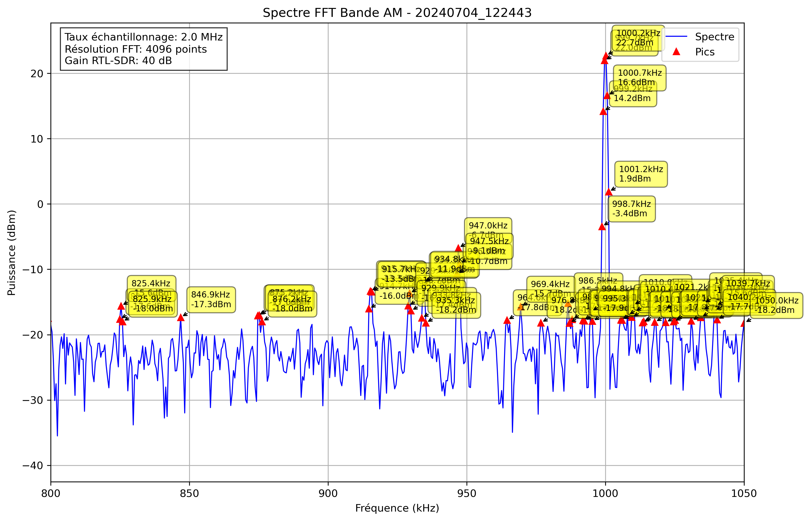

# Analyse Spectrale - 20240704_122443

## Paramètres

- Fréquence début: 800.0 kHz
- Fréquence fin: 1050.0 kHz
- Taux d'échantillonnage: 2.0 MHz
- Taille FFT: 4096 points
- Gain RTL-SDR: 40 dB

## Pics Détectés

| Fréquence (kHz) | Puissance (dBm) |
|-----------------|----------------|
| -75.0 | 0.4 |
| -74.5 | -3.0 |
| -74.0 | -14.2 |
| -70.1 | -17.7 |
| -55.5 | -17.8 |
| -55.0 | -16.6 |
| -54.5 | -17.6 |
| -38.4 | -17.7 |
| -37.9 | -16.7 |
| -37.4 | -17.2 |
| -2.7 | -17.4 |
| 15.8 | -17.8 |
| 21.7 | -16.0 |
| 22.2 | -16.6 |
| 28.0 | -18.2 |
| 28.5 | -16.7 |
| 48.5 | -18.0 |
| 49.0 | -18.0 |
| 74.4 | -12.2 |
| 74.9 | -7.5 |
| 75.4 | -9.4 |
| 84.2 | -18.0 |
| 92.5 | -15.8 |
| 93.0 | -15.1 |
| 93.5 | -17.5 |
| 99.8 | -17.8 |
| 100.3 | -18.1 |
| 114.5 | -16.6 |
| 114.9 | -14.3 |
| 115.4 | -15.8 |
| 115.9 | -17.1 |
| 127.1 | -17.6 |
| 127.6 | -15.0 |
| 128.1 | -15.1 |
| 138.9 | -12.3 |
| 139.4 | -6.2 |
| 139.8 | -2.3 |
| 140.3 | 0.6 |
| 140.8 | -1.3 |
| 141.3 | -7.5 |
| 141.8 | -11.1 |
| 142.3 | -15.0 |
| 142.8 | -16.6 |
| 154.5 | -16.2 |
| 155.0 | -16.1 |
| 158.9 | -13.5 |
| 159.4 | -10.4 |
| 159.9 | -12.2 |
| 160.4 | -14.3 |
| 160.8 | -16.1 |
| 161.3 | -17.1 |
| 165.2 | -15.7 |
| 165.7 | -15.9 |
| 171.6 | -15.1 |
| 172.1 | -13.3 |
| 172.6 | -16.4 |
| 183.3 | -16.1 |
| 183.8 | -14.6 |
| 184.3 | -15.5 |
| 184.8 | -14.1 |
| 185.3 | -16.4 |
| 211.1 | -18.2 |
| 224.8 | -16.3 |
| 225.3 | -17.5 |
| 328.8 | -18.1 |
| 329.3 | -18.2 |
| 334.2 | -14.3 |
| 334.7 | -13.9 |
| 335.2 | -15.8 |
| 342.0 | -17.3 |
| 346.9 | -16.5 |
| 374.2 | -9.1 |
| 374.7 | -1.4 |
| 375.2 | -0.3 |
| 375.7 | -6.5 |
| 399.1 | -9.3 |
| 399.6 | -1.6 |
| 400.1 | -0.3 |
| 400.6 | -5.4 |
| 401.1 | -17.6 |
| 412.3 | -18.1 |
| 435.3 | -17.7 |
| 436.2 | -16.9 |
| 436.7 | -17.4 |
| 483.1 | -16.8 |
| 483.6 | -16.6 |
| 484.1 | -15.8 |
| 484.6 | -13.3 |
| 485.1 | -15.0 |
| 485.5 | -15.9 |
| 501.7 | -17.5 |
| 524.1 | -17.2 |
| 524.6 | -8.5 |
| 525.1 | -6.4 |
| 525.6 | -11.4 |
| 545.1 | -17.6 |
| 593.9 | -17.1 |
| 594.4 | -14.6 |
| 594.9 | -17.1 |
| 614.5 | -15.9 |
| 614.9 | -14.8 |
| 615.4 | -11.7 |
| 615.9 | -14.0 |
| 616.4 | -18.1 |
| 634.0 | -15.9 |
| 634.5 | -15.4 |
| 635.0 | -17.4 |
| 646.7 | -18.1 |
| 647.2 | -16.6 |
| 693.1 | -18.0 |
| 698.9 | -15.4 |
| 699.4 | -5.1 |
| 699.9 | -0.9 |
| 700.4 | -3.1 |
| 700.9 | -11.6 |
| 724.8 | -15.7 |
| 725.3 | -17.7 |
| 739.5 | -17.0 |
| 739.9 | -14.0 |
| 740.4 | -12.9 |
| 740.9 | -14.9 |
| 742.4 | -18.1 |
| 742.9 | -17.1 |
| 752.6 | -17.2 |
| 753.1 | -18.2 |
| 759.0 | -17.7 |
| 759.5 | -18.0 |
| 764.8 | -16.8 |
| 765.3 | -12.7 |
| 765.8 | -15.2 |
| 784.4 | -15.3 |
| 784.9 | -13.9 |
| 785.4 | -15.1 |
| 799.0 | -17.5 |
| 824.9 | -17.6 |
| 825.4 | -15.6 |
| 825.9 | -18.0 |
| 846.9 | -17.3 |
| 874.7 | -17.1 |
| 875.2 | -17.0 |
| 876.2 | -18.0 |
| 914.7 | -16.0 |
| 915.2 | -13.3 |
| 915.7 | -13.5 |
| 928.9 | -15.6 |
| 929.4 | -13.7 |
| 929.9 | -16.3 |
| 933.8 | -17.4 |
| 934.3 | -12.1 |
| 934.8 | -11.9 |
| 935.3 | -18.2 |
| 946.5 | -10.7 |
| 947.0 | -6.7 |
| 947.5 | -9.1 |
| 964.6 | -17.8 |
| 969.4 | -15.7 |
| 976.8 | -18.2 |
| 986.5 | -15.2 |
| 987.0 | -18.2 |
| 988.0 | -17.7 |
| 991.9 | -17.8 |
| 992.4 | -17.9 |
| 994.8 | -16.4 |
| 995.3 | -17.9 |
| 998.7 | -3.4 |
| 999.2 | 14.2 |
| 999.7 | 22.0 |
| 1000.2 | 22.7 |
| 1000.7 | 16.6 |
| 1001.2 | 1.9 |
| 1005.6 | -17.7 |
| 1006.1 | -17.8 |
| 1008.0 | -17.0 |
| 1009.5 | -17.3 |
| 1010.0 | -15.5 |
| 1010.4 | -16.5 |
| 1013.4 | -18.2 |
| 1013.9 | -18.0 |
| 1017.8 | -18.1 |
| 1021.2 | -16.2 |
| 1021.7 | -18.1 |
| 1024.6 | -18.0 |
| 1025.1 | -17.8 |
| 1031.0 | -17.9 |
| 1034.4 | -17.3 |
| 1034.9 | -16.3 |
| 1035.4 | -15.2 |
| 1039.3 | -16.3 |
| 1039.7 | -15.6 |
| 1040.2 | -17.7 |
| 1050.0 | -18.2 |
| 1052.4 | -8.1 |
| 1052.9 | -3.8 |
| 1053.4 | -6.1 |
| 1053.9 | -15.1 |
| 1065.1 | -16.7 |
| 1065.6 | -16.4 |
| 1068.6 | -18.0 |
| 1069.0 | -17.6 |
| 1083.7 | -17.6 |
| 1084.2 | -17.9 |
| 1084.7 | -14.3 |
| 1085.2 | -16.7 |
| 1085.6 | -17.6 |
| 1104.7 | -17.3 |
| 1105.7 | -12.3 |
| 1106.2 | -11.6 |
| 1106.6 | -16.9 |
| 1123.7 | -18.1 |
| 1124.2 | -16.4 |
| 1125.2 | -16.0 |
| 1136.9 | -18.2 |
| 1156.9 | -18.1 |
| 1158.4 | -16.9 |
| 1158.9 | -14.8 |
| 1183.8 | -17.7 |
| 1187.2 | -18.1 |
| 1211.6 | -15.8 |
| 1212.1 | -14.3 |
| 1215.0 | -16.3 |
| 1215.5 | -18.2 |
| 1216.0 | -15.7 |
| 1217.5 | -18.2 |
| 1228.2 | -16.7 |
| 1234.1 | -17.6 |
| 1234.6 | -12.5 |
| 1235.1 | -14.5 |
| 1246.8 | -16.8 |
| 1247.3 | -17.6 |
| 1258.0 | -18.1 |
| 1258.5 | -18.1 |
| 1259.0 | -16.9 |
| 1259.5 | -10.6 |
| 1260.0 | -11.3 |
| 1260.4 | -12.1 |
| 1260.9 | -16.4 |
| 1264.4 | -13.2 |
| 1264.8 | -10.4 |
| 1265.3 | -14.3 |
| 1274.6 | -17.5 |
| 1275.1 | -18.0 |
| 1279.5 | -18.2 |
| 1298.5 | -18.0 |
| 1299.0 | -13.2 |
| 1299.5 | -4.2 |
| 1300.0 | -0.7 |
| 1300.5 | -3.3 |
| 1301.0 | -12.2 |
| 1302.4 | -17.8 |
| 1309.3 | -17.8 |
| 1311.7 | -16.7 |
| 1312.7 | -17.4 |
| 1317.1 | -14.7 |
| 1317.6 | -8.5 |
| 1318.1 | -8.5 |
| 1318.6 | -16.4 |
| 1321.0 | -17.8 |
| 1324.4 | -11.6 |
| 1324.9 | -7.0 |
| 1325.4 | -9.5 |
| 1326.4 | -17.1 |
| 1364.5 | -15.6 |
| 1364.9 | -13.5 |
| 1365.4 | -12.9 |
| 1365.9 | -14.3 |
| 1369.3 | -18.0 |
| 1370.3 | -9.9 |
| 1370.8 | -5.4 |
| 1371.3 | -8.2 |
| 1378.1 | -17.2 |
| 1389.8 | -17.9 |
| 1403.0 | -18.1 |
| 1418.2 | -17.0 |
| 1418.7 | -17.8 |
| 1421.1 | -17.4 |
| 1421.6 | -16.6 |
| 1422.1 | -16.9 |
| 1423.0 | -17.4 |
| 1423.5 | -8.1 |
| 1424.0 | -7.7 |
| 1424.5 | -15.1 |
| 1443.6 | -16.3 |
| 1444.0 | -13.7 |
| 1444.5 | -17.5 |
| 1445.0 | -16.8 |
| 1451.9 | -15.7 |
| 1452.3 | -17.6 |
| 1459.2 | -17.5 |
| 1468.9 | -17.6 |
| 1469.4 | -18.1 |
| 1473.8 | -15.0 |
| 1474.3 | -4.7 |
| 1474.8 | 0.2 |
| 1475.3 | -1.3 |
| 1475.8 | -10.0 |
| 1476.3 | -13.8 |
| 1476.8 | -8.9 |
| 1477.2 | -10.8 |
| 1477.7 | -16.2 |
| 1514.8 | -15.2 |
| 1515.3 | -14.3 |
| 1515.8 | -16.3 |
| 1529.0 | -15.9 |
| 1529.5 | -12.3 |
| 1530.0 | -12.2 |
| 1530.5 | -16.7 |
| 1539.7 | -17.3 |
| 1540.2 | -13.3 |
| 1540.7 | -13.1 |
| 1541.2 | -17.3 |
| 1557.8 | -16.4 |
| 1558.3 | -17.9 |
| 1559.3 | -17.2 |
| 1559.8 | -15.6 |
| 1560.3 | -15.0 |
| 1572.0 | -17.4 |
| 1572.5 | -17.4 |
| 1573.4 | -17.4 |
| 1582.2 | -18.1 |
| 1582.7 | -14.4 |
| 1583.2 | -17.1 |
| 1599.8 | -9.3 |
| 1600.3 | -9.0 |
| 1610.1 | -17.9 |
| 1624.7 | -17.9 |
| 1664.3 | -17.4 |
| 1664.7 | -16.3 |
| 1665.2 | -12.6 |
| 1665.7 | -11.8 |
| 1666.2 | -16.2 |
| 1677.9 | -16.0 |
| 1684.8 | -15.5 |
| 1685.3 | -16.5 |
| 1685.7 | -18.0 |
| 1704.3 | -17.6 |
| 1734.6 | -15.7 |
| 1735.1 | -15.0 |
| 1735.5 | -16.9 |
| 1748.2 | -16.1 |
| 1748.7 | -17.8 |
| 1774.1 | -13.2 |
| 1774.6 | -7.7 |
| 1775.1 | -6.7 |
| 1775.6 | -11.1 |
| 1810.3 | -17.2 |
| 1827.3 | -17.3 |
| 1827.8 | -15.3 |
| 1828.3 | -17.8 |
| 1834.7 | -18.0 |
| 1845.9 | -18.2 |
| 1846.9 | -17.4 |
| 1854.7 | -16.8 |
| 1855.2 | -16.1 |
| 1859.1 | -15.8 |
| 1859.6 | -14.3 |
| 1871.8 | -16.6 |
| 1872.3 | -18.1 |
| 1880.1 | -17.8 |
| 1885.0 | -17.8 |
| 1896.2 | -17.6 |
| 1906.9 | -17.0 |
| 1907.4 | -16.4 |
| 1909.9 | -17.9 |
| 1910.4 | -17.7 |
| 1924.0 | -15.4 |
| 1924.5 | -3.1 |
