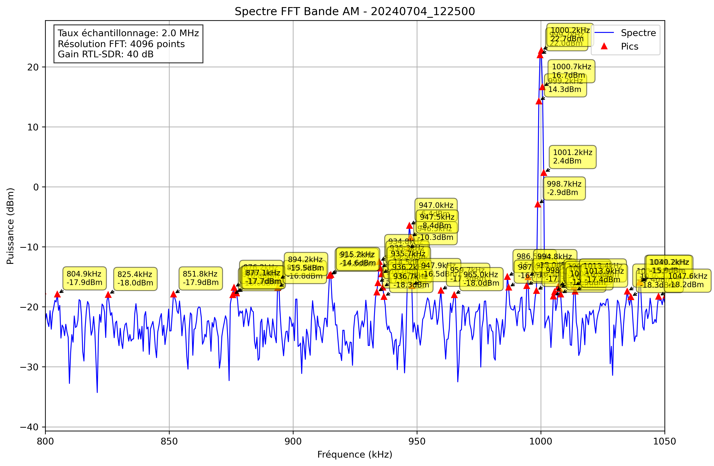

# Analyse Spectrale - 20240704_122500

## Paramètres

- Fréquence début: 800.0 kHz
- Fréquence fin: 1050.0 kHz
- Taux d'échantillonnage: 2.0 MHz
- Taille FFT: 4096 points
- Gain RTL-SDR: 40 dB

## Pics Détectés

| Fréquence (kHz) | Puissance (dBm) |
|-----------------|----------------|
| -75.0 | 1.1 |
| -74.5 | -2.3 |
| -74.0 | -13.5 |
| -54.5 | -17.6 |
| -54.0 | -17.3 |
| -37.9 | -17.3 |
| -23.7 | -17.5 |
| -13.0 | -17.8 |
| -4.2 | -17.6 |
| 21.7 | -15.9 |
| 22.2 | -16.4 |
| 38.8 | -17.0 |
| 39.3 | -17.7 |
| 48.5 | -16.0 |
| 67.6 | -18.2 |
| 73.9 | -18.0 |
| 74.4 | -12.0 |
| 74.9 | -7.3 |
| 75.4 | -9.5 |
| 75.9 | -18.3 |
| 99.8 | -18.0 |
| 100.3 | -18.0 |
| 101.8 | -16.5 |
| 102.2 | -17.0 |
| 114.5 | -17.5 |
| 114.9 | -16.7 |
| 115.4 | -17.4 |
| 126.7 | -17.7 |
| 127.1 | -16.2 |
| 127.6 | -14.6 |
| 128.1 | -15.0 |
| 136.9 | -17.1 |
| 137.4 | -16.1 |
| 137.9 | -14.6 |
| 138.4 | -9.6 |
| 138.9 | -4.4 |
| 139.4 | -1.2 |
| 139.8 | -1.5 |
| 140.3 | -3.3 |
| 140.8 | -11.0 |
| 141.3 | -15.2 |
| 141.8 | -16.9 |
| 154.5 | -17.3 |
| 159.9 | -14.6 |
| 160.4 | -12.1 |
| 160.8 | -11.9 |
| 161.3 | -13.9 |
| 164.3 | -17.7 |
| 164.7 | -16.8 |
| 165.2 | -15.8 |
| 165.7 | -16.2 |
| 171.6 | -17.9 |
| 172.1 | -15.4 |
| 172.6 | -18.0 |
| 184.8 | -13.7 |
| 185.3 | -12.6 |
| 185.7 | -14.2 |
| 224.8 | -14.7 |
| 225.3 | -16.3 |
| 244.3 | -18.2 |
| 277.5 | -16.9 |
| 278.0 | -17.0 |
| 329.3 | -17.6 |
| 335.2 | -17.8 |
| 335.6 | -16.6 |
| 361.0 | -17.6 |
| 361.5 | -16.4 |
| 374.2 | -8.7 |
| 374.7 | -0.9 |
| 375.2 | 0.2 |
| 375.7 | -5.3 |
| 376.2 | -17.4 |
| 386.9 | -18.1 |
| 399.1 | -11.0 |
| 399.6 | -2.3 |
| 400.1 | -0.7 |
| 400.6 | -5.6 |
| 401.1 | -17.1 |
| 436.2 | -18.3 |
| 447.5 | -17.2 |
| 447.9 | -17.6 |
| 482.6 | -17.1 |
| 483.1 | -17.9 |
| 483.6 | -18.2 |
| 484.1 | -17.2 |
| 484.6 | -14.3 |
| 485.1 | -14.0 |
| 485.5 | -15.2 |
| 486.0 | -16.5 |
| 486.5 | -17.0 |
| 524.6 | -9.3 |
| 525.1 | -6.7 |
| 525.6 | -12.0 |
| 541.2 | -18.0 |
| 545.1 | -18.2 |
| 576.4 | -17.7 |
| 577.8 | -18.2 |
| 595.9 | -17.9 |
| 613.5 | -16.3 |
| 614.0 | -14.5 |
| 614.5 | -12.4 |
| 614.9 | -13.5 |
| 615.4 | -16.2 |
| 629.1 | -18.2 |
| 635.0 | -18.3 |
| 635.4 | -18.0 |
| 635.9 | -18.0 |
| 675.0 | -18.1 |
| 698.9 | -14.8 |
| 699.4 | -5.3 |
| 699.9 | -1.3 |
| 700.4 | -3.3 |
| 700.9 | -11.1 |
| 724.8 | -13.5 |
| 725.3 | -15.7 |
| 739.0 | -16.7 |
| 739.5 | -17.1 |
| 739.9 | -18.1 |
| 752.6 | -18.3 |
| 758.5 | -17.6 |
| 763.9 | -17.8 |
| 764.4 | -15.6 |
| 764.8 | -17.6 |
| 765.3 | -17.1 |
| 785.4 | -16.8 |
| 785.8 | -16.4 |
| 786.3 | -18.2 |
| 798.5 | -17.4 |
| 799.0 | -17.3 |
| 804.9 | -17.9 |
| 825.4 | -18.0 |
| 851.8 | -17.9 |
| 875.7 | -18.0 |
| 876.2 | -16.8 |
| 876.7 | -17.7 |
| 877.1 | -17.7 |
| 893.8 | -16.8 |
| 894.2 | -15.5 |
| 914.7 | -14.8 |
| 915.2 | -14.6 |
| 933.8 | -17.6 |
| 934.3 | -16.0 |
| 934.8 | -12.5 |
| 935.3 | -13.5 |
| 935.7 | -14.5 |
| 936.2 | -16.7 |
| 936.7 | -18.3 |
| 946.5 | -10.3 |
| 947.0 | -6.4 |
| 947.5 | -8.4 |
| 947.9 | -16.5 |
| 959.7 | -17.3 |
| 965.0 | -18.0 |
| 986.5 | -15.0 |
| 987.0 | -16.7 |
| 994.3 | -16.5 |
| 994.8 | -15.0 |
| 998.2 | -17.3 |
| 998.7 | -2.9 |
| 999.2 | 14.3 |
| 999.7 | 22.0 |
| 1000.2 | 22.7 |
| 1000.7 | 16.7 |
| 1001.2 | 2.4 |
| 1005.1 | -18.2 |
| 1005.6 | -17.5 |
| 1007.0 | -16.6 |
| 1007.5 | -16.9 |
| 1008.0 | -17.9 |
| 1013.4 | -16.5 |
| 1013.9 | -17.4 |
| 1034.9 | -17.4 |
| 1036.3 | -18.3 |
| 1039.7 | -15.9 |
| 1040.2 | -15.9 |
| 1047.6 | -18.2 |
| 1050.5 | -18.0 |
| 1051.0 | -16.1 |
| 1051.5 | -17.2 |
| 1052.4 | -8.9 |
| 1052.9 | -4.2 |
| 1053.4 | -6.8 |
| 1053.9 | -17.4 |
| 1064.2 | -17.0 |
| 1064.6 | -17.1 |
| 1065.6 | -17.9 |
| 1082.7 | -18.3 |
| 1083.2 | -16.9 |
| 1083.7 | -16.9 |
| 1085.6 | -16.1 |
| 1086.1 | -16.7 |
| 1104.2 | -16.4 |
| 1104.7 | -17.3 |
| 1105.7 | -13.5 |
| 1106.2 | -12.7 |
| 1106.6 | -16.2 |
| 1124.7 | -15.0 |
| 1125.2 | -13.3 |
| 1125.7 | -17.5 |
| 1156.9 | -16.0 |
| 1157.4 | -18.3 |
| 1158.4 | -16.5 |
| 1158.9 | -14.6 |
| 1186.7 | -18.0 |
| 1187.2 | -17.8 |
| 1211.6 | -17.7 |
| 1212.1 | -15.2 |
| 1212.6 | -17.7 |
| 1214.1 | -18.3 |
| 1214.6 | -17.1 |
| 1215.0 | -16.7 |
| 1220.9 | -18.3 |
| 1234.6 | -16.7 |
| 1235.1 | -13.1 |
| 1235.5 | -13.3 |
| 1236.0 | -13.7 |
| 1236.5 | -15.6 |
| 1246.8 | -16.4 |
| 1247.3 | -17.8 |
| 1259.5 | -13.8 |
| 1260.0 | -10.6 |
| 1260.4 | -9.0 |
| 1260.9 | -11.5 |
| 1261.4 | -17.6 |
| 1264.4 | -17.8 |
| 1264.8 | -14.1 |
| 1265.3 | -16.8 |
| 1272.2 | -17.2 |
| 1272.7 | -17.2 |
| 1279.5 | -17.9 |
| 1283.4 | -18.3 |
| 1283.9 | -17.9 |
| 1298.5 | -17.0 |
| 1299.0 | -13.6 |
| 1299.5 | -5.3 |
| 1300.0 | -1.6 |
| 1300.5 | -3.9 |
| 1301.0 | -11.6 |
| 1301.5 | -17.3 |
| 1302.0 | -16.0 |
| 1302.4 | -14.9 |
| 1302.9 | -16.2 |
| 1303.4 | -18.2 |
| 1311.7 | -17.8 |
| 1317.1 | -12.5 |
| 1317.6 | -7.2 |
| 1318.1 | -7.7 |
| 1318.6 | -15.1 |
| 1324.4 | -13.9 |
| 1324.9 | -7.1 |
| 1325.4 | -9.1 |
| 1363.5 | -18.3 |
| 1364.9 | -15.2 |
| 1365.4 | -15.2 |
| 1365.9 | -15.8 |
| 1370.3 | -9.6 |
| 1370.8 | -5.4 |
| 1371.3 | -8.2 |
| 1371.8 | -16.8 |
| 1422.1 | -18.2 |
| 1423.0 | -14.0 |
| 1423.5 | -6.8 |
| 1424.0 | -6.9 |
| 1424.5 | -14.2 |
| 1426.0 | -17.3 |
| 1426.5 | -15.7 |
| 1427.0 | -16.9 |
| 1434.8 | -16.4 |
| 1435.3 | -15.8 |
| 1435.7 | -17.9 |
| 1441.1 | -18.1 |
| 1441.6 | -17.3 |
| 1443.6 | -18.1 |
| 1444.0 | -18.0 |
| 1445.5 | -17.8 |
| 1446.0 | -16.6 |
| 1469.4 | -18.0 |
| 1471.4 | -16.7 |
| 1471.9 | -17.8 |
| 1474.3 | -5.5 |
| 1474.8 | 0.1 |
| 1475.3 | -1.0 |
| 1475.8 | -9.5 |
| 1476.3 | -12.1 |
| 1476.8 | -7.8 |
| 1477.2 | -10.0 |
| 1477.7 | -15.1 |
| 1491.4 | -18.2 |
| 1514.8 | -15.6 |
| 1515.3 | -16.3 |
| 1527.1 | -18.0 |
| 1527.5 | -18.1 |
| 1529.0 | -17.9 |
| 1529.5 | -11.2 |
| 1530.0 | -10.6 |
| 1530.5 | -15.2 |
| 1539.3 | -17.8 |
| 1539.7 | -15.4 |
| 1540.2 | -15.2 |
| 1547.1 | -17.9 |
| 1559.3 | -18.0 |
| 1559.8 | -16.2 |
| 1560.3 | -15.3 |
| 1572.0 | -17.6 |
| 1572.5 | -17.9 |
| 1575.4 | -16.9 |
| 1575.9 | -18.0 |
| 1582.2 | -16.1 |
| 1582.7 | -13.6 |
| 1583.2 | -16.9 |
| 1597.9 | -17.9 |
| 1599.3 | -15.2 |
| 1599.8 | -8.1 |
| 1600.3 | -7.9 |
| 1600.8 | -14.7 |
| 1624.2 | -18.3 |
| 1624.7 | -16.7 |
| 1628.6 | -18.2 |
| 1629.1 | -17.4 |
| 1635.4 | -18.0 |
| 1636.9 | -17.2 |
| 1637.4 | -17.6 |
| 1663.8 | -15.0 |
| 1664.3 | -12.1 |
| 1664.7 | -12.7 |
| 1665.2 | -14.1 |
| 1677.4 | -17.6 |
| 1677.9 | -14.5 |
| 1685.3 | -17.8 |
| 1704.3 | -17.4 |
| 1716.5 | -18.2 |
| 1721.9 | -18.0 |
| 1734.6 | -17.1 |
| 1735.1 | -14.2 |
| 1735.5 | -14.9 |
| 1741.4 | -17.2 |
| 1741.9 | -17.9 |
| 1757.5 | -18.3 |
| 1774.1 | -15.8 |
| 1774.6 | -8.4 |
| 1775.1 | -6.8 |
| 1775.6 | -10.9 |
| 1777.1 | -17.1 |
| 1777.5 | -18.1 |
| 1801.0 | -17.3 |
| 1827.8 | -17.8 |
| 1828.3 | -18.1 |
| 1859.1 | -17.7 |
| 1859.6 | -14.6 |
| 1860.1 | -15.6 |
| 1877.1 | -16.6 |
| 1877.6 | -17.7 |
| 1924.0 | -14.3 |
| 1924.5 | -2.3 |
