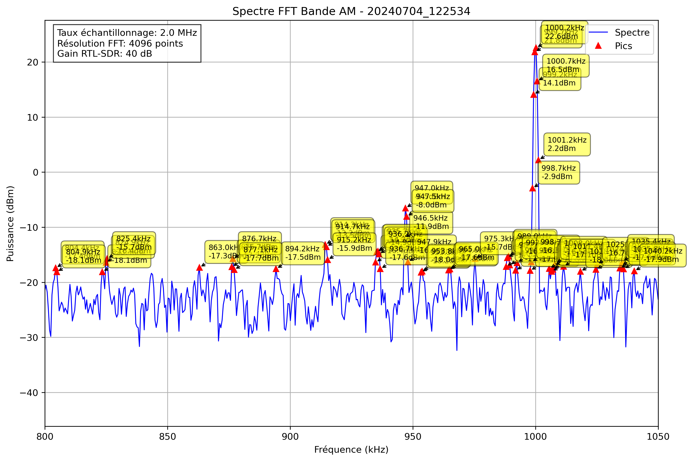

# Analyse Spectrale - 20240704_122534

## Paramètres

- Fréquence début: 800.0 kHz
- Fréquence fin: 1050.0 kHz
- Taux d'échantillonnage: 2.0 MHz
- Taille FFT: 4096 points
- Gain RTL-SDR: 40 dB

## Pics Détectés

| Fréquence (kHz) | Puissance (dBm) |
|-----------------|----------------|
| -75.0 | 1.6 |
| -74.5 | -1.8 |
| -74.0 | -12.2 |
| -55.5 | -17.8 |
| -4.7 | -16.0 |
| -4.2 | -16.1 |
| 22.2 | -15.4 |
| 22.7 | -17.8 |
| 28.5 | -17.5 |
| 29.0 | -15.2 |
| 29.5 | -16.8 |
| 58.8 | -17.9 |
| 74.4 | -11.7 |
| 74.9 | -6.2 |
| 75.4 | -7.6 |
| 75.9 | -15.5 |
| 99.8 | -17.6 |
| 100.3 | -16.3 |
| 101.3 | -16.9 |
| 101.8 | -16.1 |
| 112.5 | -17.4 |
| 114.9 | -17.4 |
| 115.4 | -17.8 |
| 127.6 | -17.2 |
| 128.1 | -17.1 |
| 133.5 | -18.1 |
| 134.0 | -17.9 |
| 137.9 | -13.1 |
| 138.4 | -6.2 |
| 138.9 | -5.0 |
| 139.4 | -1.2 |
| 139.8 | -2.7 |
| 140.3 | -6.3 |
| 140.8 | -10.3 |
| 141.3 | -13.4 |
| 141.8 | -15.5 |
| 145.2 | -16.1 |
| 159.9 | -15.9 |
| 160.4 | -11.8 |
| 160.8 | -12.1 |
| 161.3 | -13.6 |
| 161.8 | -16.0 |
| 165.2 | -17.6 |
| 171.6 | -17.4 |
| 172.1 | -14.5 |
| 172.6 | -16.5 |
| 184.3 | -16.7 |
| 184.8 | -15.1 |
| 185.3 | -13.1 |
| 185.7 | -14.6 |
| 186.2 | -17.5 |
| 186.7 | -18.3 |
| 204.8 | -17.6 |
| 278.0 | -16.7 |
| 335.2 | -16.4 |
| 335.6 | -14.4 |
| 336.1 | -17.4 |
| 336.6 | -18.0 |
| 374.2 | -9.6 |
| 374.7 | -1.1 |
| 375.2 | 0.1 |
| 375.7 | -5.4 |
| 399.1 | -10.1 |
| 399.6 | -1.9 |
| 400.1 | -0.5 |
| 400.6 | -5.6 |
| 401.1 | -18.1 |
| 427.9 | -17.7 |
| 469.9 | -17.5 |
| 470.4 | -17.8 |
| 478.2 | -18.2 |
| 484.6 | -17.6 |
| 485.5 | -15.3 |
| 486.0 | -16.3 |
| 486.5 | -18.2 |
| 524.6 | -9.1 |
| 525.1 | -6.3 |
| 525.6 | -10.2 |
| 577.8 | -17.5 |
| 578.3 | -18.3 |
| 613.0 | -18.0 |
| 613.5 | -15.0 |
| 614.0 | -15.4 |
| 614.5 | -13.4 |
| 614.9 | -15.6 |
| 629.6 | -17.1 |
| 636.4 | -16.9 |
| 672.1 | -17.6 |
| 672.6 | -17.7 |
| 698.9 | -17.6 |
| 699.4 | -6.0 |
| 699.9 | -1.8 |
| 700.4 | -4.2 |
| 700.9 | -13.2 |
| 724.3 | -17.6 |
| 724.8 | -12.5 |
| 725.3 | -13.0 |
| 739.9 | -17.1 |
| 740.4 | -18.1 |
| 744.3 | -17.4 |
| 744.8 | -17.3 |
| 752.6 | -16.7 |
| 753.1 | -16.9 |
| 763.9 | -16.3 |
| 764.4 | -15.2 |
| 764.8 | -13.7 |
| 765.3 | -14.2 |
| 765.8 | -18.0 |
| 784.9 | -18.0 |
| 785.4 | -17.3 |
| 785.8 | -17.3 |
| 804.4 | -17.4 |
| 804.9 | -18.1 |
| 823.4 | -18.1 |
| 824.9 | -16.4 |
| 825.4 | -15.7 |
| 863.0 | -17.3 |
| 876.2 | -17.2 |
| 876.7 | -15.7 |
| 877.1 | -17.7 |
| 894.2 | -17.5 |
| 914.3 | -13.2 |
| 914.7 | -13.5 |
| 915.2 | -15.9 |
| 934.8 | -16.4 |
| 935.3 | -14.5 |
| 935.7 | -14.3 |
| 936.2 | -14.9 |
| 936.7 | -17.6 |
| 946.5 | -11.9 |
| 947.0 | -6.5 |
| 947.5 | -8.0 |
| 947.9 | -16.3 |
| 953.3 | -18.2 |
| 953.8 | -18.0 |
| 964.6 | -17.8 |
| 965.0 | -17.6 |
| 975.3 | -15.7 |
| 988.0 | -17.1 |
| 988.5 | -15.5 |
| 989.0 | -15.3 |
| 989.5 | -16.9 |
| 991.9 | -17.8 |
| 992.4 | -16.4 |
| 997.8 | -17.9 |
| 998.2 | -16.3 |
| 998.7 | -2.9 |
| 999.2 | 14.1 |
| 999.7 | 21.8 |
| 1000.2 | 22.6 |
| 1000.7 | 16.5 |
| 1001.2 | 2.2 |
| 1005.6 | -17.5 |
| 1006.5 | -18.0 |
| 1007.0 | -17.6 |
| 1007.5 | -17.0 |
| 1008.0 | -16.5 |
| 1011.4 | -17.1 |
| 1018.3 | -18.0 |
| 1024.6 | -17.7 |
| 1025.1 | -16.7 |
| 1034.4 | -17.4 |
| 1034.9 | -17.0 |
| 1035.4 | -16.2 |
| 1035.8 | -17.6 |
| 1040.2 | -17.9 |
| 1052.4 | -8.2 |
| 1052.9 | -4.1 |
| 1053.4 | -6.9 |
| 1053.9 | -16.0 |
| 1064.6 | -18.2 |
| 1070.0 | -17.5 |
| 1070.5 | -16.8 |
| 1084.7 | -15.3 |
| 1085.2 | -15.0 |
| 1085.6 | -12.9 |
| 1086.1 | -17.3 |
| 1105.7 | -13.4 |
| 1106.2 | -12.5 |
| 1106.6 | -18.2 |
| 1124.7 | -13.8 |
| 1125.2 | -13.9 |
| 1158.9 | -18.0 |
| 1199.9 | -17.3 |
| 1203.8 | -18.2 |
| 1211.6 | -16.6 |
| 1212.1 | -16.7 |
| 1214.1 | -16.3 |
| 1214.6 | -16.8 |
| 1215.0 | -18.1 |
| 1215.5 | -18.0 |
| 1217.5 | -17.0 |
| 1218.0 | -17.6 |
| 1222.9 | -18.2 |
| 1223.3 | -17.5 |
| 1225.3 | -17.7 |
| 1229.7 | -18.1 |
| 1234.6 | -17.3 |
| 1235.1 | -15.1 |
| 1235.5 | -11.4 |
| 1236.0 | -14.7 |
| 1236.5 | -15.0 |
| 1253.6 | -18.2 |
| 1254.1 | -17.1 |
| 1254.6 | -18.0 |
| 1255.1 | -17.2 |
| 1259.5 | -16.0 |
| 1260.0 | -11.2 |
| 1260.4 | -9.1 |
| 1260.9 | -11.3 |
| 1261.4 | -14.3 |
| 1261.9 | -17.7 |
| 1264.4 | -13.4 |
| 1264.8 | -10.8 |
| 1265.3 | -14.0 |
| 1271.7 | -15.7 |
| 1272.2 | -16.0 |
| 1274.1 | -18.0 |
| 1275.1 | -17.8 |
| 1275.6 | -17.5 |
| 1279.5 | -16.7 |
| 1287.3 | -17.0 |
| 1295.1 | -17.4 |
| 1299.0 | -17.5 |
| 1299.5 | -5.0 |
| 1300.0 | -1.2 |
| 1300.5 | -4.5 |
| 1301.0 | -15.6 |
| 1302.4 | -18.1 |
| 1316.1 | -18.3 |
| 1316.6 | -17.2 |
| 1317.1 | -12.6 |
| 1317.6 | -8.0 |
| 1318.1 | -8.3 |
| 1318.6 | -13.1 |
| 1324.4 | -10.9 |
| 1324.9 | -6.9 |
| 1325.4 | -10.2 |
| 1325.9 | -17.0 |
| 1338.6 | -17.6 |
| 1350.8 | -17.8 |
| 1364.5 | -15.9 |
| 1364.9 | -16.1 |
| 1365.4 | -16.6 |
| 1368.8 | -16.5 |
| 1369.3 | -18.0 |
| 1370.3 | -8.0 |
| 1370.8 | -5.5 |
| 1371.3 | -9.2 |
| 1371.8 | -17.7 |
| 1382.0 | -17.6 |
| 1423.0 | -12.8 |
| 1423.5 | -7.3 |
| 1424.0 | -8.3 |
| 1424.5 | -16.9 |
| 1440.1 | -17.5 |
| 1445.5 | -17.8 |
| 1455.3 | -18.2 |
| 1473.3 | -17.2 |
| 1473.8 | -13.6 |
| 1474.3 | -4.8 |
| 1474.8 | -0.1 |
| 1475.3 | -1.4 |
| 1475.8 | -8.9 |
| 1476.3 | -7.6 |
| 1476.8 | -5.6 |
| 1477.2 | -9.4 |
| 1477.7 | -17.9 |
| 1484.6 | -17.4 |
| 1485.1 | -17.8 |
| 1485.5 | -15.5 |
| 1486.0 | -15.2 |
| 1486.5 | -18.2 |
| 1513.9 | -17.4 |
| 1514.4 | -16.5 |
| 1514.8 | -15.5 |
| 1515.3 | -17.0 |
| 1529.0 | -16.5 |
| 1529.5 | -11.6 |
| 1530.0 | -12.0 |
| 1530.5 | -17.6 |
| 1539.3 | -15.9 |
| 1539.7 | -14.1 |
| 1540.2 | -15.0 |
| 1541.7 | -18.0 |
| 1554.9 | -18.1 |
| 1560.3 | -18.1 |
| 1561.2 | -16.6 |
| 1561.7 | -17.8 |
| 1571.5 | -17.7 |
| 1572.0 | -14.4 |
| 1572.5 | -16.3 |
| 1580.3 | -18.2 |
| 1582.7 | -16.1 |
| 1584.2 | -17.8 |
| 1599.3 | -17.4 |
| 1599.8 | -10.0 |
| 1600.3 | -9.8 |
| 1600.8 | -16.4 |
| 1617.4 | -17.6 |
| 1635.4 | -15.4 |
| 1635.9 | -17.2 |
| 1663.3 | -17.9 |
| 1664.3 | -13.2 |
| 1664.7 | -12.7 |
| 1665.2 | -16.4 |
| 1665.7 | -17.7 |
| 1670.1 | -17.0 |
| 1670.6 | -17.8 |
| 1677.4 | -16.5 |
| 1677.9 | -13.7 |
| 1678.4 | -16.4 |
| 1685.3 | -16.3 |
| 1685.7 | -16.0 |
| 1704.3 | -16.7 |
| 1704.8 | -16.6 |
| 1705.3 | -17.4 |
| 1709.2 | -17.5 |
| 1717.5 | -18.1 |
| 1734.6 | -16.5 |
| 1735.1 | -14.6 |
| 1735.5 | -16.4 |
| 1741.9 | -17.1 |
| 1742.4 | -18.1 |
| 1768.8 | -18.3 |
| 1769.2 | -16.9 |
| 1769.7 | -17.4 |
| 1771.2 | -18.1 |
| 1774.1 | -15.6 |
| 1774.6 | -8.0 |
| 1775.1 | -6.1 |
| 1775.6 | -10.7 |
| 1777.1 | -18.0 |
| 1828.3 | -18.2 |
| 1839.6 | -18.2 |
| 1840.0 | -17.8 |
| 1844.4 | -18.3 |
| 1859.6 | -15.0 |
| 1860.1 | -12.7 |
| 1860.5 | -15.8 |
| 1861.0 | -17.6 |
| 1912.3 | -17.3 |
| 1912.8 | -17.5 |
| 1917.7 | -17.7 |
| 1918.2 | -17.5 |
| 1922.6 | -17.6 |
| 1923.0 | -15.5 |
| 1923.5 | -17.0 |
| 1924.0 | -11.4 |
| 1924.5 | -1.7 |
