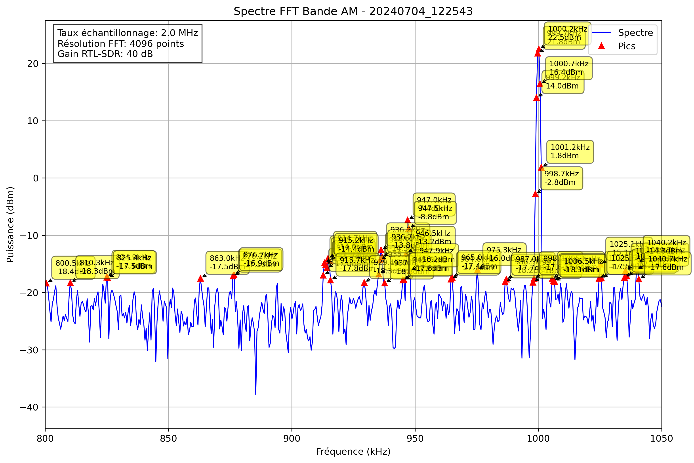

# Analyse Spectrale - 20240704_122543

## Paramètres

- Fréquence début: 800.0 kHz
- Fréquence fin: 1050.0 kHz
- Taux d'échantillonnage: 2.0 MHz
- Taille FFT: 4096 points
- Gain RTL-SDR: 40 dB

## Pics Détectés

| Fréquence (kHz) | Puissance (dBm) |
|-----------------|----------------|
| -75.0 | 1.8 |
| -74.5 | -1.2 |
| -74.0 | -10.4 |
| -72.1 | -18.3 |
| -71.6 | -18.4 |
| -48.1 | -17.8 |
| -28.6 | -18.2 |
| -23.7 | -17.6 |
| -23.2 | -17.8 |
| -4.7 | -18.1 |
| -4.2 | -18.4 |
| 22.2 | -15.5 |
| 22.7 | -16.7 |
| 48.5 | -17.3 |
| 58.8 | -18.4 |
| 74.4 | -10.1 |
| 74.9 | -5.6 |
| 75.4 | -8.1 |
| 83.7 | -17.1 |
| 84.2 | -18.1 |
| 88.1 | -17.2 |
| 101.3 | -16.4 |
| 101.8 | -16.6 |
| 112.5 | -16.3 |
| 113.0 | -16.1 |
| 113.5 | -17.4 |
| 115.9 | -18.1 |
| 127.6 | -18.2 |
| 128.1 | -17.4 |
| 135.4 | -17.0 |
| 137.4 | -14.6 |
| 137.9 | -7.0 |
| 138.4 | -1.7 |
| 138.9 | -2.0 |
| 139.4 | -3.1 |
| 139.8 | -12.9 |
| 140.3 | -12.5 |
| 140.8 | -12.4 |
| 141.3 | -14.2 |
| 145.7 | -17.4 |
| 146.2 | -18.1 |
| 150.1 | -18.0 |
| 160.8 | -14.7 |
| 161.3 | -11.9 |
| 161.8 | -12.8 |
| 163.3 | -16.4 |
| 171.6 | -17.8 |
| 172.1 | -14.1 |
| 172.6 | -15.8 |
| 184.3 | -17.9 |
| 184.8 | -16.6 |
| 185.3 | -16.2 |
| 185.7 | -15.9 |
| 186.2 | -14.9 |
| 186.7 | -14.8 |
| 187.2 | -18.3 |
| 212.6 | -18.4 |
| 241.9 | -17.4 |
| 242.4 | -16.6 |
| 277.5 | -18.2 |
| 278.0 | -16.6 |
| 335.6 | -17.0 |
| 336.1 | -15.0 |
| 336.6 | -14.4 |
| 337.1 | -17.4 |
| 337.6 | -18.0 |
| 346.9 | -18.1 |
| 374.2 | -8.6 |
| 374.7 | -1.1 |
| 375.2 | -0.2 |
| 375.7 | -5.8 |
| 376.2 | -18.0 |
| 399.1 | -11.1 |
| 399.6 | -2.0 |
| 400.1 | -0.6 |
| 400.6 | -6.1 |
| 401.1 | -17.2 |
| 408.9 | -18.2 |
| 427.9 | -16.5 |
| 428.4 | -17.2 |
| 485.5 | -15.4 |
| 486.0 | -14.2 |
| 486.5 | -14.2 |
| 487.0 | -18.3 |
| 524.6 | -10.6 |
| 525.1 | -7.1 |
| 525.6 | -10.5 |
| 560.7 | -17.9 |
| 566.1 | -18.3 |
| 574.9 | -18.4 |
| 575.9 | -18.4 |
| 576.4 | -17.8 |
| 595.9 | -18.1 |
| 613.0 | -15.1 |
| 613.5 | -12.8 |
| 614.0 | -14.5 |
| 614.5 | -17.3 |
| 629.1 | -18.3 |
| 635.0 | -18.2 |
| 635.9 | -18.2 |
| 636.4 | -16.0 |
| 646.7 | -17.6 |
| 647.2 | -17.9 |
| 699.4 | -6.7 |
| 699.9 | -1.9 |
| 700.4 | -3.8 |
| 700.9 | -12.0 |
| 725.3 | -17.2 |
| 738.0 | -17.5 |
| 738.5 | -16.2 |
| 739.0 | -17.2 |
| 739.5 | -17.8 |
| 739.9 | -17.4 |
| 752.6 | -16.4 |
| 753.1 | -17.5 |
| 762.9 | -18.1 |
| 763.4 | -15.7 |
| 763.9 | -14.7 |
| 764.4 | -17.0 |
| 765.3 | -16.6 |
| 765.8 | -18.3 |
| 770.2 | -17.8 |
| 770.7 | -17.8 |
| 776.1 | -17.7 |
| 776.6 | -17.1 |
| 785.8 | -17.6 |
| 786.3 | -17.4 |
| 786.8 | -17.1 |
| 787.3 | -18.3 |
| 800.5 | -18.4 |
| 810.3 | -18.3 |
| 824.9 | -17.3 |
| 825.4 | -17.5 |
| 863.0 | -17.5 |
| 876.2 | -17.1 |
| 876.7 | -16.9 |
| 912.8 | -17.0 |
| 913.3 | -14.8 |
| 913.8 | -15.1 |
| 914.3 | -15.7 |
| 914.7 | -14.0 |
| 915.2 | -14.4 |
| 915.7 | -17.8 |
| 929.4 | -18.3 |
| 935.3 | -16.8 |
| 935.7 | -14.3 |
| 936.2 | -12.6 |
| 936.7 | -13.8 |
| 937.7 | -18.3 |
| 945.0 | -17.8 |
| 945.5 | -17.8 |
| 946.5 | -13.2 |
| 947.0 | -7.4 |
| 947.5 | -8.8 |
| 947.9 | -16.2 |
| 964.6 | -17.7 |
| 965.0 | -17.4 |
| 975.3 | -16.0 |
| 986.5 | -18.2 |
| 987.0 | -17.7 |
| 997.8 | -18.2 |
| 998.2 | -17.6 |
| 998.7 | -2.8 |
| 999.2 | 14.0 |
| 999.7 | 21.8 |
| 1000.2 | 22.5 |
| 1000.7 | 16.4 |
| 1001.2 | 1.8 |
| 1005.6 | -17.6 |
| 1006.1 | -17.9 |
| 1006.5 | -18.1 |
| 1024.6 | -17.5 |
| 1025.1 | -15.1 |
| 1025.6 | -17.5 |
| 1034.9 | -17.4 |
| 1035.4 | -16.2 |
| 1035.8 | -17.1 |
| 1039.7 | -16.1 |
| 1040.2 | -14.8 |
| 1040.7 | -17.6 |
| 1052.4 | -8.6 |
| 1052.9 | -4.8 |
| 1053.4 | -7.7 |
| 1053.9 | -17.3 |
| 1063.2 | -17.5 |
| 1063.7 | -15.6 |
| 1064.2 | -16.6 |
| 1069.5 | -18.3 |
| 1070.0 | -16.3 |
| 1070.5 | -16.7 |
| 1081.7 | -17.8 |
| 1085.2 | -17.3 |
| 1085.6 | -14.0 |
| 1086.1 | -14.0 |
| 1086.6 | -14.1 |
| 1087.1 | -17.4 |
| 1105.7 | -13.5 |
| 1106.2 | -12.7 |
| 1124.7 | -17.4 |
| 1178.9 | -17.6 |
| 1199.4 | -17.4 |
| 1199.9 | -16.7 |
| 1211.6 | -15.9 |
| 1212.1 | -14.4 |
| 1212.6 | -17.0 |
| 1213.1 | -18.2 |
| 1213.6 | -17.7 |
| 1214.1 | -17.7 |
| 1217.5 | -17.4 |
| 1218.0 | -17.0 |
| 1218.5 | -18.1 |
| 1222.9 | -17.5 |
| 1223.3 | -17.5 |
| 1229.7 | -17.7 |
| 1230.2 | -16.7 |
| 1230.7 | -17.3 |
| 1234.6 | -16.8 |
| 1235.1 | -15.8 |
| 1235.5 | -16.9 |
| 1236.0 | -13.9 |
| 1236.5 | -11.8 |
| 1237.0 | -14.8 |
| 1254.1 | -18.2 |
| 1254.6 | -17.3 |
| 1255.1 | -17.0 |
| 1259.5 | -16.6 |
| 1260.0 | -15.4 |
| 1260.4 | -12.1 |
| 1260.9 | -10.4 |
| 1261.4 | -10.7 |
| 1261.9 | -13.0 |
| 1262.4 | -17.9 |
| 1264.4 | -11.9 |
| 1264.8 | -9.9 |
| 1265.3 | -14.2 |
| 1271.7 | -17.5 |
| 1272.2 | -17.2 |
| 1273.6 | -17.3 |
| 1274.1 | -17.8 |
| 1278.0 | -18.1 |
| 1279.0 | -18.1 |
| 1279.5 | -18.2 |
| 1282.4 | -18.0 |
| 1290.2 | -18.2 |
| 1295.1 | -17.8 |
| 1295.6 | -18.1 |
| 1299.0 | -16.0 |
| 1299.5 | -4.5 |
| 1300.0 | -0.9 |
| 1300.5 | -4.2 |
| 1301.0 | -15.3 |
| 1302.4 | -17.1 |
| 1303.4 | -18.0 |
| 1303.9 | -18.3 |
| 1304.9 | -17.3 |
| 1305.4 | -18.1 |
| 1305.9 | -18.2 |
| 1316.1 | -17.7 |
| 1316.6 | -16.0 |
| 1317.1 | -15.3 |
| 1317.6 | -9.8 |
| 1318.1 | -10.3 |
| 1318.6 | -16.5 |
| 1324.4 | -9.8 |
| 1324.9 | -6.5 |
| 1325.4 | -9.7 |
| 1325.9 | -16.2 |
| 1350.8 | -18.2 |
| 1363.5 | -14.9 |
| 1364.0 | -17.5 |
| 1364.9 | -16.4 |
| 1365.4 | -17.0 |
| 1368.8 | -17.9 |
| 1369.8 | -18.1 |
| 1370.3 | -7.4 |
| 1370.8 | -5.4 |
| 1371.3 | -10.2 |
| 1384.5 | -18.1 |
| 1423.0 | -13.3 |
| 1423.5 | -7.2 |
| 1424.0 | -8.2 |
| 1424.5 | -16.2 |
| 1441.1 | -17.9 |
| 1441.6 | -15.4 |
| 1442.1 | -16.0 |
| 1442.6 | -17.2 |
| 1453.3 | -17.3 |
| 1453.8 | -16.5 |
| 1473.8 | -16.1 |
| 1474.3 | -5.0 |
| 1474.8 | 0.1 |
| 1475.3 | -1.1 |
| 1475.8 | -7.6 |
| 1476.3 | -7.5 |
| 1476.8 | -7.0 |
| 1477.2 | -13.5 |
| 1477.7 | -18.1 |
| 1486.0 | -17.4 |
| 1512.9 | -17.1 |
| 1513.4 | -14.5 |
| 1513.9 | -14.9 |
| 1514.4 | -15.5 |
| 1514.8 | -15.6 |
| 1515.3 | -18.4 |
| 1529.0 | -16.3 |
| 1529.5 | -11.4 |
| 1530.0 | -12.6 |
| 1537.8 | -17.6 |
| 1538.3 | -15.9 |
| 1538.8 | -18.3 |
| 1539.7 | -16.4 |
| 1540.2 | -14.6 |
| 1540.7 | -17.4 |
| 1560.7 | -17.0 |
| 1561.2 | -14.1 |
| 1561.7 | -15.1 |
| 1562.2 | -17.9 |
| 1571.5 | -18.1 |
| 1572.0 | -15.4 |
| 1572.5 | -17.8 |
| 1582.2 | -17.1 |
| 1582.7 | -16.5 |
| 1599.3 | -16.4 |
| 1599.8 | -10.8 |
| 1600.3 | -11.5 |
| 1630.6 | -18.1 |
| 1631.1 | -17.3 |
| 1635.4 | -17.0 |
| 1637.4 | -17.6 |
| 1637.9 | -17.7 |
| 1662.8 | -18.1 |
| 1663.3 | -14.1 |
| 1663.8 | -15.5 |
| 1664.3 | -14.7 |
| 1664.7 | -17.0 |
| 1665.2 | -18.3 |
| 1669.6 | -18.4 |
| 1670.1 | -18.2 |
| 1670.6 | -17.7 |
| 1671.1 | -18.3 |
| 1677.4 | -15.8 |
| 1677.9 | -13.9 |
| 1678.4 | -16.4 |
| 1685.7 | -17.9 |
| 1695.0 | -18.4 |
| 1704.3 | -16.0 |
| 1704.8 | -16.8 |
| 1709.2 | -17.9 |
| 1721.9 | -17.9 |
| 1722.4 | -17.8 |
| 1734.6 | -16.6 |
| 1735.1 | -16.4 |
| 1735.5 | -17.3 |
| 1736.0 | -17.5 |
| 1736.5 | -17.3 |
| 1739.5 | -18.3 |
| 1741.9 | -17.7 |
| 1742.4 | -16.6 |
| 1771.2 | -17.3 |
| 1774.1 | -14.8 |
| 1774.6 | -7.0 |
| 1775.1 | -5.5 |
| 1775.6 | -11.1 |
| 1860.1 | -17.6 |
| 1860.5 | -17.4 |
| 1861.0 | -15.7 |
| 1861.5 | -16.6 |
| 1898.6 | -17.4 |
| 1901.1 | -18.4 |
| 1901.6 | -18.2 |
| 1923.0 | -16.8 |
| 1923.5 | -16.3 |
| 1924.0 | -10.9 |
| 1924.5 | -1.6 |
