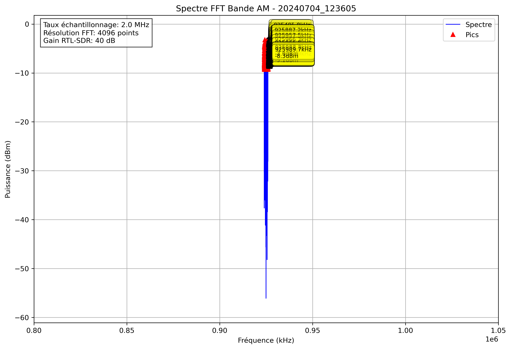

# Analyse Spectrale - 20240704_123605

## Paramètres

- Fréquence début: 800000.0 kHz
- Fréquence fin: 1050000.0 kHz
- Taux d'échantillonnage: 2.0 MHz
- Taille FFT: 4096 points
- Gain RTL-SDR: 40 dB

## Pics Détectés

| Fréquence (kHz) | Puissance (dBm) |
|-----------------|----------------|
| 924000.0 | -5.9 |
| 924000.5 | -8.9 |
| 924011.2 | -8.5 |
| 924011.7 | -8.6 |
| 924017.1 | -6.6 |
| 924017.6 | -6.4 |
| 924018.1 | -8.6 |
| 924023.4 | -7.0 |
| 924026.4 | -8.2 |
| 924026.9 | -6.7 |
| 924031.7 | -8.6 |
| 924032.2 | -8.4 |
| 924036.6 | -9.1 |
| 924056.6 | -8.6 |
| 924057.6 | -8.5 |
| 924058.1 | -5.8 |
| 924058.6 | -8.1 |
| 924060.1 | -8.8 |
| 924063.5 | -5.9 |
| 924064.0 | -4.6 |
| 924064.5 | -6.8 |
| 924065.9 | -8.0 |
| 924066.4 | -5.4 |
| 924066.9 | -7.0 |
| 924070.8 | -7.2 |
| 924071.3 | -8.2 |
| 924079.6 | -8.3 |
| 924082.0 | -7.5 |
| 924082.5 | -7.7 |
| 924083.0 | -9.2 |
| 924084.5 | -8.2 |
| 924087.4 | -8.6 |
| 924087.9 | -8.8 |
| 924089.8 | -7.3 |
| 924090.3 | -8.6 |
| 924097.7 | -6.5 |
| 924098.1 | -4.8 |
| 924098.6 | -4.8 |
| 924099.1 | -7.8 |
| 924101.6 | -8.9 |
| 924102.1 | -7.2 |
| 924104.0 | -7.3 |
| 924104.5 | -6.8 |
| 924106.0 | -8.1 |
| 924111.8 | -5.9 |
| 924112.3 | -4.3 |
| 924112.8 | -8.8 |
| 924117.2 | -8.6 |
| 924122.6 | -6.6 |
| 924123.0 | -4.5 |
| 924123.5 | -7.2 |
| 924140.6 | -8.6 |
| 924141.1 | -7.8 |
| 924148.4 | -6.3 |
| 924148.9 | -8.3 |
| 924151.9 | -7.1 |
| 924152.3 | -5.8 |
| 924152.8 | -8.2 |
| 924162.1 | -7.3 |
| 924162.6 | -8.1 |
| 924166.5 | -8.9 |
| 924167.0 | -8.1 |
| 924167.5 | -7.9 |
| 924168.9 | -9.2 |
| 924169.4 | -7.7 |
| 924169.9 | -7.8 |
| 924170.4 | -8.4 |
| 924170.9 | -8.8 |
| 924174.3 | -8.3 |
| 924176.3 | -9.0 |
| 924182.1 | -5.9 |
| 924182.6 | -6.2 |
| 924184.6 | -8.0 |
| 924185.1 | -8.3 |
| 924198.7 | -6.1 |
| 924199.2 | -7.0 |
| 924200.2 | -8.0 |
| 924200.7 | -6.2 |
| 924204.1 | -6.6 |
| 924204.6 | -8.6 |
| 924212.9 | -6.8 |
| 924213.4 | -5.0 |
| 924213.9 | -4.1 |
| 924214.4 | -5.3 |
| 924214.8 | -9.1 |
| 924216.3 | -8.2 |
| 924216.8 | -6.0 |
| 924217.3 | -6.1 |
| 924217.8 | -9.1 |
| 924218.8 | -6.9 |
| 924219.2 | -5.9 |
| 924219.7 | -7.6 |
| 924227.5 | -6.2 |
| 924228.0 | -7.0 |
| 924231.0 | -8.9 |
| 924231.4 | -8.3 |
| 924236.8 | -9.1 |
| 924239.3 | -8.8 |
| 924239.7 | -8.4 |
| 924242.7 | -8.7 |
| 924243.2 | -6.7 |
| 924243.7 | -8.8 |
| 924246.1 | -9.2 |
| 924246.6 | -6.0 |
| 924247.1 | -7.6 |
| 924251.0 | -6.9 |
| 924251.5 | -5.2 |
| 924252.0 | -8.3 |
| 924258.8 | -9.3 |
| 924259.3 | -7.9 |
| 924262.2 | -8.3 |
| 924262.7 | -7.8 |
| 924266.6 | -8.8 |
| 924267.1 | -7.6 |
| 924267.6 | -7.1 |
| 924268.1 | -8.3 |
| 924272.0 | -8.7 |
| 924272.5 | -6.2 |
| 924275.9 | -9.0 |
| 924282.2 | -9.0 |
| 924295.9 | -7.8 |
| 924296.4 | -8.0 |
| 924301.8 | -8.4 |
| 924302.2 | -5.0 |
| 924302.7 | -8.0 |
| 924304.2 | -8.0 |
| 924304.7 | -3.9 |
| 924305.2 | -3.2 |
| 924305.7 | -3.8 |
| 924306.2 | -6.7 |
| 924313.5 | -7.5 |
| 924317.9 | -9.0 |
| 924322.8 | -7.6 |
| 924323.2 | -6.7 |
| 924323.7 | -7.1 |
| 924324.2 | -8.2 |
| 924331.5 | -8.8 |
| 924332.0 | -7.8 |
| 924332.5 | -6.8 |
| 924333.0 | -6.3 |
| 924333.5 | -7.2 |
| 924334.0 | -7.6 |
| 924334.5 | -8.4 |
| 924337.4 | -7.1 |
| 924337.9 | -4.7 |
| 924338.4 | -4.7 |
| 924354.0 | -7.2 |
| 924354.5 | -8.0 |
| 924357.4 | -7.5 |
| 924357.9 | -5.8 |
| 924358.4 | -8.2 |
| 924359.9 | -8.4 |
| 924360.4 | -8.8 |
| 924367.7 | -8.7 |
| 924375.0 | -8.6 |
| 924375.5 | -8.3 |
| 924376.5 | -9.0 |
| 924387.7 | -7.9 |
| 924388.2 | -6.9 |
| 924388.7 | -9.0 |
| 924391.1 | -9.1 |
| 924391.6 | -7.7 |
| 924397.0 | -9.3 |
| 924397.5 | -8.3 |
| 924402.8 | -7.2 |
| 924403.3 | -7.6 |
| 924406.7 | -7.5 |
| 924412.1 | -8.2 |
| 924412.6 | -8.5 |
| 924413.1 | -9.2 |
| 924415.0 | -8.7 |
| 924420.4 | -8.6 |
| 924422.4 | -8.7 |
| 924422.9 | -5.4 |
| 924423.3 | -4.1 |
| 924423.8 | -4.7 |
| 924424.3 | -7.6 |
| 924428.2 | -9.2 |
| 924428.7 | -9.0 |
| 924439.9 | -8.1 |
| 924440.4 | -8.3 |
| 924445.8 | -8.6 |
| 924446.3 | -7.8 |
| 924451.2 | -8.4 |
| 924453.1 | -9.0 |
| 924453.6 | -8.7 |
| 924460.0 | -7.9 |
| 924460.4 | -7.5 |
| 924470.2 | -8.9 |
| 924470.7 | -5.0 |
| 924471.2 | -5.1 |
| 924471.7 | -6.6 |
| 924472.2 | -8.0 |
| 924486.3 | -9.1 |
| 924486.8 | -8.6 |
| 924492.2 | -7.4 |
| 924492.7 | -7.0 |
| 924501.0 | -8.7 |
| 924501.5 | -7.8 |
| 924506.3 | -7.4 |
| 924506.8 | -8.0 |
| 924507.3 | -8.9 |
| 924507.8 | -9.1 |
| 924508.3 | -8.4 |
| 924508.8 | -8.9 |
| 924512.7 | -7.7 |
| 924513.2 | -7.4 |
| 924513.7 | -7.9 |
| 924516.6 | -8.8 |
| 924517.1 | -7.7 |
| 924517.6 | -9.3 |
| 924521.0 | -8.7 |
| 924521.5 | -7.6 |
| 924524.4 | -8.9 |
| 924524.9 | -5.4 |
| 924525.4 | -6.9 |
| 924528.8 | -9.3 |
| 924529.3 | -8.8 |
| 924536.6 | -8.9 |
| 924537.1 | -8.3 |
| 924541.5 | -8.6 |
| 924542.0 | -7.2 |
| 924554.7 | -8.2 |
| 924556.6 | -8.8 |
| 924562.0 | -7.1 |
| 924562.5 | -9.1 |
| 924566.4 | -7.2 |
| 924566.9 | -8.0 |
| 924570.8 | -8.5 |
| 924571.3 | -8.8 |
| 924574.7 | -8.5 |
| 924580.6 | -9.1 |
| 924587.9 | -8.2 |
| 924588.4 | -8.8 |
| 924592.3 | -8.7 |
| 924592.8 | -7.1 |
| 924593.3 | -8.0 |
| 924594.2 | -8.4 |
| 924594.7 | -8.1 |
| 924599.1 | -8.1 |
| 924599.6 | -7.7 |
| 924600.1 | -8.4 |
| 924600.6 | -7.7 |
| 924601.1 | -8.0 |
| 924602.1 | -8.4 |
| 924613.3 | -7.0 |
| 924613.8 | -8.3 |
| 924618.7 | -8.6 |
| 924619.1 | -6.6 |
| 924628.4 | -8.7 |
| 924628.9 | -7.6 |
| 924638.2 | -9.2 |
| 924640.6 | -8.2 |
| 924661.6 | -7.9 |
| 924667.5 | -8.7 |
| 924668.0 | -8.6 |
| 924678.2 | -7.5 |
| 924678.7 | -8.1 |
| 924697.3 | -8.1 |
| 924697.8 | -7.3 |
| 924698.2 | -7.9 |
| 924701.2 | -5.9 |
| 924701.7 | -5.3 |
| 924705.1 | -9.0 |
| 924710.0 | -8.7 |
| 924710.4 | -7.5 |
| 924718.3 | -8.4 |
| 924718.8 | -7.7 |
| 924721.2 | -7.8 |
| 924721.7 | -8.4 |
| 924730.0 | -8.6 |
| 924731.9 | -9.2 |
| 924732.4 | -7.0 |
| 924732.9 | -6.6 |
| 924735.4 | -9.0 |
| 924736.3 | -8.7 |
| 924740.7 | -7.0 |
| 924741.2 | -7.9 |
| 924754.9 | -7.5 |
| 924755.4 | -7.7 |
| 924767.6 | -9.2 |
| 924771.5 | -9.2 |
| 924772.0 | -8.8 |
| 924773.9 | -7.1 |
| 924791.5 | -8.7 |
| 924796.9 | -6.3 |
| 924797.4 | -7.5 |
| 924809.6 | -9.0 |
| 924821.8 | -7.3 |
| 924822.3 | -7.2 |
| 924829.6 | -8.5 |
| 924837.4 | -9.1 |
| 924837.9 | -9.0 |
| 924847.2 | -8.6 |
| 924847.7 | -8.7 |
| 924858.9 | -8.4 |
| 924894.0 | -9.2 |
| 924903.3 | -8.7 |
| 924903.8 | -7.6 |
| 924904.3 | -8.6 |
| 924915.5 | -8.5 |
| 924916.0 | -8.7 |
| 924965.3 | -8.6 |
| 925002.0 | -9.1 |
| 925002.4 | -8.6 |
| 925106.4 | -8.9 |
| 925120.6 | -8.6 |
| 925121.1 | -7.9 |
| 925121.6 | -8.2 |
| 925122.1 | -7.6 |
| 925122.6 | -8.4 |
| 925125.0 | -9.2 |
| 925169.9 | -7.5 |
| 925170.4 | -8.1 |
| 925189.9 | -8.1 |
| 925190.4 | -9.2 |
| 925195.3 | -8.1 |
| 925195.8 | -8.5 |
| 925198.7 | -8.0 |
| 925199.2 | -8.8 |
| 925200.2 | -8.8 |
| 925200.7 | -7.5 |
| 925206.5 | -9.2 |
| 925214.8 | -8.5 |
| 925218.8 | -7.2 |
| 925219.2 | -8.3 |
| 925235.4 | -8.8 |
| 925235.8 | -8.6 |
| 925241.2 | -9.2 |
| 925248.5 | -7.6 |
| 925249.0 | -7.1 |
| 925266.1 | -8.0 |
| 925266.6 | -9.1 |
| 925274.4 | -8.1 |
| 925274.9 | -7.9 |
| 925277.3 | -8.7 |
| 925277.8 | -8.7 |
| 925285.6 | -6.9 |
| 925286.1 | -8.1 |
| 925289.6 | -7.9 |
| 925290.0 | -8.2 |
| 925292.0 | -8.3 |
| 925312.0 | -7.0 |
| 925312.5 | -5.8 |
| 925313.0 | -5.6 |
| 925313.5 | -6.5 |
| 925314.0 | -9.1 |
| 925332.0 | -7.8 |
| 925332.5 | -7.2 |
| 925333.0 | -7.3 |
| 925333.5 | -7.9 |
| 925335.0 | -8.0 |
| 925335.4 | -9.2 |
| 925342.3 | -7.9 |
| 925345.2 | -7.4 |
| 925345.7 | -5.8 |
| 925346.2 | -4.5 |
| 925346.7 | -6.9 |
| 925350.6 | -7.6 |
| 925356.0 | -8.3 |
| 925356.4 | -8.3 |
| 925359.9 | -8.0 |
| 925362.3 | -8.4 |
| 925362.8 | -8.3 |
| 925369.6 | -6.7 |
| 925370.1 | -4.6 |
| 925370.6 | -5.1 |
| 925371.1 | -9.1 |
| 925376.5 | -9.2 |
| 925377.9 | -8.7 |
| 925378.4 | -8.5 |
| 925388.2 | -9.1 |
| 925395.0 | -8.2 |
| 925395.5 | -7.5 |
| 925396.0 | -8.4 |
| 925398.4 | -8.6 |
| 925398.9 | -8.4 |
| 925403.8 | -9.2 |
| 925405.3 | -6.6 |
| 925405.8 | -3.3 |
| 925406.2 | -4.5 |
| 925406.7 | -9.2 |
| 925411.1 | -7.5 |
| 925411.6 | -7.1 |
| 925413.1 | -9.2 |
| 925413.6 | -9.0 |
| 925416.5 | -8.4 |
| 925419.4 | -8.9 |
| 925419.9 | -6.2 |
| 925420.4 | -8.4 |
| 925423.3 | -8.8 |
| 925427.2 | -7.7 |
| 925427.7 | -8.9 |
| 925428.2 | -8.8 |
| 925430.7 | -7.8 |
| 925431.2 | -6.5 |
| 925431.6 | -8.9 |
| 925439.5 | -8.3 |
| 925439.9 | -5.4 |
| 925447.8 | -7.8 |
| 925448.2 | -6.9 |
| 925448.7 | -7.5 |
| 925449.2 | -8.2 |
| 925454.1 | -8.6 |
| 925461.4 | -7.5 |
| 925461.9 | -8.0 |
| 925464.8 | -6.2 |
| 925465.3 | -8.3 |
| 925465.8 | -8.9 |
| 925466.3 | -4.8 |
| 925466.8 | -7.0 |
| 925467.8 | -8.6 |
| 925472.7 | -9.1 |
| 925473.1 | -9.1 |
| 925491.7 | -9.2 |
| 925492.2 | -9.0 |
| 925499.0 | -8.0 |
| 925499.5 | -7.9 |
| 925504.4 | -7.7 |
| 925504.9 | -7.2 |
| 925505.4 | -7.4 |
| 925505.9 | -8.6 |
| 925515.1 | -6.5 |
| 925515.6 | -5.3 |
| 925516.1 | -8.0 |
| 925524.9 | -6.6 |
| 925525.4 | -8.2 |
| 925527.8 | -8.3 |
| 925530.3 | -7.3 |
| 925530.8 | -6.9 |
| 925531.2 | -7.5 |
| 925531.7 | -9.3 |
| 925540.0 | -8.6 |
| 925540.5 | -8.1 |
| 925552.2 | -7.4 |
| 925552.7 | -8.9 |
| 925556.2 | -8.8 |
| 925559.1 | -6.1 |
| 925559.6 | -5.7 |
| 925560.1 | -7.6 |
| 925571.3 | -8.8 |
| 925574.2 | -9.1 |
| 925574.7 | -9.1 |
| 925577.1 | -7.2 |
| 925577.6 | -9.3 |
| 925588.4 | -9.0 |
| 925592.8 | -7.0 |
| 925593.3 | -6.6 |
| 925593.8 | -8.3 |
| 925600.1 | -8.7 |
| 925600.6 | -8.3 |
| 925625.0 | -7.4 |
| 925625.5 | -8.0 |
| 925642.1 | -7.1 |
| 925642.6 | -7.3 |
| 925651.4 | -8.0 |
| 925651.9 | -8.2 |
| 925660.2 | -8.1 |
| 925660.6 | -4.3 |
| 925661.1 | -5.7 |
| 925668.9 | -8.7 |
| 925670.4 | -8.4 |
| 925670.9 | -9.2 |
| 925681.2 | -9.0 |
| 925681.6 | -7.7 |
| 925682.1 | -8.4 |
| 925685.5 | -8.0 |
| 925686.0 | -6.3 |
| 925686.5 | -8.8 |
| 925691.9 | -6.7 |
| 925697.8 | -9.0 |
| 925703.1 | -8.1 |
| 925704.1 | -8.6 |
| 925704.6 | -6.0 |
| 925705.1 | -8.3 |
| 925712.4 | -8.8 |
| 925716.3 | -8.3 |
| 925718.3 | -6.4 |
| 925718.8 | -6.6 |
| 925719.2 | -8.4 |
| 925719.7 | -8.1 |
| 925720.2 | -7.5 |
| 925720.7 | -8.7 |
| 925726.6 | -7.8 |
| 925727.1 | -6.3 |
| 925727.5 | -8.8 |
| 925743.7 | -8.6 |
| 925744.1 | -9.0 |
| 925758.8 | -7.8 |
| 925760.3 | -6.5 |
| 925760.7 | -5.2 |
| 925761.2 | -8.5 |
| 925769.5 | -6.6 |
| 925770.0 | -8.0 |
| 925774.9 | -8.5 |
| 925775.4 | -8.2 |
| 925775.9 | -9.1 |
| 925776.4 | -7.8 |
| 925785.6 | -9.2 |
| 925786.6 | -9.0 |
| 925787.1 | -8.1 |
| 925791.0 | -6.4 |
| 925791.5 | -4.3 |
| 925792.0 | -7.6 |
| 925804.7 | -7.4 |
| 925805.2 | -5.1 |
| 925805.7 | -8.3 |
| 925809.1 | -8.8 |
| 925810.5 | -7.2 |
| 925811.0 | -5.6 |
| 925811.5 | -6.1 |
| 925813.5 | -9.0 |
| 925820.8 | -8.2 |
| 925821.3 | -6.5 |
| 925821.8 | -7.9 |
| 925822.3 | -7.6 |
| 925822.8 | -7.0 |
| 925823.2 | -8.5 |
| 925823.7 | -7.9 |
| 925824.2 | -5.3 |
| 925824.7 | -4.8 |
| 925825.2 | -6.7 |
| 925825.7 | -8.5 |
| 925831.1 | -6.9 |
| 925831.5 | -4.8 |
| 925832.0 | -6.7 |
| 925832.5 | -9.2 |
| 925857.4 | -9.2 |
| 925864.7 | -9.2 |
| 925871.1 | -9.0 |
| 925877.4 | -8.5 |
| 925881.8 | -8.1 |
| 925882.3 | -6.5 |
| 925882.8 | -7.9 |
| 925883.3 | -7.8 |
| 925883.8 | -6.9 |
| 925884.3 | -6.8 |
| 925884.8 | -7.9 |
| 925885.3 | -8.6 |
| 925886.7 | -5.8 |
| 925887.2 | -4.3 |
| 925887.7 | -7.1 |
| 925888.2 | -7.3 |
| 925895.5 | -8.5 |
| 925896.0 | -9.1 |
| 925897.9 | -8.6 |
| 925910.6 | -8.1 |
| 925911.1 | -6.8 |
| 925911.6 | -8.9 |
| 925919.9 | -8.7 |
| 925920.4 | -8.5 |
| 925930.7 | -8.5 |
| 925931.2 | -7.9 |
| 925933.6 | -8.4 |
| 925943.8 | -8.3 |
| 925944.3 | -8.9 |
| 925957.0 | -5.7 |
| 925957.5 | -5.4 |
| 925965.8 | -7.0 |
| 925966.3 | -6.2 |
| 925966.8 | -6.9 |
| 925974.1 | -8.1 |
| 925979.0 | -9.2 |
| 925979.5 | -8.3 |
| 925981.4 | -9.2 |
| 925983.9 | -9.1 |
| 925984.4 | -8.0 |
| 925987.8 | -7.8 |
| 925988.3 | -7.9 |
| 925989.7 | -8.3 |
