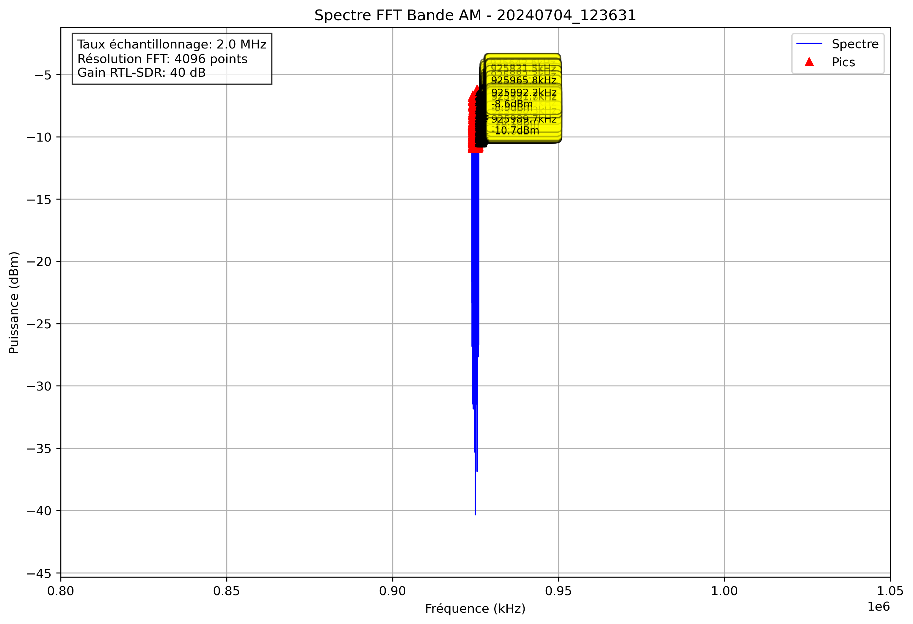

# Analyse Spectrale - 20240704_123631

## Paramètres

- Fréquence début: 800000.0 kHz
- Fréquence fin: 1050000.0 kHz
- Taux d'échantillonnage: 2.0 MHz
- Taille FFT: 4096 points
- Gain RTL-SDR: 40 dB

## Pics Détectés

| Fréquence (kHz) | Puissance (dBm) |
|-----------------|----------------|
| 924000.0 | -7.6 |
| 924000.5 | -9.3 |
| 924002.9 | -10.4 |
| 924003.4 | -8.6 |
| 924003.9 | -10.4 |
| 924004.9 | -8.7 |
| 924005.4 | -10.5 |
| 924016.6 | -8.9 |
| 924017.1 | -7.2 |
| 924017.6 | -7.5 |
| 924025.4 | -9.1 |
| 924025.9 | -9.2 |
| 924026.4 | -10.5 |
| 924031.7 | -10.6 |
| 924036.6 | -10.8 |
| 924042.5 | -10.8 |
| 924044.9 | -10.5 |
| 924052.7 | -9.1 |
| 924053.2 | -10.0 |
| 924056.2 | -9.5 |
| 924056.6 | -8.2 |
| 924057.6 | -8.9 |
| 924058.1 | -7.1 |
| 924058.6 | -9.0 |
| 924061.5 | -10.9 |
| 924064.0 | -8.1 |
| 924064.5 | -6.8 |
| 924065.9 | -10.9 |
| 924066.4 | -9.3 |
| 924066.9 | -9.7 |
| 924070.8 | -9.1 |
| 924071.3 | -9.8 |
| 924079.1 | -10.2 |
| 924079.6 | -7.1 |
| 924080.1 | -10.2 |
| 924082.5 | -10.3 |
| 924087.4 | -9.5 |
| 924087.9 | -10.3 |
| 924089.4 | -9.8 |
| 924089.8 | -10.0 |
| 924098.1 | -8.9 |
| 924098.6 | -9.9 |
| 924099.1 | -9.9 |
| 924102.1 | -10.0 |
| 924102.5 | -9.5 |
| 924104.5 | -9.2 |
| 924111.8 | -10.1 |
| 924112.8 | -10.9 |
| 924123.0 | -10.0 |
| 924126.5 | -9.8 |
| 924127.0 | -10.0 |
| 924140.1 | -10.7 |
| 924140.6 | -9.0 |
| 924141.1 | -8.9 |
| 924146.0 | -10.2 |
| 924147.0 | -9.3 |
| 924147.9 | -9.9 |
| 924151.9 | -7.5 |
| 924152.3 | -8.6 |
| 924160.6 | -10.4 |
| 924162.6 | -9.8 |
| 924165.5 | -9.5 |
| 924166.0 | -8.5 |
| 924166.5 | -8.3 |
| 924167.0 | -9.0 |
| 924167.5 | -10.5 |
| 924168.5 | -10.7 |
| 924168.9 | -9.0 |
| 924169.4 | -9.5 |
| 924170.9 | -9.4 |
| 924171.4 | -10.0 |
| 924173.8 | -10.9 |
| 924174.3 | -8.5 |
| 924174.8 | -10.8 |
| 924176.3 | -9.8 |
| 924176.8 | -10.9 |
| 924182.1 | -8.3 |
| 924182.6 | -9.3 |
| 924184.1 | -9.8 |
| 924184.6 | -7.8 |
| 924185.1 | -10.0 |
| 924198.2 | -9.9 |
| 924198.7 | -8.0 |
| 924199.2 | -8.2 |
| 924200.2 | -9.7 |
| 924200.7 | -9.7 |
| 924204.1 | -8.5 |
| 924204.6 | -9.4 |
| 924213.4 | -10.2 |
| 924213.9 | -7.3 |
| 924214.4 | -6.7 |
| 924214.8 | -8.5 |
| 924216.8 | -9.3 |
| 924217.3 | -9.9 |
| 924218.8 | -9.7 |
| 924219.2 | -8.9 |
| 924219.7 | -10.7 |
| 924227.5 | -9.4 |
| 924228.5 | -9.8 |
| 924229.0 | -9.7 |
| 924236.3 | -10.0 |
| 924236.8 | -7.9 |
| 924237.3 | -10.2 |
| 924239.3 | -9.6 |
| 924239.7 | -8.5 |
| 924242.7 | -10.2 |
| 924246.1 | -10.8 |
| 924246.6 | -8.4 |
| 924247.1 | -10.6 |
| 924251.0 | -8.4 |
| 924251.5 | -9.2 |
| 924259.3 | -9.5 |
| 924259.8 | -10.1 |
| 924260.3 | -10.2 |
| 924262.2 | -10.7 |
| 924262.7 | -9.9 |
| 924266.1 | -9.9 |
| 924266.6 | -8.6 |
| 924267.1 | -8.4 |
| 924267.6 | -8.8 |
| 924272.0 | -10.6 |
| 924272.5 | -8.9 |
| 924272.9 | -9.2 |
| 924282.7 | -9.3 |
| 924283.2 | -9.1 |
| 924283.7 | -9.2 |
| 924291.0 | -10.9 |
| 924295.4 | -9.8 |
| 924295.9 | -9.9 |
| 924296.4 | -9.2 |
| 924296.9 | -10.4 |
| 924302.2 | -9.3 |
| 924304.2 | -8.2 |
| 924305.2 | -8.5 |
| 924305.7 | -9.1 |
| 924307.1 | -9.8 |
| 924307.6 | -9.6 |
| 924313.5 | -10.8 |
| 924322.3 | -10.0 |
| 924322.8 | -8.8 |
| 924323.2 | -10.1 |
| 924324.2 | -10.3 |
| 924326.7 | -10.4 |
| 924327.1 | -10.7 |
| 924331.1 | -9.9 |
| 924331.5 | -9.8 |
| 924332.5 | -8.6 |
| 924333.0 | -9.8 |
| 924337.4 | -9.0 |
| 924337.9 | -6.8 |
| 924338.4 | -8.1 |
| 924351.1 | -10.4 |
| 924351.6 | -10.0 |
| 924358.4 | -9.6 |
| 924368.2 | -9.9 |
| 924383.3 | -9.3 |
| 924383.8 | -10.3 |
| 924388.2 | -10.2 |
| 924391.1 | -7.7 |
| 924391.6 | -8.4 |
| 924397.0 | -9.5 |
| 924397.5 | -10.6 |
| 924402.8 | -10.0 |
| 924406.7 | -10.5 |
| 924412.6 | -10.0 |
| 924413.1 | -10.5 |
| 924415.0 | -10.4 |
| 924415.5 | -9.7 |
| 924416.0 | -10.5 |
| 924418.0 | -10.4 |
| 924418.5 | -10.2 |
| 924420.4 | -8.9 |
| 924420.9 | -9.8 |
| 924422.9 | -10.4 |
| 924423.3 | -8.9 |
| 924423.8 | -9.3 |
| 924428.2 | -9.6 |
| 924428.7 | -8.7 |
| 924439.9 | -9.7 |
| 924440.4 | -10.8 |
| 924441.9 | -10.9 |
| 924451.2 | -8.7 |
| 924451.7 | -10.1 |
| 924465.8 | -9.4 |
| 924466.3 | -10.9 |
| 924470.2 | -10.8 |
| 924470.7 | -9.2 |
| 924472.2 | -10.9 |
| 924472.7 | -9.1 |
| 924486.3 | -10.7 |
| 924486.8 | -10.8 |
| 924492.2 | -10.2 |
| 924492.7 | -9.3 |
| 924501.0 | -9.6 |
| 924501.5 | -10.5 |
| 924506.3 | -10.5 |
| 924508.8 | -9.9 |
| 924509.3 | -10.6 |
| 924512.7 | -9.5 |
| 924513.2 | -7.5 |
| 924513.7 | -7.7 |
| 924514.2 | -10.2 |
| 924516.6 | -10.6 |
| 924517.1 | -9.6 |
| 924517.6 | -10.7 |
| 924518.6 | -10.4 |
| 924521.0 | -8.6 |
| 924521.5 | -9.3 |
| 924525.4 | -10.5 |
| 924528.8 | -10.3 |
| 924529.3 | -9.5 |
| 924536.6 | -8.8 |
| 924537.1 | -8.1 |
| 924537.6 | -10.6 |
| 924545.4 | -10.9 |
| 924554.7 | -10.0 |
| 924556.2 | -8.6 |
| 924556.6 | -9.0 |
| 924561.5 | -10.4 |
| 924562.0 | -8.8 |
| 924566.4 | -10.1 |
| 924568.8 | -10.9 |
| 924570.8 | -10.7 |
| 924571.3 | -9.0 |
| 924571.8 | -10.2 |
| 924574.7 | -9.6 |
| 924575.2 | -9.6 |
| 924580.1 | -10.7 |
| 924580.6 | -10.1 |
| 924581.1 | -10.4 |
| 924583.5 | -10.1 |
| 924592.3 | -9.2 |
| 924592.8 | -8.3 |
| 924594.2 | -9.4 |
| 924594.7 | -9.5 |
| 924597.2 | -10.5 |
| 924597.7 | -10.3 |
| 924599.6 | -9.0 |
| 924600.1 | -8.9 |
| 924600.6 | -8.5 |
| 924601.1 | -8.6 |
| 924601.6 | -9.7 |
| 924602.1 | -10.3 |
| 924606.9 | -10.4 |
| 924607.4 | -9.5 |
| 924612.8 | -9.0 |
| 924613.3 | -7.9 |
| 924613.8 | -10.1 |
| 924614.3 | -10.2 |
| 924618.7 | -10.4 |
| 924620.6 | -10.4 |
| 924626.5 | -9.2 |
| 924627.0 | -9.9 |
| 924627.9 | -10.9 |
| 924628.4 | -9.4 |
| 924635.7 | -10.0 |
| 924636.2 | -9.8 |
| 924637.7 | -10.2 |
| 924658.7 | -10.4 |
| 924663.1 | -10.7 |
| 924667.5 | -10.2 |
| 924668.0 | -10.6 |
| 924671.4 | -10.9 |
| 924678.2 | -10.6 |
| 924682.1 | -10.8 |
| 924690.4 | -10.7 |
| 924697.3 | -10.0 |
| 924710.0 | -9.6 |
| 924710.4 | -9.4 |
| 924718.8 | -9.8 |
| 924719.2 | -9.4 |
| 924719.7 | -10.6 |
| 924727.1 | -9.1 |
| 924734.9 | -10.7 |
| 924736.3 | -8.4 |
| 924736.8 | -10.0 |
| 924738.8 | -9.9 |
| 924740.7 | -10.2 |
| 924754.9 | -9.8 |
| 924755.4 | -10.9 |
| 924767.6 | -9.9 |
| 924773.9 | -10.9 |
| 924791.5 | -9.6 |
| 924792.0 | -10.7 |
| 924796.9 | -9.5 |
| 924797.4 | -9.6 |
| 924821.3 | -9.4 |
| 924821.8 | -7.6 |
| 924822.3 | -10.3 |
| 924829.6 | -10.8 |
| 924836.9 | -10.8 |
| 924837.4 | -10.2 |
| 924847.7 | -10.7 |
| 924868.2 | -10.9 |
| 924868.7 | -10.9 |
| 924899.9 | -10.7 |
| 924915.5 | -10.8 |
| 924916.0 | -10.1 |
| 925108.9 | -10.8 |
| 925122.1 | -10.3 |
| 925122.6 | -9.4 |
| 925187.0 | -10.8 |
| 925196.8 | -10.9 |
| 925198.7 | -10.1 |
| 925209.0 | -10.3 |
| 925225.1 | -10.0 |
| 925225.6 | -10.2 |
| 925234.4 | -10.8 |
| 925249.0 | -9.3 |
| 925249.5 | -10.9 |
| 925257.3 | -10.4 |
| 925262.2 | -10.7 |
| 925277.3 | -10.8 |
| 925281.2 | -10.6 |
| 925281.7 | -8.6 |
| 925282.2 | -10.2 |
| 925285.2 | -10.0 |
| 925285.6 | -9.3 |
| 925289.1 | -9.8 |
| 925289.6 | -7.3 |
| 925290.0 | -7.2 |
| 925290.5 | -9.1 |
| 925298.8 | -10.6 |
| 925299.3 | -10.0 |
| 925312.0 | -9.1 |
| 925312.5 | -8.2 |
| 925313.0 | -9.1 |
| 925313.5 | -9.4 |
| 925316.9 | -10.5 |
| 925323.2 | -10.9 |
| 925332.0 | -10.0 |
| 925332.5 | -8.6 |
| 925333.0 | -8.5 |
| 925333.5 | -10.4 |
| 925335.0 | -8.8 |
| 925335.4 | -7.9 |
| 925335.9 | -10.0 |
| 925336.4 | -10.1 |
| 925337.9 | -10.3 |
| 925338.4 | -10.2 |
| 925342.3 | -10.1 |
| 925342.8 | -10.8 |
| 925344.7 | -9.1 |
| 925345.2 | -7.8 |
| 925345.7 | -7.3 |
| 925346.2 | -6.2 |
| 925346.7 | -7.1 |
| 925350.1 | -10.3 |
| 925350.6 | -8.7 |
| 925356.0 | -10.5 |
| 925356.4 | -9.6 |
| 925356.9 | -10.9 |
| 925357.9 | -9.9 |
| 925359.9 | -9.3 |
| 925360.4 | -9.7 |
| 925362.3 | -8.5 |
| 925362.8 | -10.3 |
| 925366.2 | -9.7 |
| 925369.6 | -8.9 |
| 925370.1 | -9.0 |
| 925376.0 | -9.9 |
| 925376.5 | -10.4 |
| 925377.4 | -10.7 |
| 925377.9 | -10.3 |
| 925378.4 | -9.0 |
| 925378.9 | -8.9 |
| 925380.4 | -9.5 |
| 925380.9 | -10.9 |
| 925385.3 | -10.1 |
| 925386.2 | -9.9 |
| 925387.7 | -9.3 |
| 925388.2 | -9.3 |
| 925395.0 | -8.8 |
| 925395.5 | -7.8 |
| 925396.0 | -8.0 |
| 925396.5 | -9.3 |
| 925398.9 | -10.7 |
| 925403.8 | -8.8 |
| 925405.3 | -9.7 |
| 925405.8 | -6.8 |
| 925406.2 | -6.3 |
| 925406.7 | -8.8 |
| 925408.2 | -10.6 |
| 925410.6 | -10.8 |
| 925411.1 | -8.8 |
| 925411.6 | -8.2 |
| 925413.1 | -10.8 |
| 925414.1 | -10.2 |
| 925416.5 | -9.1 |
| 925419.9 | -10.8 |
| 925422.9 | -10.3 |
| 925423.3 | -8.3 |
| 925424.8 | -10.4 |
| 925425.3 | -10.8 |
| 925427.7 | -9.6 |
| 925430.7 | -9.1 |
| 925431.2 | -8.6 |
| 925435.5 | -8.9 |
| 925436.0 | -9.5 |
| 925439.5 | -10.5 |
| 925439.9 | -8.4 |
| 925445.8 | -9.9 |
| 925446.3 | -10.5 |
| 925447.3 | -9.4 |
| 925447.8 | -7.8 |
| 925448.2 | -9.8 |
| 925453.6 | -9.9 |
| 925454.1 | -10.3 |
| 925455.1 | -10.9 |
| 925458.0 | -10.7 |
| 925461.4 | -9.1 |
| 925461.9 | -9.0 |
| 925464.4 | -9.5 |
| 925464.8 | -7.8 |
| 925465.3 | -9.9 |
| 925466.3 | -10.2 |
| 925466.8 | -9.8 |
| 925467.3 | -9.7 |
| 925467.8 | -8.2 |
| 925468.3 | -8.9 |
| 925471.2 | -10.8 |
| 925471.7 | -9.6 |
| 925472.2 | -8.8 |
| 925472.7 | -10.0 |
| 925473.6 | -10.9 |
| 925499.0 | -9.3 |
| 925499.5 | -9.6 |
| 925503.9 | -9.4 |
| 925504.4 | -8.5 |
| 925504.9 | -7.6 |
| 925505.4 | -8.1 |
| 925505.9 | -10.9 |
| 925511.2 | -10.9 |
| 925511.7 | -10.1 |
| 925515.1 | -10.4 |
| 925515.6 | -10.4 |
| 925518.6 | -10.2 |
| 925520.5 | -9.7 |
| 925521.0 | -9.0 |
| 925521.5 | -10.3 |
| 925527.3 | -10.8 |
| 925527.8 | -8.2 |
| 925529.8 | -9.4 |
| 925530.3 | -9.3 |
| 925539.6 | -10.8 |
| 925549.8 | -9.4 |
| 925550.3 | -9.9 |
| 925552.7 | -10.0 |
| 925556.2 | -10.8 |
| 925558.6 | -10.5 |
| 925559.1 | -7.3 |
| 925559.6 | -7.5 |
| 925567.4 | -10.3 |
| 925567.9 | -10.7 |
| 925573.7 | -9.8 |
| 925574.2 | -9.1 |
| 925574.7 | -9.2 |
| 925576.7 | -10.4 |
| 925577.6 | -10.9 |
| 925588.4 | -10.8 |
| 925592.8 | -8.0 |
| 925593.3 | -7.4 |
| 925593.8 | -9.1 |
| 925598.6 | -10.4 |
| 925617.2 | -10.8 |
| 925625.0 | -9.5 |
| 925625.5 | -10.5 |
| 925636.7 | -10.9 |
| 925641.6 | -9.4 |
| 925642.1 | -6.3 |
| 925642.6 | -6.2 |
| 925644.0 | -10.3 |
| 925650.9 | -10.1 |
| 925651.9 | -9.3 |
| 925652.3 | -9.9 |
| 925660.2 | -10.4 |
| 925660.6 | -9.4 |
| 925670.4 | -9.2 |
| 925670.9 | -8.9 |
| 925672.9 | -10.7 |
| 925674.3 | -10.8 |
| 925674.8 | -8.7 |
| 925675.3 | -8.5 |
| 925681.2 | -9.9 |
| 925681.6 | -8.7 |
| 925682.1 | -9.5 |
| 925686.0 | -10.1 |
| 925686.5 | -10.0 |
| 925691.4 | -10.5 |
| 925695.8 | -10.1 |
| 925698.2 | -10.8 |
| 925703.1 | -9.9 |
| 925704.6 | -9.7 |
| 925705.1 | -10.2 |
| 925711.4 | -10.9 |
| 925711.9 | -9.8 |
| 925712.4 | -10.8 |
| 925716.3 | -8.7 |
| 925718.3 | -7.1 |
| 925718.8 | -6.7 |
| 925719.2 | -8.2 |
| 925719.7 | -9.4 |
| 925720.2 | -8.8 |
| 925720.7 | -7.9 |
| 925722.7 | -10.8 |
| 925726.6 | -9.5 |
| 925727.1 | -9.7 |
| 925728.0 | -9.9 |
| 925728.5 | -10.0 |
| 925738.8 | -10.7 |
| 925742.2 | -10.5 |
| 925743.7 | -10.3 |
| 925744.1 | -9.5 |
| 925760.3 | -8.5 |
| 925760.7 | -9.0 |
| 925761.2 | -10.2 |
| 925765.6 | -10.8 |
| 925769.5 | -8.4 |
| 925770.0 | -10.8 |
| 925785.6 | -10.9 |
| 925787.6 | -10.5 |
| 925791.5 | -7.8 |
| 925792.0 | -7.7 |
| 925793.0 | -10.2 |
| 925804.7 | -8.7 |
| 925805.2 | -7.0 |
| 925805.7 | -8.8 |
| 925810.5 | -8.3 |
| 925811.0 | -8.0 |
| 925811.5 | -9.6 |
| 925814.0 | -10.6 |
| 925815.4 | -9.2 |
| 925815.9 | -10.7 |
| 925820.8 | -8.2 |
| 925821.3 | -6.6 |
| 925821.8 | -8.7 |
| 925822.3 | -9.1 |
| 925822.8 | -8.2 |
| 925824.7 | -9.9 |
| 925825.2 | -9.1 |
| 925825.7 | -10.4 |
| 925831.1 | -10.9 |
| 925831.5 | -6.7 |
| 925832.0 | -7.9 |
| 925832.5 | -9.0 |
| 925833.0 | -8.9 |
| 925838.9 | -9.9 |
| 925847.7 | -9.0 |
| 925848.1 | -9.0 |
| 925873.0 | -10.9 |
| 925873.5 | -10.5 |
| 925878.4 | -9.8 |
| 925878.9 | -10.4 |
| 925882.3 | -7.2 |
| 925882.8 | -8.0 |
| 925883.3 | -9.9 |
| 925885.3 | -10.2 |
| 925887.2 | -9.4 |
| 925887.7 | -9.8 |
| 925888.2 | -8.7 |
| 925888.7 | -10.6 |
| 925896.0 | -9.5 |
| 925898.4 | -10.5 |
| 925903.8 | -10.9 |
| 925904.3 | -10.3 |
| 925910.6 | -10.0 |
| 925911.1 | -10.2 |
| 925911.6 | -10.4 |
| 925914.1 | -10.7 |
| 925924.8 | -10.9 |
| 925930.7 | -10.0 |
| 925931.2 | -9.0 |
| 925935.1 | -9.6 |
| 925935.5 | -10.3 |
| 925938.0 | -9.8 |
| 925938.5 | -9.7 |
| 925939.5 | -10.4 |
| 925939.9 | -10.5 |
| 925943.8 | -10.1 |
| 925944.3 | -9.6 |
| 925946.3 | -9.4 |
| 925952.6 | -9.7 |
| 925953.1 | -9.3 |
| 925965.8 | -7.6 |
| 925966.3 | -8.8 |
| 925974.1 | -10.7 |
| 925975.6 | -10.8 |
| 925976.1 | -9.1 |
| 925979.0 | -10.1 |
| 925983.9 | -10.4 |
| 925984.4 | -9.4 |
| 925987.8 | -9.0 |
| 925988.3 | -10.1 |
| 925989.7 | -10.7 |
| 925991.7 | -8.9 |
| 925992.2 | -8.6 |
