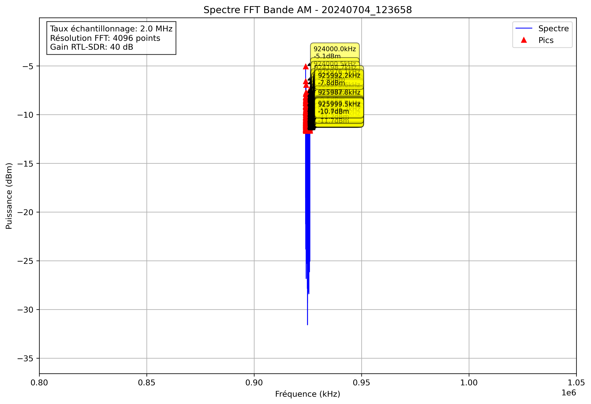

# Analyse Spectrale - 20240704_123658

## Paramètres

- Fréquence début: 800000.0 kHz
- Fréquence fin: 1050000.0 kHz
- Taux d'échantillonnage: 2.0 MHz
- Taille FFT: 4096 points
- Gain RTL-SDR: 40 dB

## Pics Détectés

| Fréquence (kHz) | Puissance (dBm) |
|-----------------|----------------|
| 924000.0 | -5.1 |
| 924000.5 | -6.6 |
| 924001.0 | -9.8 |
| 924001.5 | -10.2 |
| 924002.0 | -9.1 |
| 924002.4 | -8.2 |
| 924002.9 | -8.5 |
| 924003.4 | -8.6 |
| 924004.9 | -10.2 |
| 924005.4 | -9.2 |
| 924010.3 | -10.8 |
| 924010.7 | -10.5 |
| 924011.7 | -11.5 |
| 924012.2 | -10.8 |
| 924016.1 | -11.6 |
| 924017.6 | -11.6 |
| 924021.5 | -11.1 |
| 924022.0 | -9.8 |
| 924022.5 | -11.5 |
| 924023.4 | -10.9 |
| 924025.4 | -10.5 |
| 924025.9 | -10.9 |
| 924027.3 | -11.5 |
| 924033.2 | -10.9 |
| 924036.6 | -11.5 |
| 924037.6 | -11.0 |
| 924038.1 | -8.8 |
| 924038.6 | -9.1 |
| 924039.6 | -11.2 |
| 924040.0 | -11.3 |
| 924044.9 | -10.7 |
| 924053.2 | -10.3 |
| 924056.2 | -10.2 |
| 924058.1 | -10.0 |
| 924058.6 | -8.8 |
| 924064.0 | -11.1 |
| 924064.5 | -7.8 |
| 924065.9 | -10.3 |
| 924066.4 | -8.8 |
| 924066.9 | -9.7 |
| 924070.8 | -11.6 |
| 924071.3 | -10.6 |
| 924076.2 | -11.4 |
| 924079.1 | -9.7 |
| 924079.6 | -8.2 |
| 924080.1 | -10.6 |
| 924082.5 | -11.3 |
| 924083.0 | -11.0 |
| 924083.5 | -11.2 |
| 924098.1 | -10.5 |
| 924102.1 | -9.7 |
| 924102.5 | -9.7 |
| 924104.0 | -11.2 |
| 924104.5 | -10.6 |
| 924112.8 | -11.7 |
| 924121.1 | -11.5 |
| 924123.0 | -8.6 |
| 924126.5 | -9.9 |
| 924127.0 | -9.6 |
| 924127.4 | -11.5 |
| 924128.4 | -10.9 |
| 924128.9 | -9.8 |
| 924129.4 | -10.7 |
| 924132.8 | -11.4 |
| 924133.3 | -10.5 |
| 924136.2 | -11.6 |
| 924140.6 | -11.2 |
| 924143.1 | -9.8 |
| 924144.5 | -11.0 |
| 924146.0 | -11.0 |
| 924146.5 | -10.9 |
| 924147.0 | -10.1 |
| 924147.9 | -9.8 |
| 924148.4 | -11.3 |
| 924148.9 | -11.6 |
| 924151.9 | -8.6 |
| 924152.3 | -8.4 |
| 924165.5 | -8.7 |
| 924166.0 | -7.9 |
| 924166.5 | -9.6 |
| 924168.5 | -9.3 |
| 924168.9 | -9.1 |
| 924169.4 | -11.1 |
| 924170.4 | -9.5 |
| 924170.9 | -8.9 |
| 924173.3 | -10.2 |
| 924173.8 | -9.4 |
| 924174.3 | -10.3 |
| 924179.2 | -11.1 |
| 924179.7 | -10.6 |
| 924181.6 | -10.1 |
| 924182.1 | -10.4 |
| 924184.1 | -11.2 |
| 924192.4 | -11.6 |
| 924198.2 | -8.5 |
| 924198.7 | -6.9 |
| 924199.2 | -7.7 |
| 924204.1 | -9.1 |
| 924204.6 | -10.5 |
| 924214.4 | -9.7 |
| 924214.8 | -8.5 |
| 924215.3 | -10.7 |
| 924218.8 | -10.0 |
| 924219.2 | -9.6 |
| 924219.7 | -11.2 |
| 924220.2 | -10.6 |
| 924229.0 | -11.4 |
| 924236.3 | -11.3 |
| 924236.8 | -10.3 |
| 924237.3 | -11.4 |
| 924239.3 | -9.4 |
| 924239.7 | -10.1 |
| 924242.7 | -9.7 |
| 924243.2 | -10.6 |
| 924243.7 | -10.4 |
| 924260.7 | -11.3 |
| 924262.2 | -9.1 |
| 924262.7 | -9.1 |
| 924265.6 | -11.4 |
| 924266.1 | -10.1 |
| 924266.6 | -10.0 |
| 924268.1 | -10.9 |
| 924272.9 | -10.3 |
| 924275.9 | -10.6 |
| 924276.4 | -11.1 |
| 924276.9 | -10.7 |
| 924277.3 | -11.4 |
| 924277.8 | -11.2 |
| 924283.7 | -10.8 |
| 924287.1 | -11.5 |
| 924287.6 | -11.4 |
| 924295.4 | -10.5 |
| 924302.7 | -11.2 |
| 924303.2 | -11.5 |
| 924303.7 | -11.3 |
| 924304.2 | -8.5 |
| 924305.2 | -9.4 |
| 924305.7 | -11.3 |
| 924307.1 | -9.1 |
| 924307.6 | -9.6 |
| 924318.4 | -10.9 |
| 924318.8 | -11.5 |
| 924322.3 | -10.2 |
| 924322.8 | -9.8 |
| 924323.2 | -10.0 |
| 924323.7 | -10.6 |
| 924324.2 | -11.3 |
| 924327.1 | -10.7 |
| 924327.6 | -10.6 |
| 924332.5 | -11.5 |
| 924338.4 | -11.2 |
| 924340.8 | -11.2 |
| 924343.8 | -11.6 |
| 924344.2 | -11.1 |
| 924350.6 | -9.9 |
| 924351.1 | -9.0 |
| 924351.6 | -10.1 |
| 924352.1 | -11.6 |
| 924357.4 | -10.6 |
| 924358.4 | -9.5 |
| 924365.7 | -11.4 |
| 924372.6 | -11.3 |
| 924373.0 | -9.8 |
| 924376.5 | -11.1 |
| 924377.9 | -10.2 |
| 924378.4 | -10.8 |
| 924387.7 | -11.0 |
| 924388.2 | -11.1 |
| 924391.1 | -8.4 |
| 924391.6 | -10.1 |
| 924398.9 | -11.2 |
| 924402.8 | -11.7 |
| 924406.7 | -10.7 |
| 924408.2 | -11.6 |
| 924415.5 | -11.6 |
| 924418.0 | -11.5 |
| 924418.5 | -10.6 |
| 924420.4 | -10.1 |
| 924420.9 | -11.2 |
| 924422.4 | -10.3 |
| 924422.9 | -8.6 |
| 924423.3 | -8.2 |
| 924423.8 | -9.0 |
| 924428.2 | -9.5 |
| 924428.7 | -9.7 |
| 924430.2 | -10.8 |
| 924430.7 | -9.3 |
| 924431.2 | -10.3 |
| 924438.0 | -11.0 |
| 924438.5 | -11.5 |
| 924439.9 | -10.0 |
| 924440.4 | -10.4 |
| 924441.9 | -10.3 |
| 924446.3 | -10.6 |
| 924451.2 | -10.1 |
| 924451.7 | -10.3 |
| 924453.1 | -11.3 |
| 924458.5 | -11.3 |
| 924465.8 | -10.2 |
| 924466.3 | -9.9 |
| 924466.8 | -11.5 |
| 924486.3 | -10.9 |
| 924486.8 | -9.7 |
| 924487.3 | -9.0 |
| 924492.7 | -10.9 |
| 924500.5 | -10.5 |
| 924501.0 | -9.5 |
| 924508.8 | -11.2 |
| 924513.7 | -9.2 |
| 924514.2 | -10.2 |
| 924518.6 | -11.2 |
| 924521.0 | -11.4 |
| 924522.0 | -11.7 |
| 924536.1 | -9.2 |
| 924536.6 | -8.1 |
| 924537.1 | -9.0 |
| 924545.4 | -11.4 |
| 924546.9 | -10.0 |
| 924547.4 | -9.6 |
| 924549.3 | -10.9 |
| 924550.8 | -11.5 |
| 924551.3 | -10.7 |
| 924552.7 | -11.5 |
| 924553.2 | -11.0 |
| 924554.2 | -11.6 |
| 924558.1 | -11.0 |
| 924561.5 | -10.5 |
| 924562.0 | -8.8 |
| 924562.5 | -11.3 |
| 924566.4 | -9.1 |
| 924566.9 | -10.3 |
| 924567.4 | -11.6 |
| 924568.8 | -10.8 |
| 924569.3 | -10.7 |
| 924571.3 | -11.5 |
| 924575.2 | -10.9 |
| 924580.1 | -10.1 |
| 924580.6 | -9.4 |
| 924581.1 | -10.4 |
| 924582.0 | -11.4 |
| 924582.5 | -10.6 |
| 924592.3 | -11.6 |
| 924592.8 | -9.4 |
| 924593.3 | -10.2 |
| 924594.2 | -9.0 |
| 924594.7 | -8.5 |
| 924599.6 | -10.3 |
| 924600.1 | -10.5 |
| 924600.6 | -11.4 |
| 924601.1 | -11.2 |
| 924603.5 | -10.5 |
| 924606.9 | -9.8 |
| 924607.4 | -8.9 |
| 924614.3 | -10.3 |
| 924614.7 | -10.0 |
| 924617.7 | -10.7 |
| 924618.7 | -9.6 |
| 924626.5 | -10.9 |
| 924629.9 | -11.4 |
| 924637.7 | -11.3 |
| 924638.2 | -10.3 |
| 924640.6 | -10.7 |
| 924641.1 | -11.2 |
| 924658.2 | -10.9 |
| 924658.7 | -10.0 |
| 924661.6 | -10.9 |
| 924663.1 | -10.8 |
| 924663.6 | -11.6 |
| 924668.0 | -11.2 |
| 924671.4 | -11.5 |
| 924690.4 | -10.8 |
| 924691.9 | -11.1 |
| 924701.2 | -11.2 |
| 924702.1 | -11.7 |
| 924702.6 | -11.1 |
| 924710.0 | -10.8 |
| 924710.4 | -10.4 |
| 924717.3 | -10.6 |
| 924718.8 | -10.3 |
| 924719.2 | -11.0 |
| 924719.7 | -11.4 |
| 924723.1 | -11.4 |
| 924723.6 | -11.4 |
| 924728.0 | -11.5 |
| 924728.5 | -11.0 |
| 924730.0 | -11.4 |
| 924734.9 | -10.7 |
| 924735.4 | -10.3 |
| 924735.8 | -10.3 |
| 924736.3 | -11.0 |
| 924738.3 | -10.1 |
| 924738.8 | -9.7 |
| 924744.6 | -10.9 |
| 924745.1 | -11.5 |
| 924754.9 | -10.1 |
| 924755.4 | -9.4 |
| 924760.7 | -10.7 |
| 924761.2 | -10.2 |
| 924763.2 | -11.7 |
| 924765.6 | -11.7 |
| 924767.6 | -10.0 |
| 924781.7 | -11.3 |
| 924786.1 | -11.4 |
| 924791.5 | -10.1 |
| 924792.0 | -9.2 |
| 924792.5 | -10.7 |
| 924796.4 | -11.0 |
| 924796.9 | -9.2 |
| 924797.4 | -10.5 |
| 924802.2 | -11.4 |
| 924806.2 | -10.3 |
| 924806.6 | -11.6 |
| 924829.1 | -10.9 |
| 924829.6 | -9.4 |
| 924830.1 | -11.2 |
| 924836.4 | -11.2 |
| 924841.8 | -11.1 |
| 924843.3 | -11.3 |
| 924847.7 | -11.5 |
| 924848.1 | -11.1 |
| 924848.6 | -11.0 |
| 924851.6 | -11.6 |
| 924865.7 | -11.5 |
| 924974.1 | -11.4 |
| 925032.7 | -11.6 |
| 925108.9 | -11.3 |
| 925122.1 | -10.9 |
| 925122.6 | -9.6 |
| 925170.4 | -11.5 |
| 925173.8 | -11.5 |
| 925174.3 | -11.5 |
| 925178.7 | -11.1 |
| 925200.2 | -10.9 |
| 925200.7 | -9.0 |
| 925201.2 | -10.6 |
| 925206.5 | -11.0 |
| 925225.1 | -10.9 |
| 925225.6 | -11.2 |
| 925242.2 | -11.2 |
| 925242.7 | -10.2 |
| 925244.6 | -11.6 |
| 925256.8 | -11.5 |
| 925257.3 | -11.0 |
| 925257.8 | -9.8 |
| 925258.3 | -11.3 |
| 925261.7 | -11.2 |
| 925262.2 | -11.3 |
| 925268.1 | -11.1 |
| 925268.6 | -11.0 |
| 925276.9 | -11.4 |
| 925277.3 | -11.6 |
| 925278.3 | -10.8 |
| 925278.8 | -11.6 |
| 925279.3 | -10.0 |
| 925281.2 | -11.6 |
| 925281.7 | -9.0 |
| 925282.2 | -11.3 |
| 925285.2 | -11.5 |
| 925285.6 | -8.4 |
| 925286.1 | -9.7 |
| 925289.6 | -8.8 |
| 925290.0 | -9.8 |
| 925292.0 | -11.6 |
| 925294.9 | -9.8 |
| 925295.4 | -10.4 |
| 925316.9 | -11.4 |
| 925321.3 | -10.9 |
| 925321.8 | -9.1 |
| 925328.1 | -10.5 |
| 925328.6 | -9.8 |
| 925329.1 | -11.4 |
| 925332.0 | -10.4 |
| 925332.5 | -10.6 |
| 925333.0 | -11.1 |
| 925333.5 | -11.4 |
| 925334.0 | -11.5 |
| 925334.5 | -11.0 |
| 925335.0 | -9.7 |
| 925335.4 | -10.4 |
| 925338.4 | -11.1 |
| 925344.7 | -9.1 |
| 925345.2 | -7.9 |
| 925345.7 | -8.2 |
| 925346.2 | -8.5 |
| 925346.7 | -9.1 |
| 925347.2 | -11.3 |
| 925350.1 | -11.6 |
| 925350.6 | -9.1 |
| 925359.4 | -11.3 |
| 925359.9 | -8.8 |
| 925365.7 | -10.9 |
| 925366.2 | -10.1 |
| 925368.7 | -11.4 |
| 925369.1 | -9.8 |
| 925369.6 | -8.9 |
| 925370.1 | -9.5 |
| 925377.0 | -10.7 |
| 925377.4 | -10.0 |
| 925377.9 | -10.9 |
| 925380.4 | -9.9 |
| 925380.9 | -11.2 |
| 925383.8 | -10.5 |
| 925387.7 | -10.8 |
| 925388.2 | -9.6 |
| 925395.5 | -8.7 |
| 925396.0 | -9.1 |
| 925396.5 | -11.0 |
| 925401.4 | -11.3 |
| 925403.8 | -10.1 |
| 925405.3 | -11.4 |
| 925405.8 | -9.7 |
| 925406.2 | -10.3 |
| 925406.7 | -11.6 |
| 925410.6 | -9.4 |
| 925411.1 | -8.5 |
| 925411.6 | -9.0 |
| 925413.1 | -11.0 |
| 925416.0 | -10.3 |
| 925416.5 | -10.0 |
| 925439.5 | -11.5 |
| 925439.9 | -8.2 |
| 925440.4 | -9.4 |
| 925443.4 | -10.9 |
| 925447.8 | -9.2 |
| 925448.2 | -10.5 |
| 925456.1 | -10.9 |
| 925461.4 | -11.5 |
| 925466.8 | -9.3 |
| 925467.3 | -8.9 |
| 925467.8 | -8.3 |
| 925468.3 | -9.4 |
| 925471.2 | -11.2 |
| 925471.7 | -10.4 |
| 925472.2 | -8.6 |
| 925472.7 | -10.2 |
| 925473.6 | -11.2 |
| 925474.1 | -11.4 |
| 925476.1 | -11.6 |
| 925495.1 | -9.7 |
| 925495.6 | -10.2 |
| 925496.1 | -10.8 |
| 925497.6 | -11.4 |
| 925499.0 | -11.2 |
| 925499.5 | -9.5 |
| 925503.9 | -9.7 |
| 925504.4 | -9.8 |
| 925504.9 | -10.1 |
| 925505.9 | -11.2 |
| 925506.3 | -9.7 |
| 925516.1 | -11.0 |
| 925521.0 | -10.8 |
| 925521.5 | -10.4 |
| 925522.0 | -11.2 |
| 925527.3 | -11.5 |
| 925527.8 | -10.6 |
| 925530.3 | -11.4 |
| 925539.6 | -11.7 |
| 925540.0 | -10.5 |
| 925540.5 | -10.6 |
| 925549.8 | -10.4 |
| 925552.2 | -10.7 |
| 925556.2 | -11.4 |
| 925556.6 | -9.7 |
| 925557.1 | -10.8 |
| 925558.6 | -10.8 |
| 925559.1 | -10.8 |
| 925559.6 | -8.9 |
| 925560.1 | -9.6 |
| 925572.3 | -11.3 |
| 925574.2 | -11.1 |
| 925574.7 | -9.7 |
| 925575.2 | -11.0 |
| 925576.7 | -10.2 |
| 925577.1 | -10.8 |
| 925577.6 | -9.8 |
| 925580.6 | -10.6 |
| 925588.4 | -11.7 |
| 925592.8 | -9.6 |
| 925593.3 | -8.4 |
| 925593.8 | -8.4 |
| 925594.2 | -10.0 |
| 925598.1 | -10.8 |
| 925598.6 | -10.7 |
| 925600.6 | -9.8 |
| 925601.1 | -10.1 |
| 925601.6 | -9.4 |
| 925602.1 | -11.6 |
| 925606.9 | -10.7 |
| 925607.4 | -9.8 |
| 925607.9 | -11.2 |
| 925616.7 | -11.0 |
| 925617.2 | -10.2 |
| 925641.6 | -11.3 |
| 925642.1 | -9.6 |
| 925644.0 | -9.7 |
| 925650.9 | -9.8 |
| 925651.4 | -10.1 |
| 925651.9 | -8.4 |
| 925652.3 | -8.6 |
| 925652.8 | -10.1 |
| 925660.6 | -9.6 |
| 925670.4 | -9.3 |
| 925670.9 | -8.4 |
| 925671.4 | -10.2 |
| 925672.9 | -10.9 |
| 925673.3 | -11.4 |
| 925680.7 | -10.9 |
| 925681.2 | -9.5 |
| 925681.6 | -9.5 |
| 925682.1 | -9.6 |
| 925686.5 | -9.9 |
| 925687.0 | -11.3 |
| 925691.4 | -11.0 |
| 925695.8 | -11.2 |
| 925703.1 | -11.5 |
| 925704.6 | -11.2 |
| 925715.8 | -10.3 |
| 925716.3 | -8.6 |
| 925718.3 | -9.0 |
| 925718.8 | -9.2 |
| 925720.7 | -9.7 |
| 925722.7 | -9.9 |
| 925723.1 | -10.5 |
| 925726.1 | -11.3 |
| 925726.6 | -9.1 |
| 925728.0 | -9.0 |
| 925728.5 | -9.6 |
| 925729.5 | -10.0 |
| 925730.0 | -10.1 |
| 925744.1 | -10.7 |
| 925748.0 | -11.1 |
| 925758.3 | -11.4 |
| 925758.8 | -10.8 |
| 925760.7 | -11.2 |
| 925761.2 | -9.5 |
| 925765.6 | -11.5 |
| 925769.5 | -11.3 |
| 925785.6 | -11.1 |
| 925791.5 | -11.6 |
| 925793.0 | -10.6 |
| 925799.3 | -10.8 |
| 925799.8 | -11.2 |
| 925802.2 | -11.6 |
| 925804.7 | -10.4 |
| 925805.2 | -11.3 |
| 925805.7 | -10.8 |
| 925811.0 | -11.5 |
| 925814.9 | -10.1 |
| 925815.4 | -8.8 |
| 925815.9 | -10.9 |
| 925818.4 | -11.4 |
| 925821.3 | -10.2 |
| 925821.8 | -9.2 |
| 925822.3 | -10.2 |
| 925824.2 | -11.6 |
| 925824.7 | -10.8 |
| 925831.5 | -9.7 |
| 925832.0 | -9.7 |
| 925832.5 | -9.7 |
| 925833.0 | -11.3 |
| 925841.8 | -11.5 |
| 925847.7 | -9.2 |
| 925848.1 | -7.9 |
| 925851.6 | -11.6 |
| 925877.0 | -11.6 |
| 925882.3 | -9.3 |
| 925882.8 | -8.8 |
| 925883.3 | -11.0 |
| 925887.2 | -8.8 |
| 925887.7 | -9.7 |
| 925888.2 | -9.7 |
| 925888.7 | -10.5 |
| 925889.2 | -10.6 |
| 925889.6 | -11.6 |
| 925894.0 | -11.5 |
| 925896.0 | -10.8 |
| 925897.9 | -10.5 |
| 925898.4 | -9.1 |
| 925903.8 | -10.0 |
| 925904.3 | -9.4 |
| 925908.7 | -11.1 |
| 925909.2 | -10.5 |
| 925912.1 | -11.6 |
| 925916.5 | -11.4 |
| 925917.0 | -11.6 |
| 925919.9 | -10.0 |
| 925920.4 | -8.9 |
| 925930.7 | -10.3 |
| 925931.2 | -9.4 |
| 925931.6 | -11.2 |
| 925935.1 | -9.6 |
| 925935.5 | -9.9 |
| 925938.0 | -9.7 |
| 925938.5 | -10.7 |
| 925943.8 | -10.8 |
| 925944.3 | -9.8 |
| 925944.8 | -10.7 |
| 925945.3 | -11.6 |
| 925946.3 | -11.3 |
| 925957.0 | -10.4 |
| 925961.4 | -11.2 |
| 925973.6 | -11.1 |
| 925974.1 | -9.7 |
| 925974.6 | -10.7 |
| 925975.6 | -8.7 |
| 925976.1 | -7.4 |
| 925976.6 | -10.4 |
| 925987.3 | -10.5 |
| 925987.8 | -9.5 |
| 925988.3 | -10.6 |
| 925989.7 | -11.7 |
| 925991.7 | -11.2 |
| 925992.2 | -7.8 |
| 925992.7 | -10.6 |
| 925999.5 | -10.7 |
