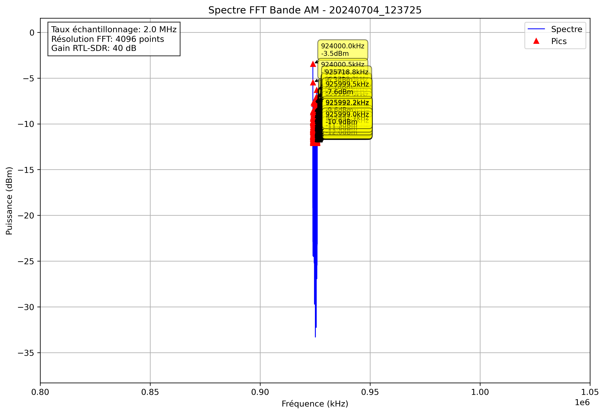

# Analyse Spectrale - 20240704_123725

## Paramètres

- Fréquence début: 800000.0 kHz
- Fréquence fin: 1050000.0 kHz
- Taux d'échantillonnage: 2.0 MHz
- Taille FFT: 4096 points
- Gain RTL-SDR: 40 dB

## Pics Détectés

| Fréquence (kHz) | Puissance (dBm) |
|-----------------|----------------|
| 924000.0 | -3.5 |
| 924000.5 | -5.5 |
| 924001.0 | -9.8 |
| 924001.5 | -11.5 |
| 924002.0 | -10.4 |
| 924002.4 | -9.8 |
| 924002.9 | -12.0 |
| 924004.9 | -9.9 |
| 924005.4 | -8.8 |
| 924005.9 | -10.8 |
| 924006.3 | -11.6 |
| 924008.8 | -12.0 |
| 924009.3 | -12.1 |
| 924009.8 | -11.4 |
| 924010.3 | -10.8 |
| 924022.0 | -10.5 |
| 924022.5 | -11.3 |
| 924035.6 | -11.8 |
| 924036.1 | -11.4 |
| 924038.1 | -9.5 |
| 924038.6 | -9.4 |
| 924052.7 | -10.7 |
| 924058.6 | -9.8 |
| 924060.5 | -10.5 |
| 924061.0 | -12.0 |
| 924062.5 | -12.0 |
| 924063.5 | -11.4 |
| 924064.0 | -10.8 |
| 924064.5 | -9.7 |
| 924066.4 | -10.1 |
| 924066.9 | -11.7 |
| 924076.2 | -11.3 |
| 924076.7 | -10.6 |
| 924077.1 | -12.1 |
| 924078.1 | -10.9 |
| 924078.6 | -10.7 |
| 924079.1 | -9.7 |
| 924079.6 | -8.6 |
| 924080.1 | -10.7 |
| 924082.0 | -11.3 |
| 924082.5 | -9.9 |
| 924083.0 | -9.4 |
| 924083.5 | -9.7 |
| 924084.0 | -11.3 |
| 924086.9 | -11.7 |
| 924089.4 | -11.5 |
| 924089.8 | -11.8 |
| 924098.1 | -11.4 |
| 924102.1 | -9.4 |
| 924102.5 | -10.1 |
| 924126.5 | -11.2 |
| 924127.4 | -10.7 |
| 924127.9 | -11.8 |
| 924129.4 | -11.3 |
| 924129.9 | -11.4 |
| 924131.3 | -11.7 |
| 924131.8 | -11.0 |
| 924143.1 | -11.5 |
| 924143.6 | -11.2 |
| 924144.0 | -10.7 |
| 924144.5 | -11.4 |
| 924146.0 | -9.2 |
| 924146.5 | -9.9 |
| 924148.4 | -11.8 |
| 924153.3 | -11.6 |
| 924166.0 | -11.7 |
| 924166.5 | -10.3 |
| 924169.4 | -12.1 |
| 924169.9 | -11.8 |
| 924170.4 | -10.5 |
| 924170.9 | -10.1 |
| 924173.8 | -9.4 |
| 924174.3 | -9.8 |
| 924182.1 | -11.9 |
| 924188.0 | -11.9 |
| 924188.5 | -11.2 |
| 924189.5 | -11.4 |
| 924193.8 | -11.4 |
| 924194.3 | -11.9 |
| 924198.2 | -10.4 |
| 924198.7 | -9.3 |
| 924199.2 | -11.9 |
| 924204.6 | -11.3 |
| 924209.5 | -11.3 |
| 924210.0 | -11.3 |
| 924212.9 | -11.8 |
| 924214.8 | -9.8 |
| 924215.3 | -10.5 |
| 924218.8 | -12.0 |
| 924219.2 | -11.1 |
| 924219.7 | -11.6 |
| 924222.7 | -11.1 |
| 924223.1 | -11.3 |
| 924224.6 | -12.1 |
| 924225.1 | -11.6 |
| 924228.5 | -10.4 |
| 924236.8 | -11.1 |
| 924237.3 | -10.6 |
| 924239.3 | -10.3 |
| 924239.7 | -11.1 |
| 924242.7 | -11.6 |
| 924243.2 | -10.7 |
| 924243.7 | -10.6 |
| 924245.1 | -11.7 |
| 924255.4 | -11.9 |
| 924255.9 | -10.5 |
| 924256.3 | -10.1 |
| 924256.8 | -10.8 |
| 924257.3 | -10.7 |
| 924258.8 | -11.6 |
| 924259.3 | -10.0 |
| 924259.8 | -9.6 |
| 924260.3 | -11.4 |
| 924262.2 | -9.0 |
| 924262.7 | -11.3 |
| 924266.1 | -11.1 |
| 924266.6 | -12.0 |
| 924276.4 | -12.0 |
| 924277.8 | -11.6 |
| 924283.7 | -10.3 |
| 924284.2 | -11.4 |
| 924295.4 | -10.6 |
| 924303.2 | -12.0 |
| 924303.7 | -11.6 |
| 924304.2 | -7.7 |
| 924305.2 | -9.2 |
| 924318.4 | -11.6 |
| 924318.8 | -11.2 |
| 924321.8 | -11.9 |
| 924327.1 | -11.5 |
| 924332.5 | -10.3 |
| 924333.0 | -10.8 |
| 924337.9 | -12.1 |
| 924338.4 | -11.1 |
| 924339.8 | -11.6 |
| 924340.3 | -9.7 |
| 924340.8 | -10.7 |
| 924343.8 | -11.8 |
| 924344.2 | -11.0 |
| 924344.7 | -11.6 |
| 924347.7 | -12.0 |
| 924348.1 | -9.4 |
| 924348.6 | -10.6 |
| 924350.6 | -12.1 |
| 924351.1 | -10.8 |
| 924366.2 | -12.1 |
| 924371.6 | -11.5 |
| 924373.0 | -10.1 |
| 924376.5 | -11.4 |
| 924377.0 | -10.0 |
| 924377.4 | -9.3 |
| 924377.9 | -8.6 |
| 924378.4 | -10.5 |
| 924382.8 | -11.9 |
| 924387.7 | -11.3 |
| 924388.2 | -10.8 |
| 924392.6 | -12.1 |
| 924393.1 | -9.9 |
| 924399.4 | -11.9 |
| 924408.2 | -10.2 |
| 924408.7 | -10.2 |
| 924414.6 | -11.9 |
| 924415.0 | -11.2 |
| 924417.5 | -11.9 |
| 924418.0 | -9.8 |
| 924418.5 | -11.2 |
| 924420.4 | -11.8 |
| 924422.4 | -11.0 |
| 924422.9 | -9.8 |
| 924423.3 | -8.7 |
| 924423.8 | -9.4 |
| 924424.3 | -11.5 |
| 924428.7 | -11.1 |
| 924430.7 | -10.4 |
| 924431.2 | -10.7 |
| 924431.6 | -11.1 |
| 924438.5 | -11.2 |
| 924439.0 | -12.1 |
| 924440.4 | -10.8 |
| 924440.9 | -11.0 |
| 924445.3 | -11.3 |
| 924445.8 | -10.5 |
| 924446.3 | -10.3 |
| 924451.2 | -11.3 |
| 924451.7 | -12.0 |
| 924455.6 | -11.1 |
| 924470.2 | -9.5 |
| 924470.7 | -9.3 |
| 924472.7 | -9.3 |
| 924473.1 | -9.5 |
| 924476.1 | -11.4 |
| 924484.4 | -12.0 |
| 924486.3 | -10.9 |
| 924486.8 | -10.3 |
| 924492.2 | -10.8 |
| 924497.1 | -11.1 |
| 924497.6 | -11.0 |
| 924498.0 | -11.6 |
| 924500.5 | -10.2 |
| 924501.0 | -11.3 |
| 924503.9 | -12.0 |
| 924504.4 | -11.9 |
| 924505.9 | -11.5 |
| 924508.8 | -11.8 |
| 924513.2 | -11.6 |
| 924513.7 | -8.8 |
| 924514.2 | -9.5 |
| 924515.6 | -10.9 |
| 924516.1 | -11.4 |
| 924518.1 | -11.9 |
| 924519.0 | -11.8 |
| 924521.0 | -11.3 |
| 924524.9 | -11.2 |
| 924528.8 | -11.9 |
| 924529.3 | -11.3 |
| 924529.8 | -11.5 |
| 924530.8 | -11.8 |
| 924531.2 | -12.0 |
| 924536.1 | -11.7 |
| 924536.6 | -10.8 |
| 924537.1 | -10.5 |
| 924537.6 | -12.0 |
| 924542.5 | -11.3 |
| 924543.0 | -11.3 |
| 924545.4 | -10.1 |
| 924545.9 | -12.0 |
| 924559.6 | -10.2 |
| 924560.1 | -10.4 |
| 924561.5 | -9.6 |
| 924562.0 | -7.8 |
| 924562.5 | -10.3 |
| 924566.9 | -11.7 |
| 924567.4 | -10.3 |
| 924567.9 | -11.4 |
| 924575.2 | -10.6 |
| 924575.7 | -12.1 |
| 924576.7 | -11.4 |
| 924577.1 | -11.5 |
| 924580.6 | -11.3 |
| 924582.0 | -10.1 |
| 924582.5 | -9.6 |
| 924583.0 | -10.8 |
| 924583.5 | -11.1 |
| 924589.4 | -12.0 |
| 924589.8 | -11.3 |
| 924592.8 | -10.6 |
| 924593.3 | -9.3 |
| 924594.7 | -9.9 |
| 924600.1 | -11.4 |
| 924600.6 | -11.2 |
| 924601.1 | -10.9 |
| 924603.0 | -11.7 |
| 924603.5 | -9.5 |
| 924604.0 | -10.7 |
| 924606.9 | -9.4 |
| 924607.4 | -9.7 |
| 924614.3 | -11.1 |
| 924616.7 | -11.5 |
| 924617.2 | -11.1 |
| 924617.7 | -9.3 |
| 924618.2 | -11.9 |
| 924618.7 | -9.4 |
| 924624.0 | -11.3 |
| 924627.0 | -11.6 |
| 924629.9 | -11.0 |
| 924637.7 | -10.1 |
| 924638.2 | -10.1 |
| 924640.1 | -11.1 |
| 924640.6 | -10.9 |
| 924642.6 | -11.5 |
| 924645.0 | -10.9 |
| 924645.5 | -11.4 |
| 924651.9 | -11.4 |
| 924657.2 | -11.8 |
| 924661.6 | -11.6 |
| 924663.1 | -10.0 |
| 924663.6 | -11.7 |
| 924671.4 | -9.3 |
| 924671.9 | -11.7 |
| 924673.3 | -11.8 |
| 924690.4 | -10.8 |
| 924693.4 | -11.8 |
| 924693.8 | -11.8 |
| 924699.7 | -11.2 |
| 924700.2 | -11.9 |
| 924700.7 | -10.7 |
| 924701.2 | -10.0 |
| 924701.7 | -11.2 |
| 924710.4 | -11.9 |
| 924715.8 | -11.8 |
| 924716.3 | -12.0 |
| 924720.2 | -11.7 |
| 924723.1 | -11.6 |
| 924727.1 | -11.9 |
| 924728.0 | -12.0 |
| 924728.5 | -10.2 |
| 924729.0 | -11.8 |
| 924729.5 | -11.7 |
| 924730.0 | -12.0 |
| 924735.4 | -10.5 |
| 924735.8 | -10.2 |
| 924736.3 | -10.6 |
| 924741.2 | -10.3 |
| 924741.7 | -11.7 |
| 924742.7 | -12.0 |
| 924744.6 | -11.2 |
| 924747.1 | -11.5 |
| 924761.2 | -11.5 |
| 924764.2 | -11.8 |
| 924771.0 | -12.1 |
| 924773.9 | -11.5 |
| 924781.7 | -9.9 |
| 924782.2 | -11.7 |
| 924786.1 | -11.5 |
| 924791.5 | -11.6 |
| 924796.4 | -10.8 |
| 924796.9 | -10.5 |
| 924806.6 | -11.1 |
| 924807.1 | -11.9 |
| 924841.8 | -10.6 |
| 924843.3 | -12.0 |
| 924843.8 | -11.6 |
| 924865.2 | -10.4 |
| 924865.7 | -11.1 |
| 924876.0 | -10.8 |
| 924891.6 | -11.7 |
| 924928.2 | -12.0 |
| 924974.6 | -11.8 |
| 925122.6 | -10.1 |
| 925123.0 | -10.7 |
| 925160.6 | -10.4 |
| 925187.0 | -11.8 |
| 925189.5 | -11.4 |
| 925195.3 | -11.2 |
| 925195.8 | -11.1 |
| 925196.3 | -11.8 |
| 925196.8 | -12.0 |
| 925206.1 | -11.4 |
| 925206.5 | -10.2 |
| 925207.0 | -11.2 |
| 925208.5 | -11.8 |
| 925222.7 | -11.8 |
| 925238.8 | -8.8 |
| 925239.3 | -11.6 |
| 925244.1 | -12.0 |
| 925244.6 | -11.9 |
| 925250.5 | -11.7 |
| 925256.8 | -12.1 |
| 925267.1 | -11.7 |
| 925267.6 | -11.9 |
| 925268.1 | -11.8 |
| 925268.6 | -11.9 |
| 925277.3 | -10.5 |
| 925278.3 | -12.0 |
| 925285.2 | -11.9 |
| 925289.6 | -11.3 |
| 925290.0 | -12.1 |
| 925292.0 | -10.7 |
| 925292.5 | -10.2 |
| 925293.0 | -11.9 |
| 925299.8 | -10.9 |
| 925300.3 | -12.1 |
| 925305.7 | -11.9 |
| 925316.9 | -11.8 |
| 925321.3 | -8.5 |
| 925321.8 | -7.7 |
| 925323.2 | -11.7 |
| 925325.7 | -11.8 |
| 925331.5 | -10.9 |
| 925332.0 | -8.0 |
| 925332.5 | -9.0 |
| 925334.5 | -11.7 |
| 925335.0 | -11.1 |
| 925335.4 | -11.3 |
| 925335.9 | -10.6 |
| 925344.7 | -10.8 |
| 925345.2 | -10.1 |
| 925345.7 | -10.1 |
| 925346.2 | -10.7 |
| 925358.9 | -11.1 |
| 925362.3 | -10.5 |
| 925362.8 | -9.4 |
| 925369.6 | -10.0 |
| 925370.1 | -10.9 |
| 925370.6 | -11.2 |
| 925371.1 | -11.2 |
| 925377.9 | -11.8 |
| 925379.9 | -10.2 |
| 925380.4 | -7.6 |
| 925380.9 | -9.3 |
| 925383.8 | -10.2 |
| 925384.3 | -11.2 |
| 925386.7 | -11.6 |
| 925387.2 | -11.6 |
| 925387.7 | -10.6 |
| 925388.2 | -11.7 |
| 925391.6 | -12.0 |
| 925395.5 | -11.4 |
| 925396.0 | -9.3 |
| 925396.5 | -10.8 |
| 925400.4 | -12.1 |
| 925400.9 | -11.4 |
| 925401.4 | -10.3 |
| 925401.9 | -11.7 |
| 925403.8 | -10.1 |
| 925406.2 | -10.1 |
| 925406.7 | -10.2 |
| 925407.2 | -10.6 |
| 925407.7 | -9.7 |
| 925408.2 | -10.6 |
| 925410.2 | -8.3 |
| 925410.6 | -7.2 |
| 925411.1 | -8.3 |
| 925411.6 | -11.1 |
| 925412.6 | -11.6 |
| 925413.1 | -9.9 |
| 925414.6 | -11.5 |
| 925416.0 | -11.2 |
| 925424.8 | -11.1 |
| 925425.3 | -10.9 |
| 925427.2 | -12.0 |
| 925427.7 | -10.5 |
| 925428.2 | -10.5 |
| 925439.5 | -9.9 |
| 925439.9 | -9.4 |
| 925455.1 | -11.6 |
| 925455.6 | -12.0 |
| 925456.1 | -11.5 |
| 925466.3 | -11.4 |
| 925466.8 | -9.2 |
| 925467.3 | -9.1 |
| 925467.8 | -8.3 |
| 925468.3 | -8.3 |
| 925468.8 | -10.1 |
| 925470.2 | -11.0 |
| 925470.7 | -9.7 |
| 925471.2 | -9.4 |
| 925471.7 | -9.9 |
| 925472.2 | -9.9 |
| 925474.1 | -10.6 |
| 925474.6 | -11.1 |
| 925476.1 | -10.7 |
| 925478.0 | -11.2 |
| 925495.6 | -11.5 |
| 925496.1 | -10.4 |
| 925503.9 | -10.4 |
| 925504.4 | -10.8 |
| 925506.3 | -11.3 |
| 925508.8 | -11.4 |
| 925509.3 | -11.9 |
| 925511.2 | -12.0 |
| 925511.7 | -11.3 |
| 925512.2 | -11.7 |
| 925514.6 | -10.6 |
| 925515.1 | -10.9 |
| 925523.9 | -11.9 |
| 925524.4 | -10.8 |
| 925535.2 | -11.4 |
| 925540.0 | -11.1 |
| 925540.5 | -10.4 |
| 925546.9 | -11.9 |
| 925550.3 | -12.0 |
| 925552.2 | -11.0 |
| 925552.7 | -10.4 |
| 925553.2 | -11.2 |
| 925556.2 | -11.6 |
| 925556.6 | -10.9 |
| 925558.6 | -9.4 |
| 925559.1 | -8.7 |
| 925559.6 | -8.3 |
| 925560.1 | -11.0 |
| 925564.5 | -10.7 |
| 925564.9 | -11.9 |
| 925567.4 | -11.4 |
| 925573.7 | -12.1 |
| 925574.2 | -11.8 |
| 925575.2 | -11.9 |
| 925577.6 | -10.2 |
| 925580.6 | -11.1 |
| 925585.4 | -11.9 |
| 925588.9 | -11.1 |
| 925589.4 | -10.8 |
| 925589.8 | -11.0 |
| 925593.3 | -12.0 |
| 925598.1 | -12.0 |
| 925604.0 | -11.3 |
| 925604.5 | -10.9 |
| 925606.4 | -10.5 |
| 925606.9 | -11.5 |
| 925607.4 | -10.4 |
| 925607.9 | -11.0 |
| 925617.2 | -11.8 |
| 925635.3 | -11.0 |
| 925635.7 | -12.1 |
| 925636.2 | -11.8 |
| 925644.0 | -11.9 |
| 925650.9 | -11.5 |
| 925652.3 | -11.6 |
| 925652.8 | -11.7 |
| 925660.2 | -11.9 |
| 925662.6 | -9.9 |
| 925663.1 | -10.9 |
| 925665.0 | -11.8 |
| 925666.5 | -11.9 |
| 925670.9 | -11.9 |
| 925689.5 | -11.1 |
| 925689.9 | -11.5 |
| 925690.9 | -11.7 |
| 925691.4 | -12.0 |
| 925695.3 | -11.7 |
| 925695.8 | -11.6 |
| 925697.8 | -10.3 |
| 925698.2 | -11.9 |
| 925702.6 | -11.0 |
| 925703.1 | -9.8 |
| 925710.9 | -11.3 |
| 925716.3 | -11.1 |
| 925718.3 | -7.1 |
| 925718.8 | -6.3 |
| 925719.2 | -9.9 |
| 925720.7 | -9.9 |
| 925722.2 | -11.4 |
| 925722.7 | -11.0 |
| 925723.1 | -11.2 |
| 925724.1 | -11.0 |
| 925724.6 | -12.0 |
| 925729.5 | -11.6 |
| 925730.0 | -8.8 |
| 925730.5 | -10.1 |
| 925731.4 | -12.0 |
| 925738.3 | -10.7 |
| 925738.8 | -9.8 |
| 925739.3 | -11.7 |
| 925758.8 | -10.0 |
| 925759.3 | -11.3 |
| 925769.5 | -11.6 |
| 925775.4 | -11.9 |
| 925782.7 | -11.8 |
| 925793.0 | -11.6 |
| 925801.8 | -10.7 |
| 925805.7 | -11.2 |
| 925811.0 | -12.0 |
| 925814.9 | -10.9 |
| 925815.4 | -9.1 |
| 925815.9 | -9.9 |
| 925833.5 | -11.9 |
| 925837.4 | -10.9 |
| 925837.9 | -10.8 |
| 925841.8 | -11.8 |
| 925847.7 | -12.0 |
| 925848.1 | -11.1 |
| 925853.0 | -10.2 |
| 925864.7 | -11.3 |
| 925865.2 | -10.0 |
| 925865.7 | -10.9 |
| 925868.7 | -12.0 |
| 925878.9 | -11.9 |
| 925879.4 | -11.2 |
| 925882.3 | -10.3 |
| 925882.8 | -9.7 |
| 925883.3 | -10.5 |
| 925884.8 | -11.4 |
| 925885.3 | -11.7 |
| 925887.2 | -11.4 |
| 925889.6 | -12.1 |
| 925894.0 | -11.1 |
| 925896.0 | -12.1 |
| 925896.5 | -11.4 |
| 925897.0 | -11.5 |
| 925897.5 | -10.6 |
| 925897.9 | -10.5 |
| 925898.4 | -11.2 |
| 925903.8 | -10.5 |
| 925904.3 | -10.5 |
| 925916.5 | -10.1 |
| 925917.0 | -10.4 |
| 925920.4 | -11.1 |
| 925923.3 | -12.0 |
| 925925.3 | -11.9 |
| 925931.2 | -11.6 |
| 925931.6 | -11.3 |
| 925935.1 | -11.9 |
| 925935.5 | -11.2 |
| 925936.0 | -12.1 |
| 925938.0 | -10.3 |
| 925938.5 | -10.9 |
| 925943.8 | -10.8 |
| 925944.3 | -9.9 |
| 925944.8 | -11.3 |
| 925949.7 | -12.0 |
| 925951.7 | -11.2 |
| 925955.6 | -11.2 |
| 925956.1 | -11.1 |
| 925957.0 | -10.6 |
| 925957.5 | -11.4 |
| 925964.4 | -10.2 |
| 925964.8 | -11.0 |
| 925967.3 | -11.6 |
| 925971.7 | -11.7 |
| 925974.1 | -11.4 |
| 925975.6 | -10.7 |
| 925976.1 | -10.9 |
| 925976.6 | -12.0 |
| 925987.8 | -9.8 |
| 925988.3 | -9.8 |
| 925989.7 | -10.9 |
| 925990.2 | -9.7 |
| 925990.7 | -10.6 |
| 925991.7 | -11.6 |
| 925992.2 | -9.6 |
| 925992.7 | -11.3 |
| 925999.0 | -10.9 |
| 925999.5 | -7.6 |
