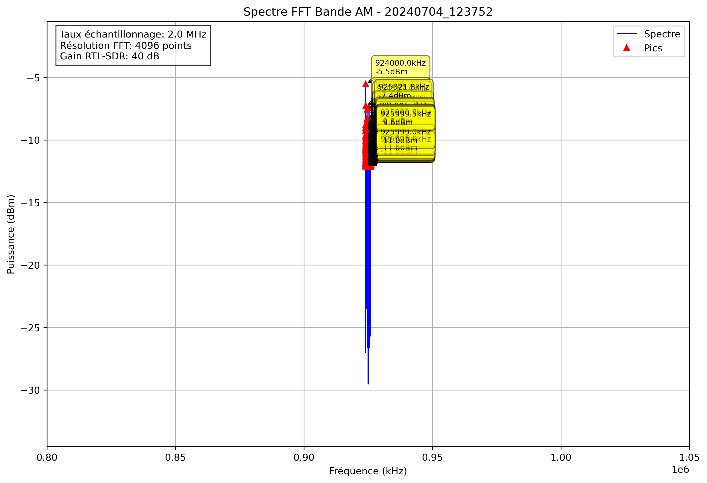

# Analyse Spectrale - 20240704_123752

## Paramètres

- Fréquence début: 800000.0 kHz
- Fréquence fin: 1050000.0 kHz
- Taux d'échantillonnage: 2.0 MHz
- Taille FFT: 4096 points
- Gain RTL-SDR: 40 dB

## Pics Détectés

| Fréquence (kHz) | Puissance (dBm) |
|-----------------|----------------|
| 924000.0 | -5.5 |
| 924000.5 | -7.3 |
| 924001.5 | -10.4 |
| 924002.0 | -9.0 |
| 924002.4 | -9.1 |
| 924002.9 | -10.0 |
| 924003.4 | -9.8 |
| 924003.9 | -9.6 |
| 924004.4 | -10.7 |
| 924004.9 | -9.3 |
| 924005.4 | -9.7 |
| 924005.9 | -12.0 |
| 924008.8 | -11.8 |
| 924010.3 | -11.2 |
| 924010.7 | -11.1 |
| 924016.1 | -11.6 |
| 924018.1 | -11.5 |
| 924018.6 | -11.8 |
| 924023.4 | -10.9 |
| 924023.9 | -9.6 |
| 924031.2 | -12.1 |
| 924036.1 | -12.1 |
| 924037.6 | -11.9 |
| 924038.1 | -10.2 |
| 924038.6 | -10.8 |
| 924042.0 | -12.0 |
| 924042.5 | -11.6 |
| 924053.7 | -12.0 |
| 924058.1 | -10.4 |
| 924058.6 | -10.5 |
| 924060.5 | -11.4 |
| 924061.0 | -11.8 |
| 924062.0 | -11.7 |
| 924062.5 | -10.6 |
| 924063.0 | -10.8 |
| 924063.5 | -10.1 |
| 924064.0 | -9.9 |
| 924064.5 | -9.3 |
| 924065.9 | -10.9 |
| 924066.4 | -9.6 |
| 924066.9 | -12.1 |
| 924077.1 | -11.8 |
| 924078.1 | -9.6 |
| 924078.6 | -9.2 |
| 924079.1 | -8.7 |
| 924079.6 | -8.8 |
| 924080.1 | -10.9 |
| 924082.5 | -11.3 |
| 924083.0 | -10.1 |
| 924083.5 | -11.1 |
| 924084.0 | -11.4 |
| 924084.5 | -12.0 |
| 924086.9 | -10.5 |
| 924089.4 | -11.8 |
| 924089.8 | -11.6 |
| 924102.5 | -11.2 |
| 924107.9 | -11.3 |
| 924108.4 | -11.7 |
| 924113.8 | -12.1 |
| 924126.0 | -12.1 |
| 924127.4 | -11.5 |
| 924127.9 | -10.0 |
| 924128.4 | -10.6 |
| 924129.4 | -11.0 |
| 924129.9 | -11.3 |
| 924131.3 | -11.7 |
| 924131.8 | -10.8 |
| 924143.1 | -10.7 |
| 924143.6 | -11.6 |
| 924146.5 | -11.0 |
| 924148.4 | -10.8 |
| 924148.9 | -12.0 |
| 924152.8 | -12.1 |
| 924153.3 | -10.6 |
| 924166.5 | -9.2 |
| 924167.0 | -9.9 |
| 924169.9 | -11.6 |
| 924170.4 | -10.6 |
| 924170.9 | -10.8 |
| 924173.8 | -12.0 |
| 924175.8 | -11.2 |
| 924176.3 | -11.3 |
| 924186.0 | -12.0 |
| 924188.0 | -11.8 |
| 924188.5 | -10.0 |
| 924189.0 | -10.9 |
| 924189.5 | -12.0 |
| 924196.3 | -12.0 |
| 924198.7 | -9.0 |
| 924199.2 | -9.6 |
| 924202.6 | -11.3 |
| 924204.6 | -11.7 |
| 924223.6 | -11.7 |
| 924224.1 | -9.8 |
| 924224.6 | -10.1 |
| 924225.1 | -11.2 |
| 924227.1 | -11.5 |
| 924227.5 | -11.2 |
| 924228.0 | -10.0 |
| 924228.5 | -9.0 |
| 924229.0 | -11.6 |
| 924231.9 | -11.7 |
| 924237.3 | -11.5 |
| 924237.8 | -11.3 |
| 924238.8 | -10.0 |
| 924239.3 | -11.7 |
| 924240.2 | -12.0 |
| 924244.6 | -11.8 |
| 924245.1 | -10.9 |
| 924256.3 | -11.0 |
| 924256.8 | -10.0 |
| 924257.3 | -11.3 |
| 924258.8 | -10.5 |
| 924259.3 | -9.9 |
| 924259.8 | -9.9 |
| 924260.3 | -10.6 |
| 924266.1 | -9.2 |
| 924266.6 | -8.9 |
| 924269.0 | -11.9 |
| 924269.5 | -11.8 |
| 924277.8 | -11.9 |
| 924280.8 | -11.5 |
| 924294.9 | -10.6 |
| 924295.4 | -8.8 |
| 924295.9 | -10.9 |
| 924304.2 | -11.5 |
| 924309.6 | -11.4 |
| 924318.8 | -10.9 |
| 924327.1 | -11.0 |
| 924332.5 | -11.7 |
| 924333.0 | -10.7 |
| 924337.4 | -11.9 |
| 924338.4 | -11.9 |
| 924338.9 | -11.9 |
| 924340.3 | -9.4 |
| 924340.8 | -8.6 |
| 924341.3 | -12.0 |
| 924342.3 | -11.5 |
| 924343.3 | -12.1 |
| 924343.8 | -10.0 |
| 924344.2 | -10.4 |
| 924344.7 | -12.0 |
| 924350.6 | -10.7 |
| 924351.1 | -10.3 |
| 924354.0 | -11.4 |
| 924376.5 | -10.5 |
| 924377.0 | -8.6 |
| 924377.4 | -9.4 |
| 924392.6 | -11.1 |
| 924393.1 | -10.3 |
| 924399.4 | -10.8 |
| 924399.9 | -11.4 |
| 924414.6 | -11.3 |
| 924415.0 | -11.2 |
| 924418.0 | -9.5 |
| 924418.5 | -11.4 |
| 924420.4 | -10.5 |
| 924420.9 | -10.9 |
| 924422.4 | -10.9 |
| 924422.9 | -10.1 |
| 924423.3 | -11.1 |
| 924423.8 | -11.7 |
| 924430.7 | -11.9 |
| 924438.0 | -11.5 |
| 924439.0 | -11.5 |
| 924439.5 | -10.6 |
| 924442.4 | -11.8 |
| 924445.8 | -9.9 |
| 924446.3 | -8.3 |
| 924446.8 | -10.3 |
| 924449.2 | -11.1 |
| 924450.7 | -11.5 |
| 924451.2 | -9.5 |
| 924451.7 | -9.8 |
| 924460.9 | -11.6 |
| 924469.7 | -10.4 |
| 924470.2 | -9.1 |
| 924470.7 | -10.7 |
| 924472.7 | -11.3 |
| 924474.6 | -11.7 |
| 924475.6 | -12.1 |
| 924476.1 | -10.0 |
| 924477.5 | -12.1 |
| 924482.4 | -12.1 |
| 924484.4 | -12.0 |
| 924486.3 | -12.0 |
| 924489.3 | -11.4 |
| 924500.0 | -11.7 |
| 924500.5 | -10.5 |
| 924503.9 | -10.1 |
| 924504.4 | -10.0 |
| 924504.9 | -11.5 |
| 924505.4 | -10.4 |
| 924505.9 | -9.5 |
| 924506.3 | -10.6 |
| 924508.8 | -11.3 |
| 924513.7 | -12.0 |
| 924515.6 | -10.8 |
| 924516.1 | -11.4 |
| 924517.6 | -10.9 |
| 924518.1 | -11.5 |
| 924520.5 | -11.6 |
| 924521.0 | -11.3 |
| 924524.9 | -11.1 |
| 924525.4 | -11.7 |
| 924528.3 | -11.8 |
| 924528.8 | -11.3 |
| 924529.3 | -12.1 |
| 924529.8 | -11.6 |
| 924530.3 | -11.4 |
| 924530.8 | -11.3 |
| 924537.1 | -11.6 |
| 924537.6 | -11.3 |
| 924538.6 | -11.6 |
| 924539.1 | -11.2 |
| 924539.6 | -11.9 |
| 924542.5 | -11.1 |
| 924544.9 | -10.6 |
| 924545.4 | -9.0 |
| 924545.9 | -11.8 |
| 924549.8 | -12.1 |
| 924556.6 | -11.6 |
| 924561.5 | -11.0 |
| 924562.0 | -10.0 |
| 924562.5 | -9.4 |
| 924564.9 | -11.7 |
| 924566.9 | -9.6 |
| 924567.4 | -7.5 |
| 924567.9 | -8.3 |
| 924568.8 | -12.0 |
| 924574.2 | -10.7 |
| 924574.7 | -10.7 |
| 924575.2 | -10.9 |
| 924576.7 | -11.2 |
| 924577.1 | -10.6 |
| 924580.6 | -11.1 |
| 924582.0 | -11.5 |
| 924582.5 | -11.7 |
| 924583.0 | -11.7 |
| 924585.4 | -11.8 |
| 924592.8 | -10.4 |
| 924593.3 | -9.8 |
| 924594.7 | -10.4 |
| 924595.2 | -11.5 |
| 924600.1 | -10.1 |
| 924600.6 | -8.9 |
| 924601.1 | -9.2 |
| 924601.6 | -11.8 |
| 924603.0 | -11.7 |
| 924603.5 | -9.5 |
| 924604.0 | -10.1 |
| 924604.5 | -11.6 |
| 924605.0 | -10.7 |
| 924605.5 | -11.9 |
| 924606.9 | -10.9 |
| 924607.4 | -10.0 |
| 924608.4 | -11.2 |
| 924609.4 | -11.2 |
| 924609.9 | -11.5 |
| 924616.2 | -11.6 |
| 924616.7 | -11.9 |
| 924617.2 | -11.4 |
| 924617.7 | -9.6 |
| 924618.2 | -11.3 |
| 924618.7 | -10.8 |
| 924626.0 | -11.8 |
| 924626.5 | -9.8 |
| 924627.0 | -11.2 |
| 924632.3 | -11.0 |
| 924637.7 | -11.3 |
| 924638.2 | -11.3 |
| 924640.1 | -11.7 |
| 924640.6 | -11.8 |
| 924642.1 | -11.6 |
| 924642.6 | -10.0 |
| 924643.1 | -10.2 |
| 924643.6 | -11.5 |
| 924645.5 | -11.0 |
| 924654.8 | -11.6 |
| 924657.7 | -10.7 |
| 924663.1 | -11.1 |
| 924663.6 | -10.4 |
| 924667.0 | -11.6 |
| 924681.6 | -10.3 |
| 924692.4 | -11.4 |
| 924697.3 | -11.7 |
| 924697.8 | -12.0 |
| 924710.0 | -11.8 |
| 924710.4 | -11.4 |
| 924715.3 | -12.0 |
| 924715.8 | -11.2 |
| 924717.3 | -11.6 |
| 924717.8 | -12.1 |
| 924723.1 | -12.1 |
| 924727.1 | -11.3 |
| 924727.5 | -11.5 |
| 924730.0 | -10.6 |
| 924730.5 | -10.7 |
| 924735.8 | -11.2 |
| 924736.3 | -10.0 |
| 924743.7 | -11.7 |
| 924744.1 | -11.3 |
| 924744.6 | -11.3 |
| 924745.1 | -11.7 |
| 924746.6 | -11.8 |
| 924747.1 | -11.1 |
| 924759.3 | -10.8 |
| 924760.7 | -11.2 |
| 924761.2 | -10.6 |
| 924763.2 | -11.0 |
| 924770.5 | -11.8 |
| 924773.9 | -11.5 |
| 924782.2 | -11.9 |
| 924791.0 | -9.9 |
| 924791.5 | -9.9 |
| 924797.4 | -11.8 |
| 924797.9 | -11.2 |
| 924798.3 | -10.8 |
| 924798.8 | -11.4 |
| 924807.1 | -12.0 |
| 924807.6 | -11.6 |
| 924808.1 | -12.1 |
| 924835.9 | -11.5 |
| 924836.4 | -11.6 |
| 924886.7 | -11.5 |
| 924887.2 | -11.8 |
| 924893.1 | -12.1 |
| 924903.8 | -11.3 |
| 924904.3 | -10.8 |
| 924928.2 | -10.4 |
| 924928.7 | -11.2 |
| 924953.6 | -11.8 |
| 925071.3 | -11.7 |
| 925127.0 | -12.1 |
| 925161.1 | -12.1 |
| 925162.1 | -11.8 |
| 925171.4 | -11.5 |
| 925171.9 | -11.3 |
| 925174.8 | -12.0 |
| 925189.5 | -11.7 |
| 925189.9 | -11.8 |
| 925206.1 | -12.1 |
| 925206.5 | -11.6 |
| 925207.0 | -12.1 |
| 925208.5 | -10.7 |
| 925209.0 | -11.8 |
| 925229.5 | -12.0 |
| 925242.7 | -11.0 |
| 925243.2 | -11.4 |
| 925250.5 | -10.5 |
| 925251.0 | -10.1 |
| 925251.5 | -11.2 |
| 925256.3 | -12.1 |
| 925256.8 | -9.6 |
| 925257.3 | -9.8 |
| 925267.6 | -11.6 |
| 925268.1 | -11.6 |
| 925271.0 | -11.1 |
| 925277.3 | -11.6 |
| 925278.3 | -11.9 |
| 925283.2 | -12.0 |
| 925286.1 | -11.9 |
| 925290.0 | -11.6 |
| 925291.5 | -11.2 |
| 925292.0 | -8.9 |
| 925292.5 | -9.3 |
| 925293.0 | -10.1 |
| 925293.5 | -10.1 |
| 925299.3 | -11.9 |
| 925299.8 | -9.8 |
| 925300.3 | -10.4 |
| 925300.8 | -11.6 |
| 925301.8 | -11.4 |
| 925303.7 | -10.1 |
| 925304.2 | -9.9 |
| 925305.7 | -10.6 |
| 925314.9 | -10.8 |
| 925315.4 | -12.0 |
| 925321.3 | -8.4 |
| 925321.8 | -7.4 |
| 925322.3 | -10.8 |
| 925322.8 | -12.0 |
| 925323.2 | -11.4 |
| 925325.7 | -10.5 |
| 925326.2 | -10.7 |
| 925331.5 | -10.7 |
| 925332.5 | -10.6 |
| 925333.0 | -11.5 |
| 925335.4 | -11.5 |
| 925335.9 | -10.7 |
| 925339.4 | -11.7 |
| 925343.3 | -12.0 |
| 925343.8 | -11.8 |
| 925344.7 | -11.9 |
| 925345.7 | -12.0 |
| 925346.2 | -11.0 |
| 925356.0 | -12.1 |
| 925356.4 | -12.0 |
| 925358.4 | -11.7 |
| 925362.3 | -10.1 |
| 925362.8 | -9.8 |
| 925368.2 | -11.9 |
| 925369.1 | -11.4 |
| 925369.6 | -9.1 |
| 925370.1 | -9.8 |
| 925370.6 | -11.0 |
| 925371.1 | -11.6 |
| 925377.0 | -11.8 |
| 925377.4 | -11.5 |
| 925379.4 | -10.9 |
| 925379.9 | -11.4 |
| 925380.9 | -12.0 |
| 925383.8 | -11.3 |
| 925386.2 | -11.2 |
| 925386.7 | -9.3 |
| 925387.2 | -9.9 |
| 925387.7 | -10.7 |
| 925395.5 | -11.6 |
| 925399.9 | -11.4 |
| 925400.4 | -11.5 |
| 925400.9 | -11.2 |
| 925401.4 | -10.0 |
| 925401.9 | -11.8 |
| 925407.2 | -10.2 |
| 925407.7 | -9.6 |
| 925408.2 | -12.0 |
| 925410.6 | -10.3 |
| 925411.1 | -9.1 |
| 925411.6 | -11.4 |
| 925416.0 | -11.9 |
| 925424.8 | -11.2 |
| 925425.3 | -11.6 |
| 925428.2 | -11.2 |
| 925435.5 | -11.9 |
| 925436.0 | -12.1 |
| 925439.5 | -10.8 |
| 925439.9 | -9.5 |
| 925440.4 | -11.6 |
| 925447.8 | -11.5 |
| 925455.1 | -10.9 |
| 925455.6 | -11.4 |
| 925456.1 | -10.8 |
| 925466.8 | -11.6 |
| 925467.3 | -11.7 |
| 925467.8 | -9.5 |
| 925468.3 | -10.4 |
| 925469.2 | -11.1 |
| 925470.2 | -11.1 |
| 925470.7 | -10.9 |
| 925471.2 | -10.1 |
| 925471.7 | -9.0 |
| 925472.2 | -8.8 |
| 925474.6 | -12.0 |
| 925476.1 | -11.7 |
| 925480.0 | -11.2 |
| 925495.1 | -11.7 |
| 925495.6 | -10.6 |
| 925496.1 | -10.6 |
| 925496.6 | -11.8 |
| 925499.5 | -10.9 |
| 925503.9 | -9.8 |
| 925504.4 | -9.7 |
| 925506.3 | -11.7 |
| 925508.8 | -12.1 |
| 925511.7 | -11.7 |
| 925512.2 | -10.2 |
| 925514.6 | -10.9 |
| 925515.1 | -10.8 |
| 925524.4 | -11.1 |
| 925527.8 | -12.1 |
| 925529.3 | -11.1 |
| 925529.8 | -10.8 |
| 925534.7 | -11.8 |
| 925540.5 | -9.9 |
| 925541.0 | -10.8 |
| 925542.5 | -11.9 |
| 925546.4 | -11.9 |
| 925546.9 | -11.3 |
| 925550.3 | -12.0 |
| 925550.8 | -11.4 |
| 925552.2 | -10.7 |
| 925552.7 | -10.7 |
| 925559.6 | -10.9 |
| 925560.1 | -11.1 |
| 925564.0 | -11.7 |
| 925564.5 | -9.7 |
| 925564.9 | -10.8 |
| 925566.9 | -11.1 |
| 925567.4 | -11.7 |
| 925570.8 | -10.5 |
| 925571.3 | -11.6 |
| 925573.7 | -11.4 |
| 925575.2 | -11.5 |
| 925576.7 | -10.7 |
| 925577.1 | -11.2 |
| 925577.6 | -10.9 |
| 925585.0 | -11.4 |
| 925585.4 | -10.6 |
| 925585.9 | -11.6 |
| 925597.7 | -12.0 |
| 925602.1 | -10.4 |
| 925602.5 | -11.8 |
| 925604.0 | -12.0 |
| 925604.5 | -11.0 |
| 925606.4 | -10.8 |
| 925606.9 | -11.4 |
| 925607.4 | -11.4 |
| 925608.4 | -11.1 |
| 925608.9 | -10.7 |
| 925616.7 | -11.8 |
| 925617.2 | -10.6 |
| 925627.0 | -12.1 |
| 925627.4 | -12.1 |
| 925634.8 | -11.2 |
| 925635.3 | -10.7 |
| 925643.6 | -11.2 |
| 925645.5 | -11.2 |
| 925646.0 | -9.4 |
| 925646.5 | -11.2 |
| 925650.9 | -9.8 |
| 925651.4 | -10.1 |
| 925652.3 | -11.5 |
| 925655.3 | -10.4 |
| 925655.8 | -10.6 |
| 925658.7 | -10.6 |
| 925660.2 | -10.4 |
| 925662.6 | -11.6 |
| 925678.7 | -11.7 |
| 925679.2 | -9.5 |
| 925679.7 | -11.5 |
| 925680.2 | -11.0 |
| 925680.7 | -11.4 |
| 925689.0 | -12.1 |
| 925696.3 | -11.9 |
| 925697.3 | -10.1 |
| 925697.8 | -10.9 |
| 925702.6 | -11.4 |
| 925703.1 | -10.6 |
| 925718.3 | -10.8 |
| 925718.8 | -9.2 |
| 925719.2 | -10.4 |
| 925720.7 | -9.4 |
| 925721.2 | -10.9 |
| 925723.6 | -11.8 |
| 925724.1 | -10.6 |
| 925724.6 | -11.2 |
| 925728.5 | -11.5 |
| 925729.5 | -10.0 |
| 925730.0 | -10.6 |
| 925735.4 | -11.1 |
| 925738.3 | -11.8 |
| 925738.8 | -12.0 |
| 925739.3 | -11.7 |
| 925754.4 | -11.6 |
| 925754.9 | -10.9 |
| 925755.4 | -12.1 |
| 925758.8 | -10.4 |
| 925759.3 | -10.1 |
| 925759.8 | -11.6 |
| 925765.1 | -11.4 |
| 925765.6 | -11.0 |
| 925769.5 | -11.5 |
| 925770.0 | -11.6 |
| 925775.4 | -11.8 |
| 925777.8 | -11.3 |
| 925781.7 | -11.9 |
| 925782.2 | -11.8 |
| 925785.6 | -11.6 |
| 925792.5 | -12.0 |
| 925793.0 | -10.2 |
| 925799.8 | -10.8 |
| 925800.3 | -11.5 |
| 925805.2 | -10.1 |
| 925805.7 | -8.9 |
| 925806.2 | -12.1 |
| 925836.4 | -12.0 |
| 925836.9 | -11.4 |
| 925837.4 | -10.9 |
| 925837.9 | -10.8 |
| 925841.3 | -11.4 |
| 925841.8 | -11.1 |
| 925842.3 | -10.8 |
| 925842.8 | -11.1 |
| 925852.5 | -11.2 |
| 925853.0 | -9.7 |
| 925853.5 | -11.9 |
| 925856.9 | -11.3 |
| 925857.4 | -11.0 |
| 925858.9 | -11.7 |
| 925861.3 | -11.8 |
| 925861.8 | -11.7 |
| 925865.2 | -11.1 |
| 925865.7 | -10.9 |
| 925879.9 | -11.7 |
| 925882.3 | -10.7 |
| 925882.8 | -10.1 |
| 925887.2 | -11.0 |
| 925887.7 | -11.2 |
| 925888.2 | -11.5 |
| 925889.6 | -11.7 |
| 925890.1 | -11.3 |
| 925896.0 | -9.7 |
| 925896.5 | -9.4 |
| 925897.0 | -10.3 |
| 925897.5 | -10.7 |
| 925897.9 | -10.3 |
| 925898.4 | -11.6 |
| 925900.9 | -11.9 |
| 925908.7 | -10.6 |
| 925909.2 | -10.6 |
| 925913.1 | -11.7 |
| 925913.6 | -10.4 |
| 925914.1 | -11.0 |
| 925914.6 | -11.2 |
| 925915.5 | -11.7 |
| 925916.0 | -11.5 |
| 925916.5 | -12.1 |
| 925917.0 | -11.9 |
| 925923.3 | -10.5 |
| 925923.8 | -12.0 |
| 925925.3 | -12.0 |
| 925931.6 | -11.1 |
| 925932.1 | -10.0 |
| 925932.6 | -11.2 |
| 925938.5 | -11.2 |
| 925944.3 | -11.4 |
| 925944.8 | -11.1 |
| 925951.2 | -11.9 |
| 925951.7 | -11.1 |
| 925953.6 | -11.5 |
| 925955.6 | -10.4 |
| 925956.1 | -11.3 |
| 925961.4 | -11.5 |
| 925962.4 | -9.9 |
| 925962.9 | -11.1 |
| 925963.9 | -11.8 |
| 925964.4 | -10.5 |
| 925964.8 | -12.0 |
| 925967.3 | -11.9 |
| 925974.6 | -11.4 |
| 925975.1 | -11.4 |
| 925975.6 | -9.4 |
| 925976.1 | -10.9 |
| 925981.0 | -11.8 |
| 925987.8 | -11.5 |
| 925989.7 | -10.8 |
| 925990.2 | -9.5 |
| 925990.7 | -9.5 |
| 925995.6 | -11.6 |
| 925999.0 | -11.0 |
| 925999.5 | -9.6 |
