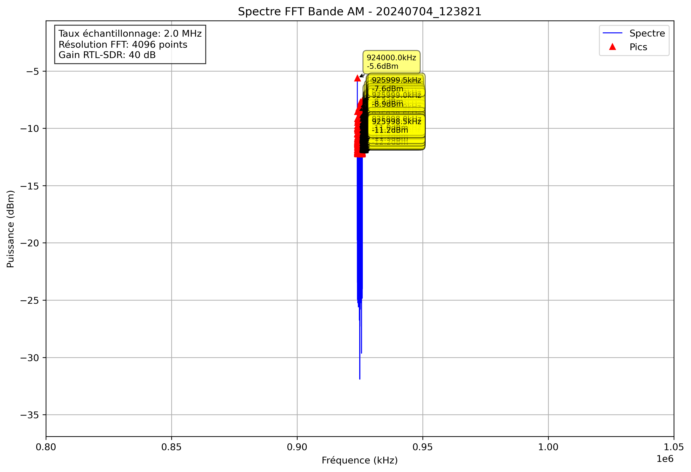

# Analyse Spectrale - 20240704_123821

## Paramètres

- Fréquence début: 800000.0 kHz
- Fréquence fin: 1050000.0 kHz
- Taux d'échantillonnage: 2.0 MHz
- Taille FFT: 4096 points
- Gain RTL-SDR: 40 dB

## Pics Détectés

| Fréquence (kHz) | Puissance (dBm) |
|-----------------|----------------|
| 924000.0 | -5.6 |
| 924000.5 | -8.5 |
| 924001.5 | -10.9 |
| 924002.0 | -9.9 |
| 924002.4 | -11.3 |
| 924003.9 | -11.2 |
| 924004.4 | -12.2 |
| 924004.9 | -12.2 |
| 924016.6 | -11.6 |
| 924017.1 | -11.8 |
| 924017.6 | -11.4 |
| 924018.1 | -11.3 |
| 924018.6 | -12.1 |
| 924019.0 | -12.0 |
| 924021.0 | -12.2 |
| 924022.0 | -12.2 |
| 924023.4 | -10.0 |
| 924023.9 | -9.2 |
| 924024.4 | -12.1 |
| 924029.8 | -12.2 |
| 924031.2 | -11.0 |
| 924031.7 | -11.2 |
| 924042.0 | -11.3 |
| 924042.5 | -11.2 |
| 924045.4 | -12.1 |
| 924053.7 | -11.6 |
| 924058.1 | -11.8 |
| 924058.6 | -11.0 |
| 924060.5 | -12.1 |
| 924061.5 | -11.2 |
| 924062.0 | -10.4 |
| 924062.5 | -10.0 |
| 924063.0 | -10.5 |
| 924063.5 | -10.5 |
| 924064.0 | -11.8 |
| 924065.4 | -12.2 |
| 924065.9 | -9.5 |
| 924066.4 | -9.8 |
| 924066.9 | -11.9 |
| 924067.4 | -12.0 |
| 924078.1 | -10.5 |
| 924078.6 | -11.1 |
| 924083.0 | -12.0 |
| 924084.5 | -10.9 |
| 924085.0 | -12.1 |
| 924085.4 | -12.0 |
| 924085.9 | -12.0 |
| 924086.4 | -11.4 |
| 924086.9 | -10.2 |
| 924097.2 | -11.8 |
| 924098.1 | -10.9 |
| 924098.6 | -12.1 |
| 924102.5 | -10.4 |
| 924103.0 | -10.7 |
| 924115.2 | -10.8 |
| 924115.7 | -10.8 |
| 924121.6 | -11.7 |
| 924122.1 | -11.3 |
| 924122.6 | -11.7 |
| 924123.0 | -11.6 |
| 924126.0 | -12.0 |
| 924126.5 | -11.2 |
| 924127.4 | -10.9 |
| 924127.9 | -12.2 |
| 924128.4 | -10.0 |
| 924128.9 | -11.5 |
| 924129.4 | -11.8 |
| 924130.9 | -11.8 |
| 924138.2 | -11.4 |
| 924139.2 | -11.6 |
| 924139.6 | -11.2 |
| 924142.6 | -12.0 |
| 924143.1 | -12.0 |
| 924146.5 | -10.5 |
| 924147.0 | -10.4 |
| 924147.9 | -10.1 |
| 924148.4 | -10.5 |
| 924155.3 | -12.2 |
| 924165.0 | -11.2 |
| 924169.9 | -12.0 |
| 924170.4 | -10.1 |
| 924170.9 | -10.0 |
| 924175.3 | -11.0 |
| 924175.8 | -10.1 |
| 924180.2 | -12.2 |
| 924189.9 | -10.4 |
| 924190.4 | -11.5 |
| 924202.6 | -11.5 |
| 924207.0 | -11.8 |
| 924207.5 | -11.5 |
| 924223.1 | -10.9 |
| 924223.6 | -11.6 |
| 924224.1 | -12.2 |
| 924224.6 | -11.0 |
| 924228.5 | -11.9 |
| 924231.9 | -12.2 |
| 924235.8 | -11.6 |
| 924236.3 | -11.7 |
| 924242.7 | -11.9 |
| 924248.5 | -11.9 |
| 924249.0 | -12.1 |
| 924250.5 | -12.0 |
| 924254.9 | -11.8 |
| 924256.3 | -11.7 |
| 924256.8 | -10.9 |
| 924257.3 | -11.5 |
| 924258.8 | -10.0 |
| 924259.3 | -9.3 |
| 924259.8 | -11.7 |
| 924269.0 | -9.8 |
| 924269.5 | -10.7 |
| 924275.4 | -10.7 |
| 924275.9 | -10.3 |
| 924276.4 | -11.5 |
| 924277.8 | -10.5 |
| 924278.3 | -11.4 |
| 924280.3 | -11.0 |
| 924280.8 | -10.1 |
| 924281.2 | -12.2 |
| 924309.1 | -11.6 |
| 924309.6 | -9.2 |
| 924310.1 | -11.7 |
| 924328.6 | -11.5 |
| 924329.1 | -11.9 |
| 924332.5 | -10.3 |
| 924333.0 | -9.0 |
| 924333.5 | -11.5 |
| 924337.4 | -11.9 |
| 924338.4 | -12.2 |
| 924338.9 | -11.4 |
| 924340.8 | -9.8 |
| 924341.3 | -11.3 |
| 924343.3 | -11.4 |
| 924343.8 | -11.2 |
| 924347.7 | -12.1 |
| 924350.6 | -10.6 |
| 924351.1 | -10.0 |
| 924353.5 | -12.1 |
| 924354.0 | -11.5 |
| 924359.9 | -12.1 |
| 924363.8 | -11.0 |
| 924364.3 | -11.2 |
| 924367.2 | -11.5 |
| 924367.7 | -12.2 |
| 924376.5 | -9.8 |
| 924377.0 | -10.5 |
| 924390.6 | -10.7 |
| 924391.1 | -11.5 |
| 924392.6 | -11.3 |
| 924393.1 | -11.4 |
| 924398.9 | -11.2 |
| 924399.4 | -10.9 |
| 924403.3 | -11.3 |
| 924406.2 | -10.9 |
| 924409.2 | -12.2 |
| 924409.7 | -11.9 |
| 924413.1 | -11.6 |
| 924414.6 | -11.4 |
| 924415.0 | -11.9 |
| 924420.4 | -11.0 |
| 924422.4 | -12.1 |
| 924432.6 | -12.0 |
| 924438.0 | -11.3 |
| 924438.5 | -10.8 |
| 924439.0 | -11.2 |
| 924440.4 | -12.1 |
| 924440.9 | -11.8 |
| 924442.4 | -12.1 |
| 924445.8 | -11.3 |
| 924446.3 | -10.1 |
| 924450.7 | -12.0 |
| 924468.3 | -12.1 |
| 924468.8 | -11.7 |
| 924474.6 | -12.2 |
| 924475.1 | -11.8 |
| 924475.6 | -10.7 |
| 924476.1 | -11.3 |
| 924481.9 | -11.5 |
| 924484.4 | -11.6 |
| 924489.3 | -11.3 |
| 924489.7 | -10.6 |
| 924490.2 | -12.0 |
| 924490.7 | -12.0 |
| 924500.0 | -12.1 |
| 924505.4 | -11.8 |
| 924506.3 | -11.8 |
| 924515.6 | -10.3 |
| 924516.1 | -9.4 |
| 924516.6 | -10.5 |
| 924526.4 | -12.0 |
| 924526.9 | -11.9 |
| 924529.3 | -11.8 |
| 924529.8 | -10.8 |
| 924530.3 | -11.3 |
| 924536.6 | -12.2 |
| 924537.1 | -10.0 |
| 924538.6 | -11.8 |
| 924544.9 | -9.8 |
| 924545.4 | -9.8 |
| 924545.9 | -11.9 |
| 924549.8 | -12.2 |
| 924556.6 | -11.0 |
| 924561.5 | -12.2 |
| 924564.9 | -11.7 |
| 924566.9 | -9.2 |
| 924567.4 | -8.2 |
| 924567.9 | -11.1 |
| 924573.7 | -11.8 |
| 924574.2 | -10.9 |
| 924576.7 | -11.4 |
| 924577.1 | -9.6 |
| 924577.6 | -11.0 |
| 924582.5 | -11.9 |
| 924585.4 | -10.5 |
| 924585.9 | -10.0 |
| 924591.8 | -11.8 |
| 924594.7 | -9.9 |
| 924595.2 | -11.4 |
| 924598.1 | -11.4 |
| 924598.6 | -11.1 |
| 924599.1 | -10.7 |
| 924599.6 | -11.6 |
| 924601.6 | -10.7 |
| 924602.1 | -10.6 |
| 924602.5 | -11.3 |
| 924603.5 | -12.2 |
| 924604.0 | -11.6 |
| 924606.9 | -12.0 |
| 924609.4 | -11.7 |
| 924615.2 | -11.7 |
| 924617.2 | -11.0 |
| 924617.7 | -10.0 |
| 924621.1 | -12.1 |
| 924626.5 | -11.1 |
| 924632.3 | -11.8 |
| 924635.7 | -12.0 |
| 924637.7 | -9.9 |
| 924638.2 | -9.5 |
| 924641.6 | -12.0 |
| 924642.1 | -11.8 |
| 924644.0 | -12.2 |
| 924645.5 | -10.5 |
| 924646.0 | -11.4 |
| 924646.5 | -11.8 |
| 924661.1 | -11.2 |
| 924661.6 | -11.0 |
| 924663.1 | -11.1 |
| 924663.6 | -10.1 |
| 924664.1 | -10.9 |
| 924664.6 | -10.4 |
| 924677.2 | -11.8 |
| 924681.2 | -10.6 |
| 924681.6 | -9.9 |
| 924683.6 | -12.1 |
| 924689.9 | -11.7 |
| 924690.4 | -11.9 |
| 924693.4 | -11.9 |
| 924697.3 | -11.2 |
| 924697.8 | -10.5 |
| 924698.2 | -12.1 |
| 924704.6 | -12.0 |
| 924710.4 | -11.6 |
| 924717.3 | -11.6 |
| 924725.6 | -10.9 |
| 924726.6 | -12.2 |
| 924727.1 | -11.6 |
| 924728.5 | -12.2 |
| 924730.0 | -10.2 |
| 924730.5 | -11.3 |
| 924735.8 | -10.1 |
| 924736.3 | -10.8 |
| 924743.7 | -12.1 |
| 924744.1 | -11.2 |
| 924746.6 | -10.9 |
| 924747.1 | -11.4 |
| 924748.0 | -12.0 |
| 924750.0 | -10.4 |
| 924750.5 | -10.5 |
| 924758.8 | -12.0 |
| 924759.3 | -11.3 |
| 924760.7 | -10.6 |
| 924761.2 | -12.0 |
| 924767.6 | -11.4 |
| 924773.9 | -11.9 |
| 924778.3 | -11.2 |
| 924778.8 | -11.6 |
| 924781.7 | -11.8 |
| 924782.2 | -11.6 |
| 924791.0 | -11.2 |
| 924791.5 | -11.5 |
| 924793.0 | -10.6 |
| 924793.5 | -10.2 |
| 924793.9 | -11.0 |
| 924795.4 | -11.9 |
| 924806.2 | -11.7 |
| 924806.6 | -11.1 |
| 924807.1 | -11.3 |
| 924807.6 | -11.1 |
| 924808.1 | -11.1 |
| 924818.8 | -11.4 |
| 924835.9 | -11.6 |
| 924864.7 | -12.0 |
| 924865.2 | -12.2 |
| 924903.8 | -11.8 |
| 924904.3 | -11.6 |
| 924953.6 | -11.9 |
| 925021.0 | -11.4 |
| 925021.5 | -11.5 |
| 925083.0 | -11.2 |
| 925126.5 | -12.2 |
| 925143.6 | -12.2 |
| 925149.9 | -11.5 |
| 925160.2 | -11.8 |
| 925160.6 | -10.9 |
| 925161.1 | -10.4 |
| 925171.4 | -12.0 |
| 925174.8 | -11.8 |
| 925190.4 | -12.0 |
| 925206.1 | -12.2 |
| 925210.4 | -11.6 |
| 925221.7 | -11.7 |
| 925222.2 | -11.1 |
| 925229.5 | -10.6 |
| 925230.0 | -10.7 |
| 925234.4 | -11.4 |
| 925242.7 | -11.2 |
| 925243.2 | -11.7 |
| 925250.5 | -9.3 |
| 925251.0 | -9.9 |
| 925253.9 | -12.0 |
| 925254.4 | -11.2 |
| 925254.9 | -12.0 |
| 925257.3 | -11.8 |
| 925257.8 | -11.3 |
| 925267.6 | -11.9 |
| 925270.5 | -12.2 |
| 925271.0 | -10.2 |
| 925271.5 | -11.2 |
| 925277.3 | -11.4 |
| 925278.3 | -11.9 |
| 925285.6 | -12.1 |
| 925286.1 | -11.5 |
| 925289.6 | -12.0 |
| 925290.0 | -11.0 |
| 925290.5 | -12.1 |
| 925292.0 | -8.8 |
| 925292.5 | -7.8 |
| 925293.0 | -8.0 |
| 925293.5 | -7.7 |
| 925293.9 | -9.7 |
| 925294.4 | -11.2 |
| 925294.9 | -11.5 |
| 925298.8 | -11.7 |
| 925299.3 | -11.2 |
| 925299.8 | -11.5 |
| 925300.3 | -11.8 |
| 925300.8 | -11.1 |
| 925301.3 | -11.2 |
| 925303.7 | -9.5 |
| 925304.2 | -10.1 |
| 925305.7 | -11.3 |
| 925306.2 | -11.8 |
| 925310.1 | -11.6 |
| 925315.9 | -11.5 |
| 925316.4 | -11.2 |
| 925316.9 | -11.3 |
| 925322.3 | -10.9 |
| 925322.8 | -12.0 |
| 925325.7 | -11.0 |
| 925326.2 | -10.1 |
| 925332.5 | -11.4 |
| 925339.4 | -11.7 |
| 925346.2 | -12.2 |
| 925356.0 | -11.8 |
| 925358.4 | -11.7 |
| 925362.3 | -11.7 |
| 925364.7 | -12.2 |
| 925366.7 | -11.5 |
| 925367.2 | -11.1 |
| 925367.7 | -11.5 |
| 925369.1 | -10.4 |
| 925369.6 | -10.5 |
| 925377.4 | -11.7 |
| 925377.9 | -12.0 |
| 925379.9 | -10.9 |
| 925383.8 | -11.3 |
| 925384.3 | -12.2 |
| 925386.7 | -11.9 |
| 925387.2 | -11.9 |
| 925387.7 | -11.5 |
| 925394.0 | -11.6 |
| 925394.5 | -11.2 |
| 925395.0 | -11.3 |
| 925395.5 | -10.4 |
| 925397.9 | -10.9 |
| 925398.4 | -11.5 |
| 925399.4 | -12.2 |
| 925403.3 | -12.0 |
| 925407.2 | -11.9 |
| 925407.7 | -12.0 |
| 925410.6 | -8.3 |
| 925411.1 | -8.5 |
| 925411.6 | -11.5 |
| 925418.0 | -12.1 |
| 925418.5 | -11.8 |
| 925426.3 | -11.9 |
| 925427.7 | -11.3 |
| 925428.2 | -11.4 |
| 925435.5 | -10.8 |
| 925439.5 | -10.9 |
| 925439.9 | -9.7 |
| 925440.4 | -11.6 |
| 925468.3 | -11.6 |
| 925468.8 | -11.4 |
| 925469.2 | -10.4 |
| 925469.7 | -11.9 |
| 925476.6 | -12.2 |
| 925484.9 | -11.7 |
| 925485.4 | -11.7 |
| 925497.1 | -11.3 |
| 925497.6 | -10.9 |
| 925502.4 | -12.0 |
| 925503.9 | -10.2 |
| 925504.4 | -9.3 |
| 925508.8 | -11.7 |
| 925509.3 | -11.8 |
| 925510.3 | -12.2 |
| 925510.7 | -12.1 |
| 925512.2 | -11.1 |
| 925514.2 | -11.3 |
| 925514.6 | -10.8 |
| 925515.1 | -11.5 |
| 925515.6 | -9.9 |
| 925516.1 | -10.4 |
| 925516.6 | -11.4 |
| 925517.1 | -12.2 |
| 925521.0 | -12.0 |
| 925524.4 | -11.2 |
| 925527.8 | -11.2 |
| 925530.3 | -11.6 |
| 925530.8 | -11.7 |
| 925534.7 | -12.2 |
| 925540.5 | -10.7 |
| 925541.0 | -9.5 |
| 925541.5 | -11.0 |
| 925552.2 | -11.3 |
| 925552.7 | -11.3 |
| 925553.2 | -11.7 |
| 925553.7 | -10.9 |
| 925555.2 | -12.2 |
| 925559.6 | -11.1 |
| 925560.1 | -9.7 |
| 925560.5 | -11.9 |
| 925564.5 | -11.7 |
| 925567.4 | -11.7 |
| 925570.3 | -10.3 |
| 925570.8 | -10.0 |
| 925572.3 | -11.4 |
| 925572.8 | -11.4 |
| 925575.2 | -11.1 |
| 925575.7 | -12.0 |
| 925576.2 | -11.6 |
| 925576.7 | -12.1 |
| 925585.0 | -11.3 |
| 925586.4 | -11.7 |
| 925586.9 | -11.3 |
| 925587.4 | -12.2 |
| 925593.8 | -11.5 |
| 925597.2 | -11.6 |
| 925597.7 | -11.3 |
| 925598.1 | -11.6 |
| 925601.6 | -11.9 |
| 925602.1 | -9.8 |
| 925603.5 | -12.2 |
| 925604.0 | -11.0 |
| 925604.5 | -10.2 |
| 925605.0 | -11.2 |
| 925612.3 | -10.7 |
| 925612.8 | -12.2 |
| 925616.7 | -10.4 |
| 925617.2 | -9.8 |
| 925618.7 | -12.2 |
| 925634.8 | -11.7 |
| 925635.3 | -11.2 |
| 925643.6 | -10.5 |
| 925644.0 | -11.3 |
| 925655.3 | -11.0 |
| 925655.8 | -10.1 |
| 925658.7 | -12.0 |
| 925662.6 | -11.3 |
| 925670.4 | -11.9 |
| 925670.9 | -11.4 |
| 925678.7 | -10.4 |
| 925679.2 | -9.9 |
| 925680.2 | -11.9 |
| 925680.7 | -11.7 |
| 925683.1 | -12.0 |
| 925689.5 | -10.8 |
| 925693.4 | -11.9 |
| 925702.6 | -11.8 |
| 925703.1 | -11.2 |
| 925720.2 | -11.2 |
| 925720.7 | -8.6 |
| 925721.2 | -10.4 |
| 925724.1 | -11.4 |
| 925728.0 | -11.4 |
| 925728.5 | -10.2 |
| 925731.4 | -11.6 |
| 925738.8 | -11.9 |
| 925749.5 | -12.1 |
| 925750.0 | -11.4 |
| 925750.5 | -11.9 |
| 925754.4 | -10.3 |
| 925754.9 | -9.7 |
| 925755.4 | -10.9 |
| 925758.3 | -12.0 |
| 925758.8 | -9.2 |
| 925759.3 | -8.5 |
| 925759.8 | -9.8 |
| 925760.3 | -12.0 |
| 925769.5 | -11.2 |
| 925770.0 | -10.4 |
| 925782.2 | -10.8 |
| 925782.7 | -11.5 |
| 925790.0 | -12.0 |
| 925805.7 | -10.1 |
| 925806.2 | -11.7 |
| 925813.0 | -11.9 |
| 925813.5 | -11.5 |
| 925815.4 | -12.1 |
| 925820.8 | -11.7 |
| 925832.5 | -12.2 |
| 925833.0 | -10.8 |
| 925833.5 | -11.3 |
| 925836.4 | -12.0 |
| 925836.9 | -10.8 |
| 925837.4 | -10.9 |
| 925837.9 | -10.9 |
| 925838.4 | -11.2 |
| 925840.8 | -12.2 |
| 925841.3 | -11.5 |
| 925842.8 | -11.6 |
| 925843.3 | -10.4 |
| 925852.5 | -12.2 |
| 925853.0 | -11.9 |
| 925856.4 | -11.0 |
| 925856.9 | -11.9 |
| 925867.7 | -12.2 |
| 925875.5 | -11.7 |
| 925877.0 | -11.8 |
| 925877.4 | -9.6 |
| 925877.9 | -10.5 |
| 925879.9 | -11.3 |
| 925880.4 | -10.2 |
| 925880.9 | -11.2 |
| 925882.3 | -11.3 |
| 925882.8 | -11.3 |
| 925889.2 | -11.6 |
| 925889.6 | -10.3 |
| 925890.1 | -11.2 |
| 925890.6 | -12.1 |
| 925892.6 | -12.1 |
| 925893.1 | -11.4 |
| 925896.0 | -11.6 |
| 925896.5 | -11.2 |
| 925897.0 | -10.7 |
| 925897.5 | -10.9 |
| 925897.9 | -11.4 |
| 925900.9 | -11.2 |
| 925901.4 | -11.6 |
| 925904.3 | -12.2 |
| 925905.8 | -11.1 |
| 925906.2 | -10.1 |
| 925906.7 | -10.3 |
| 925907.2 | -12.2 |
| 925908.2 | -11.7 |
| 925908.7 | -8.8 |
| 925909.2 | -9.7 |
| 925913.6 | -11.2 |
| 925914.1 | -11.1 |
| 925914.6 | -11.1 |
| 925915.5 | -11.1 |
| 925916.0 | -11.4 |
| 925920.9 | -10.2 |
| 925921.4 | -11.3 |
| 925922.9 | -9.9 |
| 925923.3 | -8.7 |
| 925923.8 | -11.0 |
| 925925.3 | -11.1 |
| 925936.5 | -11.4 |
| 925938.0 | -10.6 |
| 925938.5 | -10.6 |
| 925947.3 | -11.2 |
| 925947.8 | -12.1 |
| 925949.2 | -11.7 |
| 925949.7 | -11.3 |
| 925951.7 | -11.9 |
| 925952.1 | -11.6 |
| 925957.0 | -12.2 |
| 925961.4 | -11.3 |
| 925963.4 | -11.9 |
| 925963.9 | -11.7 |
| 925990.7 | -11.1 |
| 925991.2 | -11.2 |
| 925998.0 | -11.0 |
| 925998.5 | -11.2 |
| 925999.0 | -8.9 |
| 925999.5 | -7.6 |
