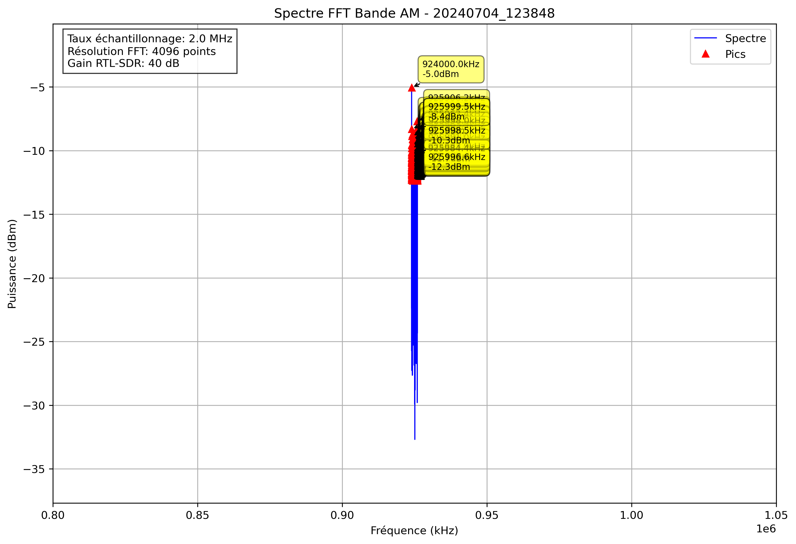

# Analyse Spectrale - 20240704_123848

## Paramètres

- Fréquence début: 800000.0 kHz
- Fréquence fin: 1050000.0 kHz
- Taux d'échantillonnage: 2.0 MHz
- Taille FFT: 4096 points
- Gain RTL-SDR: 40 dB

## Pics Détectés

| Fréquence (kHz) | Puissance (dBm) |
|-----------------|----------------|
| 924000.0 | -5.0 |
| 924000.5 | -8.3 |
| 924002.4 | -12.1 |
| 924002.9 | -12.2 |
| 924003.4 | -11.9 |
| 924003.9 | -10.3 |
| 924004.4 | -10.8 |
| 924016.6 | -10.9 |
| 924017.1 | -10.3 |
| 924017.6 | -10.5 |
| 924018.1 | -12.3 |
| 924020.5 | -11.3 |
| 924021.0 | -11.1 |
| 924022.0 | -9.8 |
| 924022.5 | -10.5 |
| 924023.4 | -11.9 |
| 924023.9 | -10.8 |
| 924024.4 | -12.2 |
| 924025.9 | -12.1 |
| 924031.7 | -12.3 |
| 924032.2 | -11.8 |
| 924032.7 | -11.3 |
| 924034.7 | -11.7 |
| 924038.6 | -11.6 |
| 924042.0 | -11.6 |
| 924053.7 | -11.7 |
| 924055.2 | -11.5 |
| 924055.7 | -10.9 |
| 924058.6 | -12.1 |
| 924060.1 | -11.3 |
| 924060.5 | -11.0 |
| 924061.0 | -11.6 |
| 924061.5 | -10.1 |
| 924062.0 | -9.6 |
| 924062.5 | -10.2 |
| 924068.4 | -11.5 |
| 924068.8 | -12.3 |
| 924069.3 | -11.5 |
| 924078.1 | -10.6 |
| 924078.6 | -11.3 |
| 924080.1 | -11.6 |
| 924083.0 | -11.8 |
| 924083.5 | -12.3 |
| 924096.7 | -11.2 |
| 924097.2 | -11.2 |
| 924097.7 | -10.5 |
| 924098.1 | -8.9 |
| 924098.6 | -10.5 |
| 924103.0 | -11.4 |
| 924105.5 | -12.0 |
| 924106.0 | -10.8 |
| 924106.4 | -11.2 |
| 924107.9 | -11.3 |
| 924114.3 | -12.1 |
| 924115.2 | -12.0 |
| 924115.7 | -11.5 |
| 924126.0 | -12.1 |
| 924126.5 | -9.8 |
| 924127.0 | -11.8 |
| 924128.4 | -11.4 |
| 924140.1 | -12.1 |
| 924140.6 | -11.9 |
| 924141.1 | -11.5 |
| 924145.0 | -12.1 |
| 924146.5 | -10.7 |
| 924147.0 | -11.1 |
| 924148.4 | -10.9 |
| 924148.9 | -11.5 |
| 924155.3 | -10.9 |
| 924155.8 | -11.4 |
| 924161.1 | -11.1 |
| 924161.6 | -11.3 |
| 924169.9 | -10.5 |
| 924170.4 | -9.5 |
| 924170.9 | -10.3 |
| 924182.1 | -12.0 |
| 924188.0 | -10.6 |
| 924188.5 | -10.4 |
| 924189.5 | -11.9 |
| 924189.9 | -11.0 |
| 924192.9 | -12.2 |
| 924193.4 | -11.1 |
| 924195.3 | -11.9 |
| 924195.8 | -11.0 |
| 924202.1 | -12.2 |
| 924202.6 | -11.6 |
| 924205.1 | -10.4 |
| 924205.6 | -11.5 |
| 924207.0 | -11.6 |
| 924207.5 | -12.0 |
| 924210.0 | -11.6 |
| 924211.9 | -12.1 |
| 924216.3 | -11.8 |
| 924216.8 | -11.2 |
| 924223.1 | -11.4 |
| 924226.6 | -11.5 |
| 924227.1 | -11.5 |
| 924228.5 | -11.8 |
| 924233.9 | -11.3 |
| 924235.8 | -10.1 |
| 924236.3 | -9.7 |
| 924236.8 | -12.3 |
| 924242.7 | -10.6 |
| 924243.2 | -10.8 |
| 924250.5 | -11.7 |
| 924258.8 | -12.1 |
| 924259.3 | -10.7 |
| 924261.7 | -12.0 |
| 924262.2 | -11.0 |
| 924262.7 | -10.5 |
| 924266.6 | -11.1 |
| 924269.0 | -10.5 |
| 924269.5 | -11.9 |
| 924272.0 | -11.1 |
| 924272.5 | -9.6 |
| 924272.9 | -10.5 |
| 924273.4 | -11.9 |
| 924275.9 | -11.4 |
| 924276.4 | -11.1 |
| 924317.4 | -10.8 |
| 924317.9 | -12.3 |
| 924324.7 | -12.2 |
| 924333.0 | -11.3 |
| 924333.5 | -11.0 |
| 924338.9 | -11.9 |
| 924340.3 | -11.9 |
| 924340.8 | -9.1 |
| 924342.8 | -11.5 |
| 924343.3 | -10.3 |
| 924343.8 | -11.3 |
| 924348.6 | -12.1 |
| 924350.6 | -10.2 |
| 924351.1 | -8.7 |
| 924351.6 | -10.4 |
| 924352.1 | -11.9 |
| 924354.0 | -11.0 |
| 924363.8 | -12.1 |
| 924374.0 | -12.4 |
| 924376.5 | -11.4 |
| 924377.0 | -11.8 |
| 924377.4 | -12.0 |
| 924378.9 | -11.9 |
| 924379.4 | -11.1 |
| 924380.9 | -11.7 |
| 924388.7 | -11.8 |
| 924399.4 | -10.5 |
| 924399.9 | -11.6 |
| 924403.3 | -11.0 |
| 924403.8 | -11.3 |
| 924409.7 | -12.3 |
| 924411.6 | -11.8 |
| 924413.1 | -12.3 |
| 924413.6 | -11.3 |
| 924415.0 | -12.2 |
| 924417.5 | -11.2 |
| 924421.4 | -11.7 |
| 924421.9 | -11.2 |
| 924423.3 | -11.7 |
| 924425.3 | -11.5 |
| 924429.2 | -11.8 |
| 924436.5 | -11.2 |
| 924437.0 | -11.5 |
| 924440.9 | -11.5 |
| 924441.4 | -12.2 |
| 924444.3 | -12.3 |
| 924446.3 | -12.1 |
| 924448.7 | -11.5 |
| 924449.2 | -11.1 |
| 924450.7 | -10.9 |
| 924454.1 | -12.3 |
| 924462.9 | -10.5 |
| 924463.4 | -10.6 |
| 924464.4 | -12.0 |
| 924464.8 | -11.7 |
| 924467.8 | -11.2 |
| 924468.3 | -10.9 |
| 924468.8 | -12.1 |
| 924475.6 | -12.0 |
| 924476.1 | -11.2 |
| 924484.4 | -11.0 |
| 924489.7 | -11.5 |
| 924503.4 | -12.3 |
| 924506.3 | -10.9 |
| 924506.8 | -11.9 |
| 924516.1 | -11.2 |
| 924516.6 | -11.4 |
| 924528.8 | -12.3 |
| 924529.8 | -11.6 |
| 924530.3 | -9.7 |
| 924530.8 | -10.1 |
| 924536.1 | -12.2 |
| 924536.6 | -9.8 |
| 924537.1 | -9.1 |
| 924545.4 | -11.3 |
| 924545.9 | -12.0 |
| 924546.9 | -12.2 |
| 924555.2 | -11.4 |
| 924555.7 | -11.3 |
| 924556.2 | -11.9 |
| 924556.6 | -10.4 |
| 924557.1 | -10.6 |
| 924562.0 | -11.9 |
| 924562.5 | -10.6 |
| 924563.0 | -12.2 |
| 924564.0 | -12.2 |
| 924564.5 | -12.2 |
| 924565.9 | -12.3 |
| 924566.4 | -11.0 |
| 924566.9 | -10.6 |
| 924567.4 | -9.4 |
| 924567.9 | -10.3 |
| 924576.7 | -9.8 |
| 924577.1 | -9.3 |
| 924577.6 | -10.8 |
| 924578.1 | -11.8 |
| 924578.6 | -12.3 |
| 924579.1 | -11.1 |
| 924579.6 | -11.8 |
| 924581.1 | -12.0 |
| 924582.5 | -10.7 |
| 924583.0 | -11.4 |
| 924585.4 | -12.4 |
| 924592.8 | -11.4 |
| 924594.7 | -9.8 |
| 924595.2 | -10.5 |
| 924595.7 | -12.2 |
| 924596.2 | -12.2 |
| 924598.1 | -11.0 |
| 924598.6 | -9.8 |
| 924599.1 | -9.6 |
| 924599.6 | -10.2 |
| 924600.1 | -11.4 |
| 924601.6 | -12.2 |
| 924602.1 | -11.1 |
| 924602.5 | -11.1 |
| 924603.0 | -12.0 |
| 924603.5 | -11.7 |
| 924606.9 | -12.1 |
| 924615.2 | -12.0 |
| 924615.7 | -12.4 |
| 924616.7 | -12.3 |
| 924617.2 | -11.1 |
| 924621.1 | -10.4 |
| 924635.7 | -12.0 |
| 924636.2 | -11.8 |
| 924637.7 | -9.2 |
| 924638.2 | -8.7 |
| 924643.1 | -11.8 |
| 924643.6 | -11.9 |
| 924644.5 | -11.7 |
| 924645.0 | -10.3 |
| 924645.5 | -9.9 |
| 924646.0 | -12.0 |
| 924651.9 | -11.9 |
| 924663.6 | -10.2 |
| 924664.1 | -10.3 |
| 924664.6 | -11.7 |
| 924666.5 | -10.6 |
| 924667.0 | -11.9 |
| 924676.3 | -10.9 |
| 924676.8 | -11.5 |
| 924681.6 | -11.1 |
| 924683.6 | -10.7 |
| 924684.1 | -11.8 |
| 924688.0 | -12.3 |
| 924688.5 | -11.3 |
| 924689.0 | -11.8 |
| 924693.8 | -11.7 |
| 924694.3 | -11.8 |
| 924696.8 | -10.8 |
| 924697.3 | -9.7 |
| 924697.8 | -10.6 |
| 924699.7 | -11.2 |
| 924700.2 | -11.3 |
| 924703.6 | -12.2 |
| 924704.6 | -10.8 |
| 924705.1 | -11.7 |
| 924710.4 | -11.1 |
| 924712.4 | -11.7 |
| 924712.9 | -10.7 |
| 924713.9 | -12.3 |
| 924714.4 | -11.0 |
| 924720.7 | -12.3 |
| 924727.1 | -12.2 |
| 924736.3 | -10.9 |
| 924746.6 | -12.3 |
| 924760.3 | -12.0 |
| 924760.7 | -10.8 |
| 924762.2 | -10.7 |
| 924762.7 | -10.6 |
| 924763.2 | -11.6 |
| 924780.3 | -12.2 |
| 924782.2 | -11.3 |
| 924792.5 | -12.0 |
| 924793.0 | -10.2 |
| 924793.5 | -11.2 |
| 924793.9 | -11.9 |
| 924805.7 | -12.3 |
| 924806.2 | -12.4 |
| 924807.1 | -12.1 |
| 924807.6 | -11.3 |
| 924815.4 | -12.3 |
| 924815.9 | -12.1 |
| 924818.4 | -12.2 |
| 924818.8 | -10.9 |
| 924856.4 | -12.3 |
| 924856.9 | -11.4 |
| 924859.4 | -11.7 |
| 924859.9 | -12.2 |
| 924864.7 | -12.0 |
| 924871.6 | -12.2 |
| 924904.3 | -12.3 |
| 924919.4 | -12.3 |
| 925083.0 | -11.5 |
| 925160.6 | -11.2 |
| 925161.1 | -12.2 |
| 925192.9 | -12.1 |
| 925193.4 | -11.5 |
| 925194.3 | -12.2 |
| 925196.3 | -10.8 |
| 925198.7 | -12.0 |
| 925199.2 | -12.1 |
| 925206.5 | -11.9 |
| 925207.0 | -12.1 |
| 925210.4 | -10.4 |
| 925210.9 | -12.1 |
| 925216.8 | -12.3 |
| 925229.5 | -10.6 |
| 925230.0 | -10.4 |
| 925232.9 | -11.9 |
| 925233.4 | -11.6 |
| 925248.0 | -11.9 |
| 925250.5 | -11.0 |
| 925251.0 | -11.4 |
| 925256.8 | -11.6 |
| 925257.3 | -12.2 |
| 925257.8 | -11.5 |
| 925259.8 | -11.9 |
| 925260.3 | -12.3 |
| 925261.7 | -12.3 |
| 925266.1 | -12.3 |
| 925268.1 | -12.2 |
| 925268.6 | -12.3 |
| 925271.0 | -10.3 |
| 925271.5 | -10.3 |
| 925277.3 | -11.1 |
| 925278.3 | -11.7 |
| 925290.0 | -11.2 |
| 925290.5 | -12.0 |
| 925292.0 | -11.1 |
| 925298.3 | -11.4 |
| 925298.8 | -11.0 |
| 925299.3 | -10.7 |
| 925299.8 | -10.5 |
| 925300.8 | -11.8 |
| 925301.3 | -11.3 |
| 925301.8 | -12.2 |
| 925303.7 | -12.0 |
| 925309.6 | -12.0 |
| 925310.1 | -10.7 |
| 925310.5 | -12.2 |
| 925318.4 | -11.6 |
| 925318.8 | -10.7 |
| 925323.7 | -12.1 |
| 925324.2 | -11.0 |
| 925325.7 | -10.6 |
| 925326.2 | -10.4 |
| 925329.1 | -10.8 |
| 925329.6 | -11.9 |
| 925331.5 | -11.9 |
| 925335.9 | -11.7 |
| 925338.9 | -11.8 |
| 925339.4 | -10.4 |
| 925339.8 | -11.9 |
| 925340.3 | -12.2 |
| 925350.1 | -12.2 |
| 925364.7 | -11.3 |
| 925367.7 | -11.9 |
| 925368.2 | -11.8 |
| 925368.7 | -11.5 |
| 925369.1 | -10.6 |
| 925369.6 | -10.9 |
| 925378.4 | -11.7 |
| 925378.9 | -11.9 |
| 925381.8 | -11.5 |
| 925382.3 | -11.2 |
| 925382.8 | -11.6 |
| 925383.3 | -11.4 |
| 925383.8 | -9.9 |
| 925384.3 | -11.8 |
| 925384.8 | -12.0 |
| 925386.2 | -11.3 |
| 925386.7 | -10.7 |
| 925387.2 | -10.6 |
| 925387.7 | -10.4 |
| 925394.0 | -11.2 |
| 925397.9 | -11.5 |
| 925398.4 | -11.3 |
| 925398.9 | -10.5 |
| 925399.4 | -11.0 |
| 925401.9 | -12.0 |
| 925403.3 | -12.1 |
| 925403.8 | -10.9 |
| 925404.3 | -11.6 |
| 925410.6 | -9.9 |
| 925411.1 | -9.5 |
| 925411.6 | -10.5 |
| 925412.1 | -11.3 |
| 925421.4 | -12.3 |
| 925427.7 | -11.6 |
| 925434.1 | -11.4 |
| 925444.8 | -11.1 |
| 925453.1 | -11.9 |
| 925468.3 | -10.3 |
| 925468.8 | -11.0 |
| 925469.2 | -12.3 |
| 925472.7 | -11.2 |
| 925473.1 | -11.9 |
| 925478.0 | -12.1 |
| 925502.9 | -12.0 |
| 925508.8 | -10.7 |
| 925509.3 | -11.3 |
| 925511.7 | -11.4 |
| 925512.2 | -10.1 |
| 925512.7 | -11.5 |
| 925513.2 | -10.5 |
| 925513.7 | -11.5 |
| 925514.2 | -9.9 |
| 925515.6 | -12.0 |
| 925516.1 | -10.9 |
| 925516.6 | -12.3 |
| 925523.4 | -12.3 |
| 925524.4 | -12.0 |
| 925541.0 | -10.0 |
| 925541.5 | -9.7 |
| 925542.0 | -11.3 |
| 925546.9 | -12.4 |
| 925547.4 | -11.4 |
| 925547.9 | -11.9 |
| 925550.8 | -12.0 |
| 925552.7 | -11.7 |
| 925553.2 | -11.9 |
| 925553.7 | -11.4 |
| 925559.6 | -10.8 |
| 925560.1 | -9.9 |
| 925562.5 | -12.3 |
| 925564.5 | -12.0 |
| 925569.3 | -12.1 |
| 925569.8 | -11.5 |
| 925570.3 | -10.5 |
| 925572.8 | -11.2 |
| 925573.2 | -12.0 |
| 925574.7 | -12.1 |
| 925575.2 | -10.1 |
| 925575.7 | -10.9 |
| 925576.2 | -11.6 |
| 925579.6 | -11.3 |
| 925582.0 | -11.7 |
| 925582.5 | -10.5 |
| 925583.0 | -11.6 |
| 925586.9 | -11.8 |
| 925588.4 | -11.6 |
| 925588.9 | -12.3 |
| 925589.8 | -12.0 |
| 925598.1 | -12.0 |
| 925604.0 | -10.9 |
| 925604.5 | -10.2 |
| 925605.0 | -11.0 |
| 925606.4 | -11.8 |
| 925616.2 | -11.6 |
| 925616.7 | -10.5 |
| 925617.2 | -10.9 |
| 925627.4 | -11.4 |
| 925630.9 | -11.7 |
| 925634.8 | -11.4 |
| 925635.3 | -10.5 |
| 925640.1 | -12.0 |
| 925643.6 | -10.2 |
| 925644.0 | -10.8 |
| 925645.5 | -11.0 |
| 925646.0 | -11.0 |
| 925646.5 | -10.2 |
| 925647.0 | -11.8 |
| 925650.9 | -11.5 |
| 925651.4 | -11.1 |
| 925652.8 | -11.7 |
| 925653.3 | -11.7 |
| 925653.8 | -11.3 |
| 925654.3 | -12.1 |
| 925655.3 | -11.6 |
| 925655.8 | -11.3 |
| 925658.7 | -12.4 |
| 925660.6 | -12.0 |
| 925661.1 | -11.0 |
| 925661.6 | -12.4 |
| 925666.5 | -12.0 |
| 925670.4 | -11.3 |
| 925678.7 | -10.9 |
| 925679.2 | -11.6 |
| 925680.2 | -10.7 |
| 925680.7 | -10.4 |
| 925697.8 | -12.3 |
| 925699.2 | -11.9 |
| 925704.1 | -12.2 |
| 925704.6 | -11.8 |
| 925721.2 | -12.1 |
| 925723.6 | -12.2 |
| 925728.5 | -10.8 |
| 925729.0 | -12.1 |
| 925738.8 | -11.0 |
| 925739.3 | -10.9 |
| 925739.7 | -11.0 |
| 925740.2 | -11.6 |
| 925746.1 | -12.1 |
| 925753.9 | -12.2 |
| 925754.4 | -9.4 |
| 925754.9 | -10.5 |
| 925759.3 | -10.7 |
| 925759.8 | -10.2 |
| 925760.3 | -12.0 |
| 925763.2 | -11.6 |
| 925770.0 | -11.0 |
| 925774.4 | -11.2 |
| 925775.4 | -11.5 |
| 925781.7 | -10.8 |
| 925782.2 | -8.8 |
| 925782.7 | -10.4 |
| 925790.0 | -11.9 |
| 925790.5 | -12.4 |
| 925811.5 | -12.2 |
| 925816.4 | -11.6 |
| 925816.9 | -11.6 |
| 925824.7 | -12.1 |
| 925829.1 | -12.2 |
| 925829.6 | -11.6 |
| 925836.4 | -11.5 |
| 925836.9 | -11.7 |
| 925837.4 | -11.6 |
| 925837.9 | -10.9 |
| 925842.8 | -11.8 |
| 925843.3 | -11.6 |
| 925847.7 | -11.9 |
| 925850.6 | -10.8 |
| 925856.0 | -11.5 |
| 925856.4 | -11.1 |
| 925867.2 | -12.2 |
| 925868.7 | -11.6 |
| 925877.0 | -11.2 |
| 925877.4 | -11.6 |
| 925879.9 | -10.7 |
| 925880.4 | -9.0 |
| 925880.9 | -8.3 |
| 925881.3 | -9.8 |
| 925882.8 | -10.7 |
| 925883.3 | -11.3 |
| 925883.8 | -10.7 |
| 925884.3 | -10.3 |
| 925884.8 | -11.5 |
| 925888.2 | -10.7 |
| 925889.6 | -12.0 |
| 925893.1 | -10.6 |
| 925893.6 | -11.1 |
| 925894.0 | -12.1 |
| 925896.0 | -11.4 |
| 925900.4 | -12.3 |
| 925900.9 | -11.3 |
| 925902.3 | -11.7 |
| 925902.8 | -12.3 |
| 925904.3 | -11.3 |
| 925905.8 | -9.1 |
| 925906.2 | -7.7 |
| 925906.7 | -9.0 |
| 925907.2 | -10.8 |
| 925907.7 | -11.2 |
| 925908.2 | -11.4 |
| 925908.7 | -9.9 |
| 925909.2 | -11.8 |
| 925911.1 | -11.8 |
| 925919.4 | -12.3 |
| 925919.9 | -11.2 |
| 925920.4 | -10.5 |
| 925920.9 | -8.4 |
| 925921.4 | -8.4 |
| 925921.9 | -9.5 |
| 925922.4 | -10.0 |
| 925922.9 | -9.0 |
| 925923.3 | -11.6 |
| 925925.3 | -9.6 |
| 925925.8 | -9.4 |
| 925926.3 | -12.0 |
| 925938.0 | -12.4 |
| 925938.5 | -11.4 |
| 925939.0 | -12.2 |
| 925949.7 | -11.2 |
| 925952.1 | -12.0 |
| 925960.4 | -11.7 |
| 925961.4 | -11.9 |
| 925962.9 | -11.2 |
| 925963.4 | -9.0 |
| 925963.9 | -9.8 |
| 925979.0 | -11.8 |
| 925980.5 | -11.9 |
| 925981.0 | -10.8 |
| 925981.4 | -11.6 |
| 925983.9 | -11.5 |
| 925984.4 | -11.7 |
| 925996.6 | -12.3 |
| 925998.0 | -9.5 |
| 925998.5 | -10.3 |
| 925999.5 | -8.4 |
