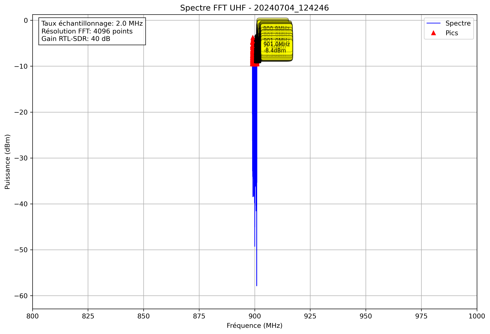

# Analyse Spectrale - 20240704_124246

## Paramètres

- Fréquence début: 800.0 MHz
- Fréquence fin: 1000.0 MHz
- Taux d'échantillonnage: 2.0 MHz
- Taille FFT: 4096 points
- Gain RTL-SDR: 40 dB

## Pics Détectés

| Fréquence (MHz) | Puissance (dBm) |
|-----------------|----------------|
| 899.0 | -7.6 |
| 899.0 | -8.7 |
| 899.0 | -8.6 |
| 899.0 | -7.5 |
| 899.0 | -6.4 |
| 899.0 | -5.9 |
| 899.0 | -6.7 |
| 899.0 | -9.4 |
| 899.0 | -9.3 |
| 899.0 | -9.1 |
| 899.0 | -8.0 |
| 899.0 | -8.8 |
| 899.0 | -7.7 |
| 899.0 | -9.4 |
| 899.0 | -8.2 |
| 899.0 | -9.2 |
| 899.0 | -7.8 |
| 899.0 | -8.2 |
| 899.0 | -8.9 |
| 899.0 | -9.5 |
| 899.0 | -8.7 |
| 899.0 | -6.0 |
| 899.0 | -4.8 |
| 899.0 | -4.6 |
| 899.0 | -5.5 |
| 899.0 | -8.0 |
| 899.1 | -8.5 |
| 899.1 | -8.4 |
| 899.1 | -5.4 |
| 899.1 | -5.7 |
| 899.1 | -6.8 |
| 899.1 | -6.4 |
| 899.1 | -7.6 |
| 899.1 | -7.0 |
| 899.1 | -6.9 |
| 899.1 | -7.2 |
| 899.1 | -7.1 |
| 899.1 | -7.4 |
| 899.1 | -9.3 |
| 899.1 | -7.9 |
| 899.1 | -8.3 |
| 899.1 | -8.8 |
| 899.1 | -8.8 |
| 899.1 | -7.1 |
| 899.1 | -9.5 |
| 899.1 | -8.1 |
| 899.1 | -6.3 |
| 899.1 | -9.3 |
| 899.1 | -7.6 |
| 899.1 | -6.7 |
| 899.1 | -9.3 |
| 899.1 | -8.5 |
| 899.1 | -7.9 |
| 899.1 | -8.4 |
| 899.1 | -9.0 |
| 899.1 | -4.9 |
| 899.1 | -3.7 |
| 899.1 | -8.3 |
| 899.1 | -9.2 |
| 899.1 | -8.5 |
| 899.2 | -9.4 |
| 899.2 | -9.3 |
| 899.2 | -6.3 |
| 899.2 | -5.9 |
| 899.2 | -6.8 |
| 899.2 | -7.5 |
| 899.2 | -8.6 |
| 899.2 | -6.9 |
| 899.2 | -6.8 |
| 899.2 | -7.9 |
| 899.2 | -8.1 |
| 899.2 | -6.1 |
| 899.2 | -6.5 |
| 899.2 | -7.4 |
| 899.2 | -7.1 |
| 899.2 | -9.3 |
| 899.2 | -8.1 |
| 899.2 | -6.2 |
| 899.2 | -8.4 |
| 899.2 | -7.8 |
| 899.2 | -9.0 |
| 899.2 | -9.0 |
| 899.2 | -7.7 |
| 899.2 | -8.3 |
| 899.2 | -8.8 |
| 899.2 | -5.2 |
| 899.2 | -4.5 |
| 899.2 | -7.9 |
| 899.2 | -8.2 |
| 899.2 | -8.7 |
| 899.2 | -9.2 |
| 899.2 | -9.2 |
| 899.2 | -8.5 |
| 899.3 | -7.6 |
| 899.3 | -4.0 |
| 899.3 | -7.1 |
| 899.3 | -8.5 |
| 899.3 | -5.2 |
| 899.3 | -7.1 |
| 899.3 | -9.4 |
| 899.3 | -7.8 |
| 899.3 | -7.5 |
| 899.3 | -9.2 |
| 899.3 | -9.1 |
| 899.3 | -9.3 |
| 899.3 | -9.2 |
| 899.3 | -9.3 |
| 899.3 | -7.5 |
| 899.3 | -9.5 |
| 899.3 | -6.8 |
| 899.3 | -5.2 |
| 899.3 | -4.3 |
| 899.3 | -4.8 |
| 899.3 | -7.5 |
| 899.3 | -6.9 |
| 899.3 | -4.2 |
| 899.3 | -5.7 |
| 899.3 | -8.9 |
| 899.3 | -9.3 |
| 899.3 | -6.8 |
| 899.3 | -5.3 |
| 899.3 | -8.2 |
| 899.3 | -8.1 |
| 899.3 | -7.5 |
| 899.3 | -8.9 |
| 899.3 | -9.4 |
| 899.4 | -7.8 |
| 899.4 | -8.0 |
| 899.4 | -8.7 |
| 899.4 | -8.1 |
| 899.4 | -8.1 |
| 899.4 | -6.9 |
| 899.4 | -6.1 |
| 899.4 | -5.1 |
| 899.4 | -7.9 |
| 899.4 | -9.4 |
| 899.4 | -9.5 |
| 899.4 | -7.0 |
| 899.4 | -9.6 |
| 899.4 | -7.3 |
| 899.4 | -5.7 |
| 899.4 | -7.8 |
| 899.4 | -9.5 |
| 899.4 | -8.4 |
| 899.4 | -8.6 |
| 899.4 | -8.8 |
| 899.4 | -5.9 |
| 899.4 | -6.7 |
| 899.4 | -7.3 |
| 899.4 | -6.8 |
| 899.4 | -9.4 |
| 899.4 | -9.1 |
| 899.4 | -9.4 |
| 899.4 | -9.1 |
| 899.4 | -8.5 |
| 899.4 | -8.3 |
| 899.4 | -9.4 |
| 899.5 | -8.8 |
| 899.5 | -8.6 |
| 899.5 | -9.0 |
| 899.5 | -9.1 |
| 899.5 | -8.8 |
| 899.5 | -9.4 |
| 899.5 | -9.2 |
| 899.5 | -8.6 |
| 899.5 | -9.3 |
| 899.5 | -6.4 |
| 899.5 | -7.4 |
| 899.5 | -6.1 |
| 899.5 | -8.8 |
| 899.5 | -9.4 |
| 899.5 | -7.9 |
| 899.5 | -9.2 |
| 899.5 | -9.5 |
| 899.5 | -9.5 |
| 899.5 | -8.2 |
| 899.5 | -8.7 |
| 899.6 | -9.4 |
| 899.6 | -7.1 |
| 899.6 | -7.1 |
| 899.6 | -7.3 |
| 899.6 | -7.3 |
| 899.6 | -8.7 |
| 899.6 | -8.8 |
| 899.6 | -8.9 |
| 899.6 | -9.0 |
| 899.6 | -9.4 |
| 899.6 | -8.2 |
| 899.6 | -8.9 |
| 899.6 | -9.5 |
| 899.6 | -9.2 |
| 899.6 | -7.0 |
| 899.6 | -8.9 |
| 899.6 | -9.3 |
| 899.6 | -6.8 |
| 899.6 | -5.4 |
| 899.6 | -8.6 |
| 899.6 | -6.5 |
| 899.6 | -7.5 |
| 899.6 | -7.9 |
| 899.6 | -7.2 |
| 899.6 | -8.5 |
| 899.6 | -8.1 |
| 899.6 | -7.9 |
| 899.6 | -8.0 |
| 899.6 | -9.5 |
| 899.6 | -6.9 |
| 899.6 | -6.5 |
| 899.6 | -7.2 |
| 899.6 | -7.8 |
| 899.6 | -9.4 |
| 899.6 | -9.3 |
| 899.6 | -8.3 |
| 899.6 | -6.3 |
| 899.6 | -9.1 |
| 899.7 | -7.8 |
| 899.7 | -8.7 |
| 899.7 | -9.2 |
| 899.7 | -6.7 |
| 899.7 | -9.3 |
| 899.7 | -7.3 |
| 899.7 | -8.2 |
| 899.7 | -8.3 |
| 899.7 | -8.3 |
| 899.7 | -7.3 |
| 899.7 | -6.0 |
| 899.7 | -8.6 |
| 899.7 | -6.2 |
| 899.7 | -7.9 |
| 899.7 | -9.2 |
| 899.7 | -8.4 |
| 899.7 | -8.1 |
| 899.7 | -8.2 |
| 899.7 | -7.1 |
| 899.7 | -8.3 |
| 899.7 | -6.8 |
| 899.7 | -6.8 |
| 899.7 | -9.0 |
| 899.7 | -8.6 |
| 899.7 | -8.2 |
| 899.7 | -7.1 |
| 899.7 | -9.5 |
| 899.7 | -9.4 |
| 899.7 | -9.1 |
| 899.7 | -6.7 |
| 899.7 | -6.5 |
| 899.7 | -9.0 |
| 899.7 | -8.8 |
| 899.7 | -6.6 |
| 899.7 | -6.7 |
| 899.7 | -8.1 |
| 899.7 | -8.6 |
| 899.7 | -7.4 |
| 899.8 | -9.3 |
| 899.8 | -8.9 |
| 899.8 | -9.1 |
| 899.8 | -9.1 |
| 899.8 | -9.4 |
| 899.8 | -7.0 |
| 899.8 | -7.4 |
| 899.8 | -6.8 |
| 899.8 | -6.9 |
| 899.8 | -7.0 |
| 899.8 | -6.2 |
| 899.8 | -7.8 |
| 899.8 | -7.4 |
| 899.8 | -8.9 |
| 899.8 | -9.5 |
| 899.8 | -8.9 |
| 899.8 | -8.4 |
| 899.8 | -9.5 |
| 899.8 | -7.0 |
| 899.8 | -8.2 |
| 899.8 | -8.0 |
| 899.8 | -9.6 |
| 899.9 | -7.5 |
| 899.9 | -5.9 |
| 899.9 | -4.7 |
| 899.9 | -5.8 |
| 899.9 | -8.6 |
| 899.9 | -9.0 |
| 899.9 | -8.9 |
| 899.9 | -9.3 |
| 899.9 | -8.6 |
| 899.9 | -9.2 |
| 899.9 | -6.9 |
| 899.9 | -7.6 |
| 899.9 | -8.3 |
| 899.9 | -8.8 |
| 899.9 | -9.1 |
| 899.9 | -7.9 |
| 899.9 | -8.0 |
| 899.9 | -9.0 |
| 900.1 | -9.4 |
| 900.1 | -8.1 |
| 900.1 | -8.9 |
| 900.1 | -9.5 |
| 900.1 | -9.2 |
| 900.1 | -9.4 |
| 900.1 | -9.4 |
| 900.1 | -8.5 |
| 900.1 | -7.4 |
| 900.1 | -9.1 |
| 900.1 | -9.5 |
| 900.1 | -7.3 |
| 900.1 | -7.6 |
| 900.1 | -6.8 |
| 900.1 | -8.8 |
| 900.1 | -9.3 |
| 900.1 | -8.9 |
| 900.2 | -9.3 |
| 900.2 | -9.2 |
| 900.2 | -8.8 |
| 900.2 | -8.5 |
| 900.2 | -9.4 |
| 900.2 | -7.5 |
| 900.2 | -9.0 |
| 900.2 | -7.7 |
| 900.2 | -7.2 |
| 900.2 | -9.5 |
| 900.2 | -8.1 |
| 900.3 | -7.0 |
| 900.3 | -8.0 |
| 900.3 | -7.3 |
| 900.3 | -6.7 |
| 900.3 | -9.2 |
| 900.3 | -8.2 |
| 900.3 | -9.3 |
| 900.3 | -9.3 |
| 900.3 | -7.5 |
| 900.3 | -5.2 |
| 900.3 | -4.7 |
| 900.3 | -4.8 |
| 900.3 | -6.6 |
| 900.3 | -8.2 |
| 900.3 | -8.3 |
| 900.3 | -7.6 |
| 900.3 | -8.9 |
| 900.3 | -7.5 |
| 900.3 | -9.5 |
| 900.3 | -6.7 |
| 900.3 | -5.7 |
| 900.3 | -6.8 |
| 900.3 | -9.4 |
| 900.3 | -8.6 |
| 900.3 | -8.8 |
| 900.3 | -7.2 |
| 900.3 | -8.3 |
| 900.3 | -8.2 |
| 900.3 | -7.4 |
| 900.3 | -9.1 |
| 900.3 | -8.8 |
| 900.3 | -7.6 |
| 900.4 | -8.5 |
| 900.4 | -9.4 |
| 900.4 | -9.2 |
| 900.4 | -8.9 |
| 900.4 | -9.2 |
| 900.4 | -8.8 |
| 900.4 | -7.9 |
| 900.4 | -6.2 |
| 900.4 | -8.0 |
| 900.4 | -8.1 |
| 900.4 | -6.5 |
| 900.4 | -5.3 |
| 900.4 | -8.1 |
| 900.4 | -9.5 |
| 900.4 | -8.9 |
| 900.4 | -9.1 |
| 900.4 | -7.9 |
| 900.4 | -7.7 |
| 900.4 | -9.5 |
| 900.4 | -8.7 |
| 900.4 | -6.4 |
| 900.4 | -6.3 |
| 900.4 | -9.3 |
| 900.4 | -8.7 |
| 900.4 | -7.5 |
| 900.4 | -8.8 |
| 900.4 | -7.5 |
| 900.4 | -6.9 |
| 900.4 | -8.5 |
| 900.4 | -8.5 |
| 900.4 | -8.7 |
| 900.4 | -8.9 |
| 900.4 | -9.4 |
| 900.4 | -7.9 |
| 900.4 | -8.4 |
| 900.4 | -8.7 |
| 900.4 | -8.9 |
| 900.4 | -6.5 |
| 900.4 | -7.6 |
| 900.4 | -9.0 |
| 900.5 | -8.9 |
| 900.5 | -7.5 |
| 900.5 | -6.4 |
| 900.5 | -7.1 |
| 900.5 | -8.8 |
| 900.5 | -6.4 |
| 900.5 | -8.2 |
| 900.5 | -7.5 |
| 900.5 | -6.8 |
| 900.5 | -9.2 |
| 900.5 | -6.8 |
| 900.5 | -6.2 |
| 900.5 | -9.1 |
| 900.5 | -9.1 |
| 900.5 | -9.4 |
| 900.5 | -6.8 |
| 900.5 | -9.5 |
| 900.5 | -8.1 |
| 900.5 | -7.6 |
| 900.5 | -8.0 |
| 900.5 | -8.9 |
| 900.5 | -8.4 |
| 900.5 | -9.0 |
| 900.5 | -6.4 |
| 900.5 | -8.8 |
| 900.5 | -4.3 |
| 900.5 | -4.5 |
| 900.5 | -9.3 |
| 900.5 | -6.7 |
| 900.5 | -8.7 |
| 900.6 | -8.5 |
| 900.6 | -6.0 |
| 900.6 | -9.0 |
| 900.6 | -9.5 |
| 900.6 | -9.3 |
| 900.6 | -8.7 |
| 900.6 | -8.5 |
| 900.6 | -8.5 |
| 900.6 | -8.8 |
| 900.6 | -7.0 |
| 900.6 | -8.7 |
| 900.6 | -7.8 |
| 900.6 | -5.3 |
| 900.6 | -5.3 |
| 900.6 | -8.3 |
| 900.6 | -7.6 |
| 900.6 | -7.4 |
| 900.6 | -9.4 |
| 900.6 | -7.7 |
| 900.6 | -4.7 |
| 900.6 | -7.3 |
| 900.6 | -9.2 |
| 900.6 | -8.5 |
| 900.6 | -7.8 |
| 900.6 | -9.1 |
| 900.6 | -8.6 |
| 900.6 | -5.6 |
| 900.6 | -5.7 |
| 900.6 | -9.1 |
| 900.6 | -7.3 |
| 900.7 | -7.0 |
| 900.7 | -6.3 |
| 900.7 | -8.5 |
| 900.7 | -8.6 |
| 900.7 | -7.6 |
| 900.7 | -9.1 |
| 900.7 | -7.1 |
| 900.7 | -8.0 |
| 900.7 | -9.0 |
| 900.7 | -6.8 |
| 900.7 | -6.5 |
| 900.7 | -8.5 |
| 900.7 | -9.2 |
| 900.7 | -9.3 |
| 900.7 | -7.6 |
| 900.7 | -6.9 |
| 900.7 | -8.8 |
| 900.7 | -5.3 |
| 900.7 | -6.2 |
| 900.7 | -9.0 |
| 900.7 | -6.2 |
| 900.7 | -8.1 |
| 900.7 | -8.0 |
| 900.7 | -9.4 |
| 900.7 | -8.8 |
| 900.7 | -8.3 |
| 900.7 | -9.2 |
| 900.7 | -7.0 |
| 900.7 | -7.6 |
| 900.7 | -6.4 |
| 900.7 | -6.9 |
| 900.7 | -9.4 |
| 900.7 | -9.5 |
| 900.7 | -9.2 |
| 900.8 | -8.4 |
| 900.8 | -9.3 |
| 900.8 | -8.1 |
| 900.8 | -8.2 |
| 900.8 | -8.6 |
| 900.8 | -9.5 |
| 900.8 | -8.8 |
| 900.8 | -7.9 |
| 900.8 | -4.8 |
| 900.8 | -5.6 |
| 900.8 | -9.0 |
| 900.8 | -8.3 |
| 900.8 | -8.6 |
| 900.8 | -8.8 |
| 900.8 | -8.6 |
| 900.8 | -9.5 |
| 900.8 | -6.2 |
| 900.8 | -7.7 |
| 900.8 | -9.0 |
| 900.8 | -8.4 |
| 900.8 | -9.2 |
| 900.8 | -8.1 |
| 900.8 | -8.3 |
| 900.8 | -9.2 |
| 900.8 | -6.0 |
| 900.8 | -6.8 |
| 900.8 | -7.3 |
| 900.8 | -6.9 |
| 900.8 | -9.1 |
| 900.8 | -9.5 |
| 900.9 | -7.9 |
| 900.9 | -4.9 |
| 900.9 | -5.0 |
| 900.9 | -7.6 |
| 900.9 | -8.0 |
| 900.9 | -9.0 |
| 900.9 | -9.2 |
| 900.9 | -8.0 |
| 900.9 | -9.2 |
| 900.9 | -9.2 |
| 900.9 | -8.5 |
| 900.9 | -8.4 |
| 900.9 | -8.0 |
| 900.9 | -9.3 |
| 900.9 | -8.8 |
| 900.9 | -8.0 |
| 900.9 | -8.8 |
| 900.9 | -8.9 |
| 900.9 | -8.8 |
| 900.9 | -9.0 |
| 900.9 | -7.0 |
| 900.9 | -5.8 |
| 900.9 | -8.2 |
| 900.9 | -8.5 |
| 900.9 | -9.3 |
| 900.9 | -6.9 |
| 900.9 | -7.8 |
| 900.9 | -9.0 |
| 900.9 | -6.7 |
| 900.9 | -7.8 |
| 900.9 | -9.4 |
| 900.9 | -8.6 |
| 900.9 | -7.8 |
| 900.9 | -9.3 |
| 900.9 | -8.6 |
| 900.9 | -6.2 |
| 900.9 | -7.7 |
| 901.0 | -8.2 |
| 901.0 | -7.2 |
| 901.0 | -6.6 |
| 901.0 | -6.4 |
| 901.0 | -7.1 |
| 901.0 | -7.1 |
| 901.0 | -7.8 |
| 901.0 | -7.9 |
| 901.0 | -8.5 |
| 901.0 | -7.6 |
| 901.0 | -8.9 |
| 901.0 | -8.6 |
| 901.0 | -9.0 |
| 901.0 | -9.3 |
| 901.0 | -8.8 |
| 901.0 | -8.2 |
| 901.0 | -8.2 |
| 901.0 | -7.5 |
| 901.0 | -8.4 |
