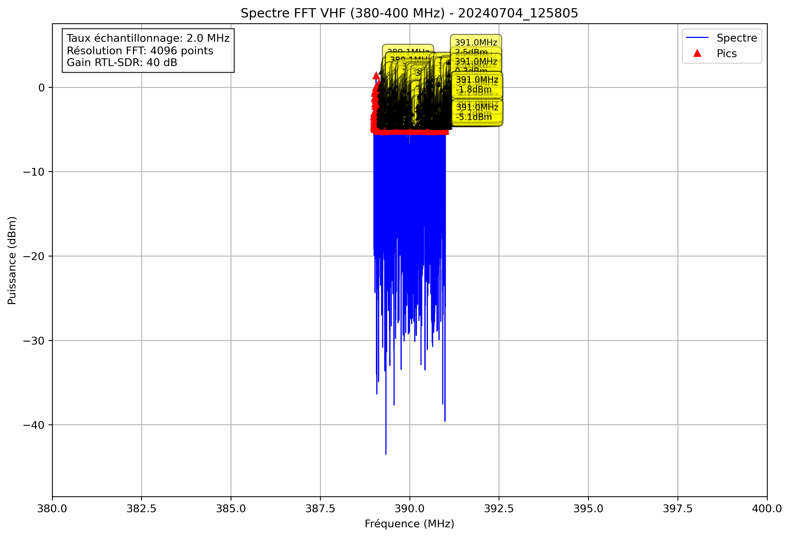

# Analyse Spectrale - 20240704_125805

## Paramètres

- Fréquence début: 380.0 MHz
- Fréquence fin: 400.0 MHz
- Taux d'échantillonnage: 2.0 MHz
- Taille FFT: 4096 points
- Gain RTL-SDR: 40 dB

## Pics Détectés

| Fréquence (MHz) | Puissance (dBm) |
|-----------------|----------------|
| 389.0 | -3.5 |
| 389.0 | -4.6 |
| 389.0 | -4.3 |
| 389.0 | -4.1 |
| 389.0 | -3.8 |
| 389.0 | -4.7 |
| 389.0 | -3.4 |
| 389.0 | -3.0 |
| 389.0 | -4.8 |
| 389.0 | -3.0 |
| 389.0 | -0.7 |
| 389.0 | -1.3 |
| 389.0 | -5.0 |
| 389.0 | -3.3 |
| 389.0 | -3.5 |
| 389.0 | -3.0 |
| 389.0 | -4.9 |
| 389.0 | -3.9 |
| 389.0 | -1.9 |
| 389.0 | -3.8 |
| 389.0 | -2.2 |
| 389.0 | -0.4 |
| 389.0 | -1.5 |
| 389.0 | -3.7 |
| 389.1 | -3.4 |
| 389.1 | -3.3 |
| 389.1 | -0.0 |
| 389.1 | 1.4 |
| 389.1 | -0.2 |
| 389.1 | -1.6 |
| 389.1 | -4.5 |
| 389.1 | -4.0 |
| 389.1 | -2.1 |
| 389.1 | -2.5 |
| 389.1 | -4.7 |
| 389.1 | -2.4 |
| 389.1 | -5.1 |
| 389.1 | -4.7 |
| 389.1 | -2.4 |
| 389.1 | -3.0 |
| 389.1 | -3.0 |
| 389.1 | -3.8 |
| 389.1 | -1.4 |
| 389.1 | -0.9 |
| 389.1 | -3.8 |
| 389.1 | -4.7 |
| 389.1 | -4.6 |
| 389.1 | -3.3 |
| 389.1 | -3.6 |
| 389.1 | -3.9 |
| 389.1 | -4.3 |
| 389.1 | -5.2 |
| 389.1 | -3.2 |
| 389.1 | -1.8 |
| 389.1 | -5.0 |
| 389.1 | -4.0 |
| 389.1 | -1.8 |
| 389.1 | 0.5 |
| 389.1 | 0.4 |
| 389.1 | -0.7 |
| 389.1 | -2.4 |
| 389.1 | -3.6 |
| 389.1 | -4.6 |
| 389.2 | -2.9 |
| 389.2 | -2.8 |
| 389.2 | -3.1 |
| 389.2 | -2.3 |
| 389.2 | -4.8 |
| 389.2 | -4.1 |
| 389.2 | -1.9 |
| 389.2 | -4.3 |
| 389.2 | -4.9 |
| 389.2 | -4.0 |
| 389.2 | -2.7 |
| 389.2 | -2.5 |
| 389.2 | -2.1 |
| 389.2 | -3.6 |
| 389.2 | -4.9 |
| 389.2 | -4.1 |
| 389.2 | -4.4 |
| 389.2 | -4.1 |
| 389.3 | -5.2 |
| 389.3 | -3.8 |
| 389.3 | -3.6 |
| 389.3 | -5.1 |
| 389.3 | -1.7 |
| 389.3 | -0.9 |
| 389.3 | -2.8 |
| 389.3 | -4.8 |
| 389.3 | -3.3 |
| 389.3 | -3.5 |
| 389.3 | -4.2 |
| 389.3 | -2.8 |
| 389.3 | -3.4 |
| 389.3 | -3.1 |
| 389.3 | -2.0 |
| 389.3 | -4.0 |
| 389.3 | -5.1 |
| 389.3 | -5.2 |
| 389.3 | -5.1 |
| 389.3 | -2.5 |
| 389.3 | -4.6 |
| 389.3 | -4.7 |
| 389.3 | -3.3 |
| 389.3 | -4.1 |
| 389.3 | -4.6 |
| 389.3 | -2.1 |
| 389.3 | -0.5 |
| 389.3 | -3.2 |
| 389.3 | -4.2 |
| 389.3 | -5.2 |
| 389.3 | -1.7 |
| 389.3 | -2.7 |
| 389.3 | -3.2 |
| 389.3 | -5.2 |
| 389.3 | -4.2 |
| 389.3 | -2.8 |
| 389.3 | -2.0 |
| 389.3 | -3.8 |
| 389.3 | -4.8 |
| 389.3 | -3.8 |
| 389.3 | -3.1 |
| 389.4 | -4.1 |
| 389.4 | -4.9 |
| 389.4 | -2.9 |
| 389.4 | -4.8 |
| 389.4 | -3.8 |
| 389.4 | -4.5 |
| 389.4 | -3.6 |
| 389.4 | -3.7 |
| 389.4 | -3.5 |
| 389.4 | -2.8 |
| 389.4 | -3.1 |
| 389.4 | -4.9 |
| 389.4 | -5.0 |
| 389.4 | -3.5 |
| 389.4 | -5.1 |
| 389.4 | -2.8 |
| 389.4 | -1.2 |
| 389.4 | -4.2 |
| 389.4 | -4.9 |
| 389.4 | -4.1 |
| 389.4 | -4.3 |
| 389.4 | -1.0 |
| 389.4 | -0.8 |
| 389.4 | -2.7 |
| 389.4 | -4.1 |
| 389.4 | -2.9 |
| 389.4 | -4.5 |
| 389.4 | -1.5 |
| 389.4 | -2.8 |
| 389.5 | -4.0 |
| 389.5 | -4.2 |
| 389.5 | -3.9 |
| 389.5 | -4.4 |
| 389.5 | -4.9 |
| 389.5 | -2.4 |
| 389.5 | -4.3 |
| 389.5 | -4.6 |
| 389.5 | -3.5 |
| 389.5 | -5.1 |
| 389.5 | -4.9 |
| 389.5 | -4.6 |
| 389.5 | -2.5 |
| 389.5 | -3.9 |
| 389.5 | -1.2 |
| 389.5 | -0.3 |
| 389.5 | -3.5 |
| 389.5 | -3.7 |
| 389.5 | -3.3 |
| 389.5 | -2.4 |
| 389.5 | -3.8 |
| 389.5 | -5.1 |
| 389.5 | -5.1 |
| 389.5 | -4.9 |
| 389.5 | -4.9 |
| 389.5 | -4.9 |
| 389.5 | -4.2 |
| 389.5 | -2.9 |
| 389.5 | -4.3 |
| 389.5 | -3.2 |
| 389.5 | -3.4 |
| 389.6 | -2.8 |
| 389.6 | -2.2 |
| 389.6 | -4.4 |
| 389.6 | -3.9 |
| 389.6 | -5.1 |
| 389.6 | -4.8 |
| 389.6 | -4.2 |
| 389.6 | -3.9 |
| 389.6 | -3.6 |
| 389.6 | -4.9 |
| 389.6 | -4.9 |
| 389.6 | -5.2 |
| 389.6 | -5.1 |
| 389.6 | -4.8 |
| 389.6 | -4.0 |
| 389.6 | -2.2 |
| 389.6 | -4.3 |
| 389.6 | -3.3 |
| 389.6 | -2.4 |
| 389.6 | -4.4 |
| 389.6 | -5.2 |
| 389.6 | -4.1 |
| 389.6 | -2.6 |
| 389.6 | -4.8 |
| 389.6 | -4.5 |
| 389.6 | -2.5 |
| 389.6 | -4.4 |
| 389.6 | -3.1 |
| 389.6 | -2.9 |
| 389.6 | -4.2 |
| 389.6 | -4.5 |
| 389.6 | -5.0 |
| 389.6 | -2.9 |
| 389.7 | -2.2 |
| 389.7 | -3.9 |
| 389.7 | -5.1 |
| 389.7 | -3.1 |
| 389.7 | -2.2 |
| 389.7 | -1.6 |
| 389.7 | -2.4 |
| 389.7 | -3.4 |
| 389.7 | -2.5 |
| 389.7 | -5.2 |
| 389.7 | -1.9 |
| 389.7 | -0.7 |
| 389.7 | -2.6 |
| 389.7 | -3.5 |
| 389.7 | -2.6 |
| 389.7 | -5.0 |
| 389.7 | -3.6 |
| 389.7 | -3.2 |
| 389.7 | -5.0 |
| 389.7 | -4.8 |
| 389.7 | -1.6 |
| 389.7 | -0.9 |
| 389.7 | -2.9 |
| 389.8 | -4.4 |
| 389.8 | -5.0 |
| 389.8 | -5.1 |
| 389.8 | -3.2 |
| 389.8 | -4.0 |
| 389.8 | -5.1 |
| 389.8 | -2.9 |
| 389.8 | -3.1 |
| 389.8 | -5.0 |
| 389.8 | -4.2 |
| 389.8 | -4.8 |
| 389.8 | -5.1 |
| 389.8 | -4.7 |
| 389.8 | -4.3 |
| 389.8 | -5.2 |
| 389.8 | -2.2 |
| 389.8 | -3.3 |
| 389.8 | -3.8 |
| 389.8 | -3.5 |
| 389.8 | -4.5 |
| 389.8 | -4.5 |
| 389.8 | -4.7 |
| 389.8 | -4.1 |
| 389.8 | -4.0 |
| 389.8 | -2.7 |
| 389.8 | -3.4 |
| 389.9 | -4.3 |
| 389.9 | -1.1 |
| 389.9 | -2.9 |
| 389.9 | -3.0 |
| 389.9 | -4.0 |
| 389.9 | -4.9 |
| 389.9 | -4.9 |
| 389.9 | -4.8 |
| 389.9 | -4.6 |
| 389.9 | -4.7 |
| 389.9 | -5.1 |
| 389.9 | -3.6 |
| 390.0 | -5.2 |
| 390.1 | -4.9 |
| 390.1 | -4.1 |
| 390.1 | -2.7 |
| 390.1 | -3.1 |
| 390.1 | -5.2 |
| 390.1 | -4.6 |
| 390.1 | -2.6 |
| 390.1 | -4.0 |
| 390.1 | -3.4 |
| 390.1 | -3.2 |
| 390.1 | -3.7 |
| 390.1 | -3.4 |
| 390.1 | -3.4 |
| 390.1 | -3.0 |
| 390.1 | -1.4 |
| 390.1 | -1.6 |
| 390.1 | -3.5 |
| 390.1 | -3.2 |
| 390.1 | -3.8 |
| 390.2 | -4.6 |
| 390.2 | -5.1 |
| 390.2 | -3.8 |
| 390.2 | -3.6 |
| 390.2 | -4.4 |
| 390.2 | -4.6 |
| 390.2 | -4.9 |
| 390.2 | -5.0 |
| 390.2 | -3.9 |
| 390.2 | -4.2 |
| 390.2 | -2.5 |
| 390.2 | -3.4 |
| 390.2 | -4.5 |
| 390.2 | -4.1 |
| 390.2 | -1.1 |
| 390.2 | -2.5 |
| 390.2 | -4.2 |
| 390.2 | -3.3 |
| 390.2 | -3.0 |
| 390.2 | -4.3 |
| 390.2 | -4.8 |
| 390.2 | -5.2 |
| 390.3 | -4.4 |
| 390.3 | -4.9 |
| 390.3 | -5.1 |
| 390.3 | -4.8 |
| 390.3 | -2.9 |
| 390.3 | -0.7 |
| 390.3 | -2.1 |
| 390.3 | -2.9 |
| 390.3 | -4.8 |
| 390.3 | -4.3 |
| 390.3 | -3.3 |
| 390.3 | -1.3 |
| 390.3 | -1.7 |
| 390.3 | -4.0 |
| 390.3 | -5.1 |
| 390.3 | -4.7 |
| 390.3 | -3.1 |
| 390.3 | -3.0 |
| 390.3 | -2.6 |
| 390.3 | -4.5 |
| 390.3 | -3.4 |
| 390.3 | -1.9 |
| 390.3 | -3.4 |
| 390.3 | -2.7 |
| 390.4 | -5.0 |
| 390.4 | -2.8 |
| 390.4 | -3.9 |
| 390.4 | -4.7 |
| 390.4 | -4.8 |
| 390.4 | -3.7 |
| 390.4 | -3.9 |
| 390.4 | -4.3 |
| 390.4 | -2.1 |
| 390.4 | -3.3 |
| 390.4 | -5.1 |
| 390.4 | -5.1 |
| 390.4 | -0.3 |
| 390.4 | 0.4 |
| 390.4 | -2.6 |
| 390.4 | -4.9 |
| 390.4 | -3.5 |
| 390.4 | -4.7 |
| 390.4 | -3.1 |
| 390.4 | -3.5 |
| 390.4 | -4.5 |
| 390.4 | -1.9 |
| 390.4 | -0.4 |
| 390.4 | -1.7 |
| 390.4 | -3.6 |
| 390.4 | -4.2 |
| 390.4 | -4.5 |
| 390.4 | -3.2 |
| 390.4 | -2.6 |
| 390.4 | -3.9 |
| 390.4 | -1.9 |
| 390.4 | -0.1 |
| 390.4 | -1.5 |
| 390.4 | -4.1 |
| 390.4 | -2.6 |
| 390.4 | -2.9 |
| 390.4 | -2.9 |
| 390.4 | -4.7 |
| 390.4 | -4.7 |
| 390.4 | -1.9 |
| 390.4 | -1.0 |
| 390.4 | -1.7 |
| 390.4 | -2.2 |
| 390.4 | -2.7 |
| 390.5 | -4.6 |
| 390.5 | -3.2 |
| 390.5 | -3.3 |
| 390.5 | -5.1 |
| 390.5 | -0.9 |
| 390.5 | -0.1 |
| 390.5 | -2.6 |
| 390.5 | -4.8 |
| 390.5 | -5.2 |
| 390.5 | -4.7 |
| 390.5 | -3.5 |
| 390.5 | -4.8 |
| 390.5 | -3.7 |
| 390.5 | -1.4 |
| 390.5 | 0.4 |
| 390.5 | -1.1 |
| 390.5 | -3.1 |
| 390.5 | -5.1 |
| 390.5 | -3.7 |
| 390.5 | -4.3 |
| 390.5 | -4.7 |
| 390.5 | -2.3 |
| 390.5 | -0.2 |
| 390.5 | -2.6 |
| 390.5 | -4.8 |
| 390.5 | -3.2 |
| 390.5 | -4.6 |
| 390.5 | -4.9 |
| 390.5 | -5.1 |
| 390.5 | -4.4 |
| 390.5 | -5.2 |
| 390.5 | -4.7 |
| 390.6 | -4.4 |
| 390.6 | -5.2 |
| 390.6 | -2.6 |
| 390.6 | -4.0 |
| 390.6 | -5.0 |
| 390.6 | -2.6 |
| 390.6 | -3.0 |
| 390.6 | -3.7 |
| 390.6 | -5.1 |
| 390.6 | -4.9 |
| 390.6 | -4.0 |
| 390.6 | -4.0 |
| 390.6 | -2.3 |
| 390.6 | -2.6 |
| 390.6 | -4.5 |
| 390.6 | -4.7 |
| 390.6 | -4.7 |
| 390.6 | -4.8 |
| 390.6 | -5.2 |
| 390.6 | -4.4 |
| 390.6 | -2.9 |
| 390.6 | -4.8 |
| 390.6 | -3.1 |
| 390.6 | -2.7 |
| 390.6 | -4.4 |
| 390.7 | -4.0 |
| 390.7 | -4.5 |
| 390.7 | -3.7 |
| 390.7 | -4.8 |
| 390.7 | -5.2 |
| 390.7 | -4.1 |
| 390.7 | -5.2 |
| 390.7 | -3.8 |
| 390.7 | -3.6 |
| 390.7 | -3.4 |
| 390.7 | 0.1 |
| 390.7 | -0.1 |
| 390.7 | -4.6 |
| 390.7 | -3.6 |
| 390.7 | -4.9 |
| 390.7 | -4.5 |
| 390.7 | -2.5 |
| 390.7 | -2.2 |
| 390.7 | -4.5 |
| 390.7 | -4.0 |
| 390.7 | -4.7 |
| 390.7 | -5.0 |
| 390.7 | -4.4 |
| 390.8 | -4.1 |
| 390.8 | -4.3 |
| 390.8 | -5.2 |
| 390.8 | -5.0 |
| 390.8 | -3.4 |
| 390.8 | -2.3 |
| 390.8 | -0.8 |
| 390.8 | -4.9 |
| 390.8 | -4.9 |
| 390.8 | -3.9 |
| 390.8 | -3.7 |
| 390.8 | -4.9 |
| 390.8 | -4.0 |
| 390.8 | -4.2 |
| 390.8 | -2.7 |
| 390.8 | -4.4 |
| 390.8 | -4.3 |
| 390.8 | -3.3 |
| 390.8 | -4.6 |
| 390.8 | -3.2 |
| 390.8 | -2.8 |
| 390.8 | -4.0 |
| 390.8 | -4.8 |
| 390.8 | -5.2 |
| 390.8 | -4.9 |
| 390.8 | -4.2 |
| 390.8 | -4.2 |
| 390.8 | -3.1 |
| 390.8 | -1.5 |
| 390.8 | -1.3 |
| 390.8 | -4.8 |
| 390.8 | -3.0 |
| 390.8 | -1.6 |
| 390.8 | -1.1 |
| 390.8 | -2.3 |
| 390.8 | -4.0 |
| 390.8 | -4.5 |
| 390.8 | -3.0 |
| 390.8 | -1.9 |
| 390.8 | -4.1 |
| 390.9 | -1.9 |
| 390.9 | -0.4 |
| 390.9 | -2.2 |
| 390.9 | -4.7 |
| 390.9 | -2.3 |
| 390.9 | -4.6 |
| 390.9 | -4.1 |
| 390.9 | -3.1 |
| 390.9 | -3.5 |
| 390.9 | -5.2 |
| 390.9 | -4.9 |
| 390.9 | -4.8 |
| 390.9 | -4.5 |
| 390.9 | -1.6 |
| 390.9 | -2.7 |
| 390.9 | -4.8 |
| 390.9 | -4.4 |
| 390.9 | -4.0 |
| 390.9 | -4.2 |
| 390.9 | -3.2 |
| 390.9 | -4.8 |
| 390.9 | -4.6 |
| 390.9 | -4.9 |
| 390.9 | -4.0 |
| 390.9 | -4.6 |
| 390.9 | -4.1 |
| 390.9 | -4.2 |
| 390.9 | -4.0 |
| 390.9 | -2.1 |
| 390.9 | -0.3 |
| 390.9 | -1.6 |
| 390.9 | -4.8 |
| 390.9 | -3.7 |
| 390.9 | -3.1 |
| 390.9 | -2.3 |
| 390.9 | -4.4 |
| 390.9 | -5.0 |
| 390.9 | -3.4 |
| 390.9 | -0.4 |
| 390.9 | -2.4 |
| 390.9 | -4.2 |
| 390.9 | -1.4 |
| 390.9 | -3.1 |
| 390.9 | -5.0 |
| 390.9 | -3.5 |
| 390.9 | -4.8 |
| 390.9 | -4.9 |
| 390.9 | -4.5 |
| 390.9 | -3.2 |
| 390.9 | -2.9 |
| 391.0 | -4.8 |
| 391.0 | -4.4 |
| 391.0 | -5.0 |
| 391.0 | -4.8 |
| 391.0 | -3.3 |
| 391.0 | -5.1 |
| 391.0 | 1.1 |
| 391.0 | 2.5 |
| 391.0 | 0.3 |
| 391.0 | -2.6 |
| 391.0 | -4.8 |
| 391.0 | -5.1 |
| 391.0 | -5.2 |
| 391.0 | -4.2 |
| 391.0 | -3.2 |
| 391.0 | -2.7 |
| 391.0 | -2.7 |
| 391.0 | -1.8 |
| 391.0 | -3.4 |
| 391.0 | -4.8 |
| 391.0 | -3.8 |
| 391.0 | -3.7 |
| 391.0 | -4.7 |
| 391.0 | -2.2 |
| 391.0 | -1.8 |
| 391.0 | -5.1 |
